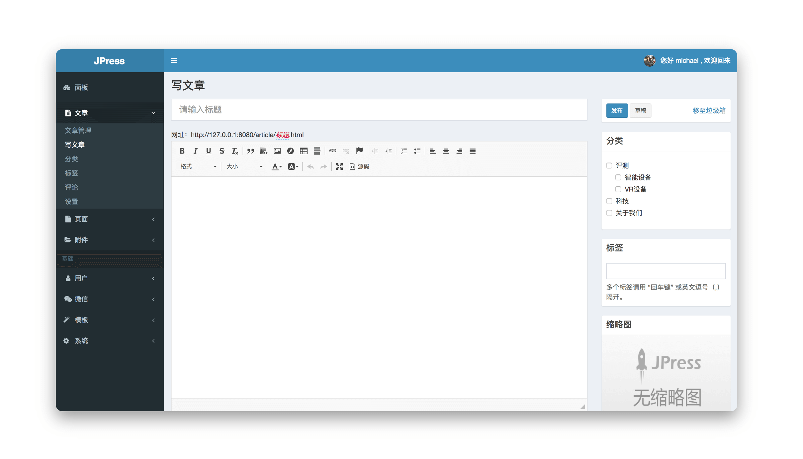

<h1 align="center"><a href="http://www.jpress.io" target="_blank"> JPress </a></h1>

一个类似 WordPress 的产品，使用Java开发。

## 特点

#### 模板

- 模板在线安装、卸载
- 模板在线启用、切换
- 在线编辑及实时生效
- 完善的模板开发文档
- 极致的模板开发体验

#### 插件

- 插件在线安装、卸载
- 插件在线启用、停止
- 插件在线更新
- 支持在插件里添加新的 Controller
- 支持在插件里添加新的 Handler
- 支持在插件里添加新的 Interceptor
- 支持在插件里添加新的 Html、Css 和 Js
- 支持在插件里创建新的数据库表以及对应的 Model
- 支持在插件里链接不同的数据库
- 支持通过插件动态扩展后台菜单和用户中心菜单
- 插件扩展的菜单支持用户权限设置的管理
- 插件被停止：该插件的所有Controller、Handler、Intercepter 自动被移除
- 插件被卸载：该插件的所有资源全部被删除

#### 用户

- 独立登录、注册入口
- 手机短信、邮箱激活功能
- 用户中心（投稿、文章管理、评论管理、个人资料管理等）
- 第三方登录：微信、QQ等
- 微信浏览时，通过微信授权自动获取用户信息

#### 角色和权限

- 角色管理
- 全自动、免维护的权限字典（自动发现后台路由、插件安装卸载自动分配对应）
- 角色和权限的分配
- 用户多角色功能
- 超级管理员

#### 微信

- 微信公众号对接
- 微信公众号关键字自动回复
- 微信公众号菜单设置
- 微信公众号运营插件
- 通过运用插件灵活扩展各种微信营销功能
- 微信小程序对接、和配置

#### 其他

- WordPress、Hexo、Jekyll 文章一键导入
- 编写文章随意切换Ckeditor和Markdown编辑
- 最大化、沉侵式的文章编写体验
- Docker 一键部署
- 阿里云、腾讯云CDN在线配置
- 阿里云、腾讯云短信验证（用户注册手机验证）
- 附件自动可配置自动同步阿里云OSS
- 完善的API接口配置管理
- 文章和页面独立的SEO配置
- ... （更多等你发现）

## 交流

- QQ群：591396171 ，288397536
- 官网：[http://www.jpress.io](http://www.jpress.io)
- 提问：[https://www.oschina.net/question/tag/jpress](https://www.oschina.net/question/tag/jpress)

## 帮助文档

- [了解JPress](./doc/about_jpress.md)
- [快速开始](./doc/quick_start.md)
- [安装](./doc/install.md)
- [使用](./doc/manual.md)
- [开发准备](./doc/dev.md)
- [模板开发](./doc/template_dev.md)
- [插件开发](./doc/addon_dev.md)
- [模块开发](./doc/module_dev.md)
- [微信运营插件开发](./doc/wechat_dev.md)
- [微信小程序开发](./doc/wechat_miniprogram_dev.md)
- [视频教程](./doc/videos.md)
- [常见问题](./doc/faq.md)
- [JPressSchool-VIP会员](./doc/vip.md)

## 微信交流群

