## JPress 官网

http://www.jpress.io

## JPress 文档 

[点击这里](./doc/readme.md)

## JPress School 

https://mp.weixin.qq.com/s/GbNv0xaK6jruWqTDJ_Ospw

    
## 新版本相关视频教程

* **1. JPress下载、编译、运行** 

https://pan.baidu.com/s/1Pe0KcYcQGalxPnlUNw9rmg

* **2. 一个小时开发一个论坛**

https://pan.baidu.com/s/1rJ5OMOxUwVz9ylK3oFD3PQ

* **3. JPress模板开发教程**

https://pan.baidu.com/s/1zSSezfMOfrZxGvs_Sz4Kig  密码:tvzh

* **4. JPress与CDN的整合实现**

https://pan.baidu.com/s/10aPgdD1HNZO1qb5ab9YB5w

## JPress 微信小程序SDK

网址：https://gitee.com/fuhai/jpress-miniprogram-sdk

## 通过Docker运行JPress

##### 1、安装docker

过程略

##### 2、通过docker-compose 运行 JPress

Linux :

```
wget https://gitee.com/fuhai/jpress/raw/master/docker/docker-compose.yml
docker-compose up -d
```

Mac OS :

```
curl -O https://gitee.com/fuhai/jpress/raw/master/docker/docker-compose.yml
docker-compose up -d
```

然后访问 127.0.0.1:8080 ，JPress会引导安装过程，一路下一步就可以了。

停止JPress ：

```
docker-compose stop
```

再次启动JPress：

```
docker-compose start
```


## 常见问题

**问题1： 如何在本地运行JPress ？**

如果使用Docker，以上已经给出了方法。

如果是tomcat，下载源码，通过 `mvn clean install`命令之后，在 stater-tomcat/target目录下回生成 jpress 的war包。把war包扔到自己对他tomcat，并启动tomcat即可。

JPress会引导你走安装过程。

**问题2：在开发环境下，如果让JPress不要自动安装**
可以在 starter 模块的 resource 下，创建两个文件：

* jboot.porperties ：配置文件
* install.lock ：空白内容，只要这个文件存在即可

可以把resource目录下的 `jboot-simple.properties` 文件重命名为 `jboot.properties` 然后修改其配置内容即可 。

**问题2：为什么运行不起来?**

注意下你本地的环境，JPress要求的环境如下：

* jdk: 1.8.x
* tomcat: 8.x
* mysql: 5.6+

**问题3：为什么无法对文章进行评论**

答：JPress的文章评论功能默认是关闭的，请先在后台 `文章 -> 设置` 开启评论功能。


**更多问题，请关注 JPress 公众号 ：**


**JPress后台截图**

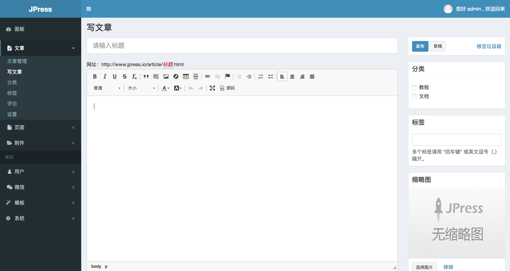

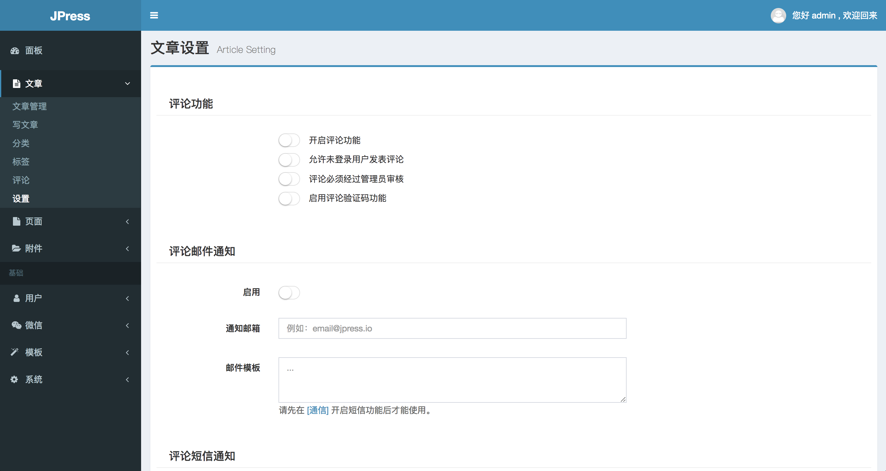

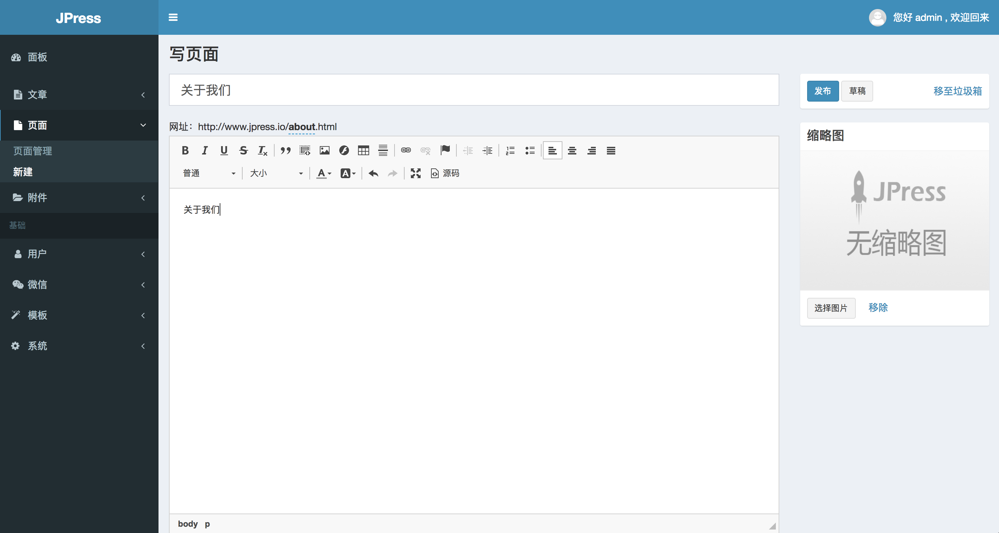

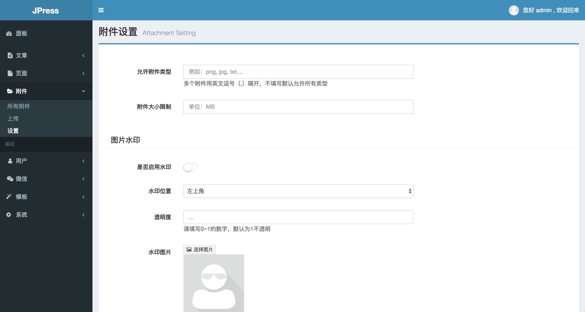

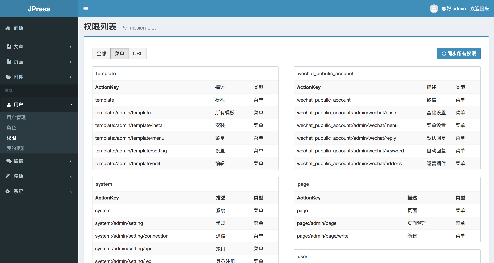

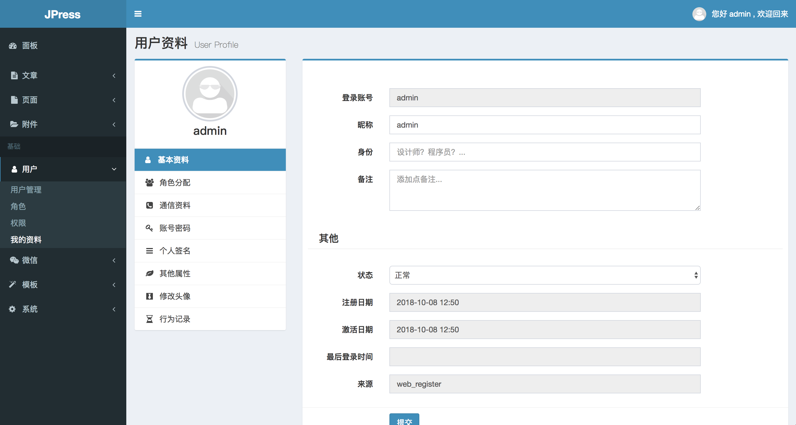

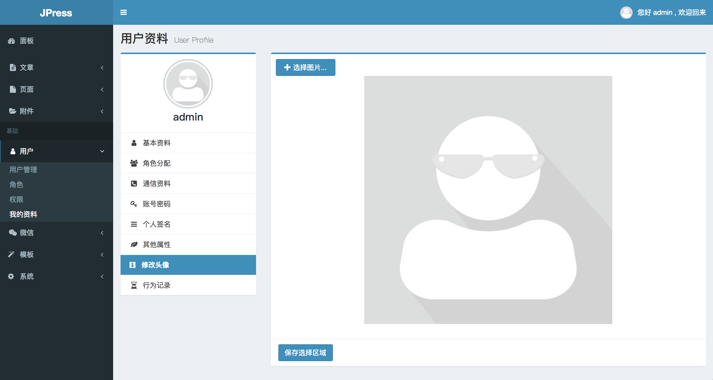

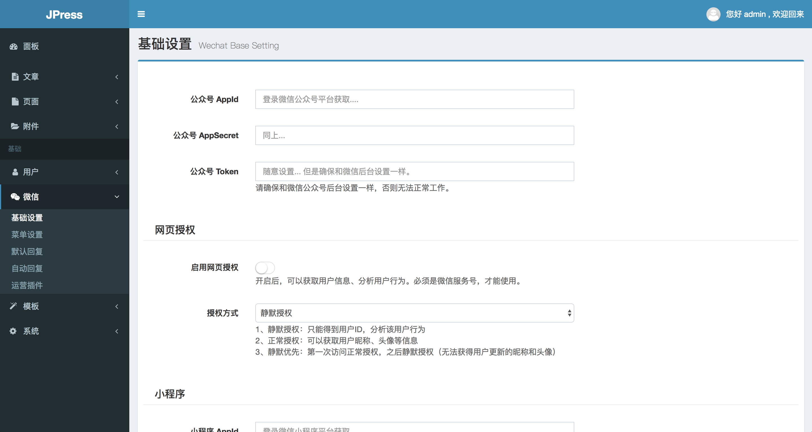

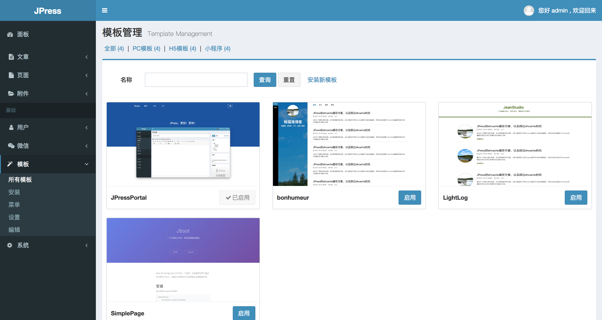

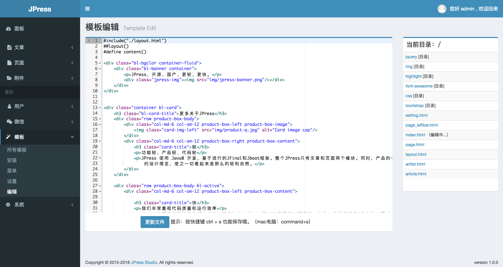

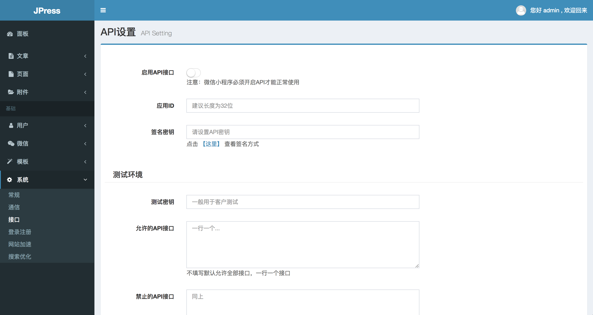

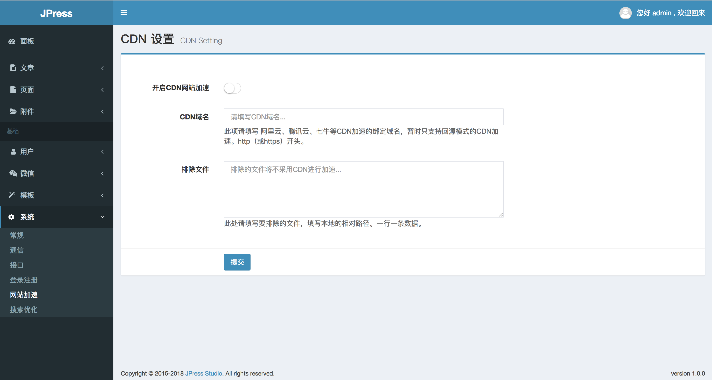

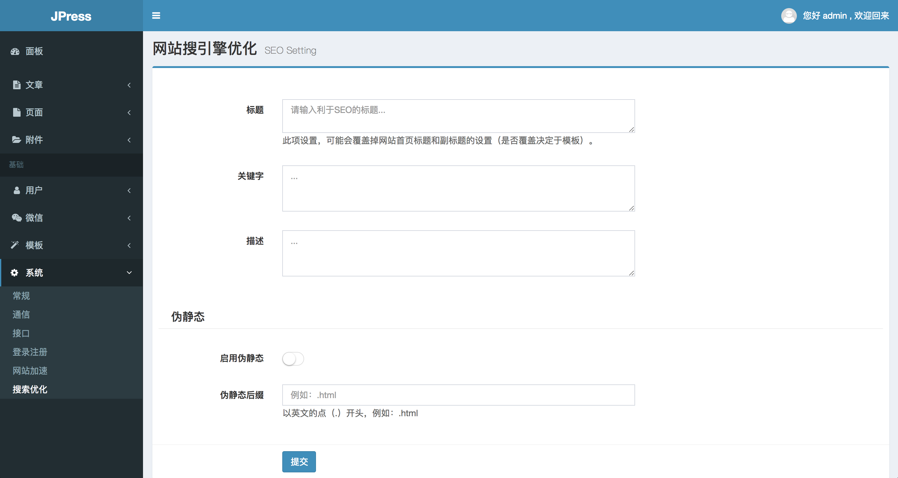

**用户中心的相关截图**


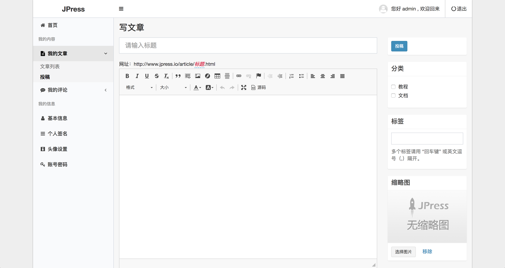

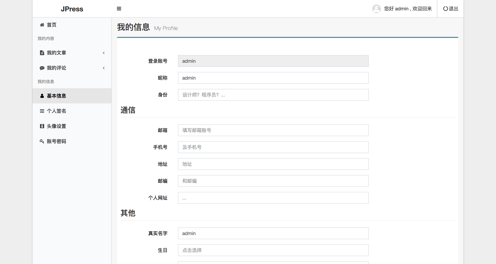

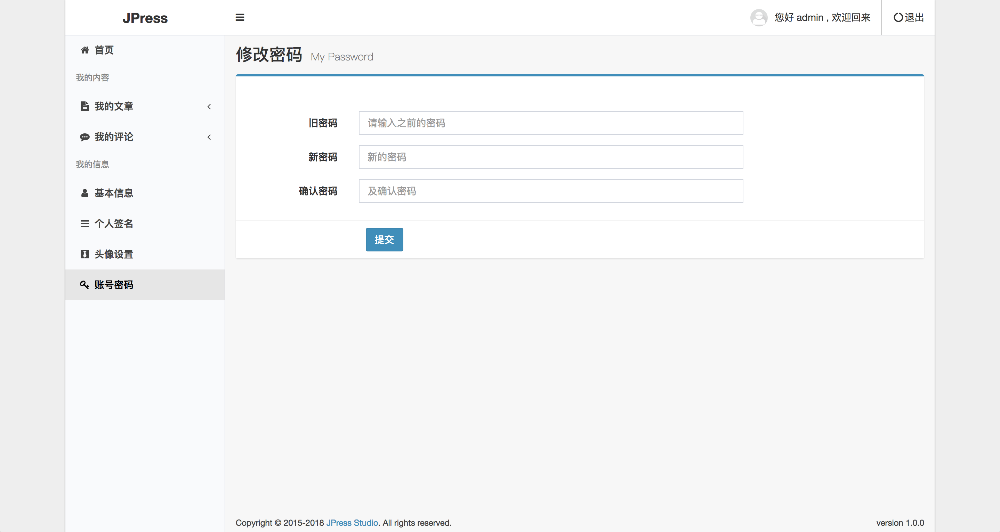


