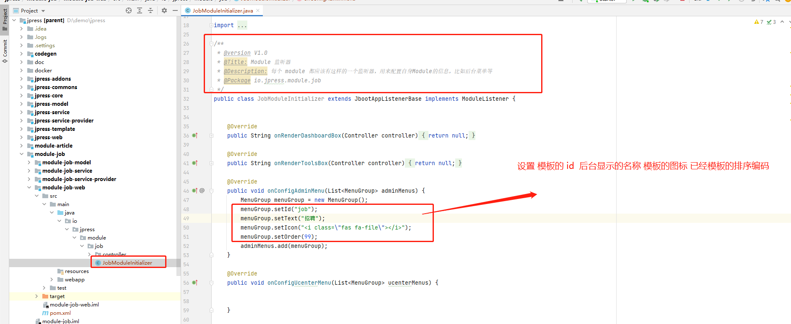

# JPress 模块开发

在开发开发之前，我们需要做好如下的准备：

- 1、下载源码。（文档地址：[jpress_download_source](/manual/jpress_download_source.md)）
- 2、导入源码到编辑器。（文档地址：[jpress_open_compiler](/manual/jpress_open_compiler.md)）
- 3、了解 JPress 如何编译并运行。（文档地址：[jpress_compile_with_run](/manual/jpress_compile_with_run.md)）


>为了方便文档讲解清楚模块开发，这里会有一个模拟模块开发的场景案例
>
> 模块名称：招聘
>
> 模块介绍：用于岗位数据管理的模块
>
> 应用场景：用于发布岗位

招聘模块开发步骤：

* 1、表设计

* 2、使用模块代码生成器

* 3、模块导入编辑器

* 4、后台菜单配置

## 4、后台菜单配置
> 此时 虽然 jpress 已经能够识别新的模块 但是我们在后台菜单中 依然是看不到 新的模块的


> 那么我们需要怎么做才能 使新的模块在后台菜单中呈现呢?

* 1、监听器配置
> 首先 **在编辑器中 Job模块下的 module-job-web 模块 找到 模块对应的监听器（JobModuleInitializer）下的 onConfigAdminMenu方法** 设置好对应的 属性
> 代码示例 如下所示

```java
   @Override
    public void onConfigAdminMenu(List<MenuGroup> adminMenus) {
    
        MenuGroup menuGroup = new MenuGroup();
        menuGroup.setId("job");
        menuGroup.setText("招聘");
        menuGroup.setIcon("<i class=\"fas fa-file\"></i>");
        menuGroup.setOrder(99);
        adminMenus.add(menuGroup);
    }
```



* 2、使 jpress 启动时 能够识别 新模块
>接着 需要将 模块的依赖 引入 **jpress stater包下的 pom.xml 文件中**
>
> **使 jpress 启动时 能够 识别并加载 新的模块** 代码示例如下所示

```xml
       <dependency>
            <groupId>io.jpress</groupId>
            <artifactId>module-job-web</artifactId>
            <version>5.0</version>
        </dependency>

        <dependency>
            <groupId>io.jpress</groupId>
            <artifactId>module-job-service-provider</artifactId>
            <version>5.0</version>
        </dependency>
```


* 3、重启项目
> 接着我们就可以重启项目 进入后台 然后就可以看到 新的模块 已经在后台菜单中呈现

