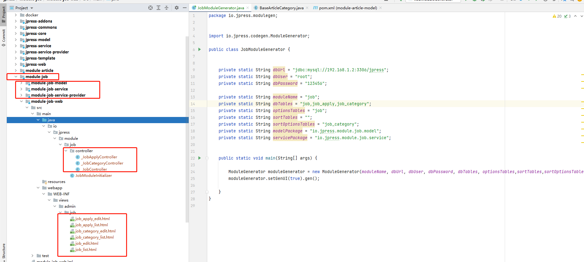

# JPress 模块开发

在开发开发之前，我们需要做好如下的准备：

- 1、下载源码。（文档地址：[jpress_download_source](/manual/jpress_download_source.md)）
- 2、导入源码到编辑器。（文档地址：[jpress_open_compiler](/manual/jpress_open_compiler.md)）
- 3、了解 JPress 如何编译并运行。（文档地址：[jpress_compile_with_run](/manual/jpress_compile_with_run.md)）


>为了方便文档讲解清楚模块开发，这里会有一个模拟模块开发的场景案例
>
> 模块名称：招聘
>
> 模块介绍：用于岗位数据管理的模块
>
> 应用场景：用于发布岗位

招聘模块开发步骤：

* 1、表设计

* 2、使用模块代码生成器

* 3、模块导入编辑器

* 4、后台菜单配置

## 2、模块代码生成器的使用

当表创建好以后 就需要使用 **模块的代码生成器 来生成表对应的基础代码**

* 1、来到编辑器 找到 **stater->src->main->java->io->jpress->modulegen** 这个包 **（在这个包下 放置了我们所有模块的 模块代码生成器 ）**

  

* 2、构建模块代码生成器

>既然要写新的模块 那么肯定需要构建新的 模块代码生成器 代码示例 如下所示

```java
public class JobModuleGenerator {


    private static String dbUrl = "jdbc:mysql://127.0.0.1:3306/jpress";
    private static String dbUser = "root";
    private static String dbPassword = "******";

    private static String moduleName = "job";
    private static String dbTables = "job,job_apply,job_category";
    private static String optionsTables = "job";
    private static String sortTables = "";
    private static String sortOptionsTables = "job_category";
    private static String modelPackage = "io.jpress.module.job.model";
    private static String servicePackage = "io.jpress.module.job.service";


    public static void main(String[] args) {

        ModuleGenerator moduleGenerator = new ModuleGenerator(moduleName, dbUrl, dbUser, dbPassword, dbTables, optionsTables,sortTables,sortOptionsTables, modelPackage, servicePackage);
        moduleGenerator.setGenUI(true).gen();

    }
}
```
> 模块构造器编写好之后 点击小箭头 运行


* 3、运行 模块代码生成器
> 点击运行之后 稍等一会 等待运行完毕 就可以看到 **项目中多出了 一个名为module-job的新模块**
> 并且已经 **生成了 model service provider controller 以及 对应的 html页面 的基础代码**

