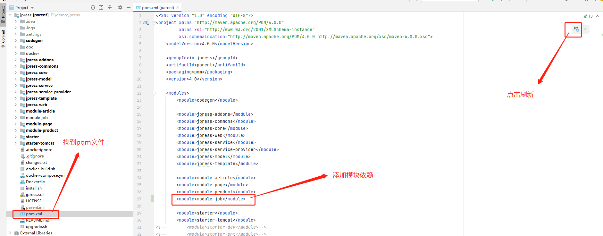

# JPress 模块开发

在开发开发之前，我们需要做好如下的准备：

- 1、下载源码。（文档地址：[jpress_download_source](/manual/jpress_download_source.md)）
- 2、导入源码到编辑器。（文档地址：[jpress_open_compiler](/manual/jpress_open_compiler.md)）
- 3、了解 JPress 如何编译并运行。（文档地址：[jpress_compile_with_run](/manual/jpress_compile_with_run.md)）

>为了方便文档讲解清楚模块开发，这里会有一个模拟模块开发的场景案例
>
> 模块名称：招聘
>
> 模块介绍：用于岗位数据管理的模块
>
> 应用场景：用于发布岗位

招聘模块开发步骤：

* 1、表设计

* 2、使用模块代码生成器

* 3、模块导入编辑器

* 4、后台菜单配置

## 3、模块导入编辑器
> 虽然新的 模块已经生成成功 但是可以看到 新的模块明显和其它的模块不一样 其他的模块 右下角都有一个蓝色的小方块
> 但是新的模块 没有 **这是因为 jpress 不能识别 此模块 那么怎么能让 jpress 识别此模块呢 ?**

* 1、将模块 依赖导入 jpress
  
> 然后我们就可以看到 jpress 已经可以识别此模块

* 2、使 jpress 能够识别 模块的 静态资源
>虽然此时 jpress 已经能够识别 新模块 但是新模块下的 html等资源 还是识别不到的
> 我们需要 找到 stater 下 的 pom.xml 文件  添加如下配置  就能使 jpress 识别到模块的 静态资源

