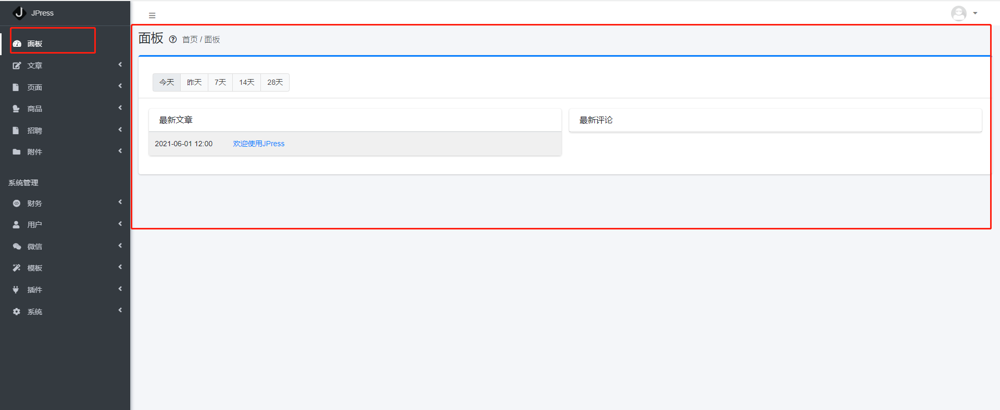
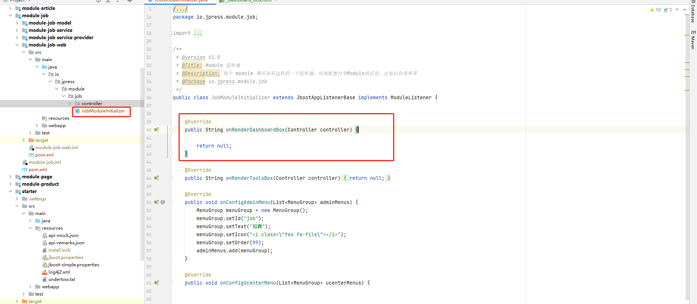

## 面板配置
* 1、面板
>当刚进入后台的时候 我们默认的就是 进入面板的页面 而在这个页面中 除了有一篇 欢迎的文章外 什么都没有
> 但是  如果我们想在面板中 放一些东西 **比如:我们想把最新的岗位 也放到面板中**



* 2、添加数据
> 如果想要添加 数据到面板中 我们需要找到对应的 模块 中的 **JobModuleInitializer 类 -> onRenderDashboardBox()方法**



> 找到方法之后 我们需要在这个方法中 将数据查询出来 然后传递 那么这里就需要将 最新的岗位查出
>
> 代码示例如下

```java
    @Override
    public String onRenderDashboardBox(Controller controller) {

        List<Job> jobList = Aop.get(JobService.class).findListByColumns(Columns.create(),"created desc",3);
        controller.setAttr("jobList",jobList);

        return "job/_dashboard_box.html";
    }
```


> 但是可以看到 这里返回的是 一个 html页面 那么这个html从哪里来?
>
> **可以新建也可以使用已经有的html** 这里的 _dashboard_box.html 是新建一个 html文件
>
> html 示例如下
```html
<style>
    .comment-content p {
        display: inline;
    }

    table td a{
        color:#007bff;
    }

</style>

<div class="col-md-6 col-sm-6 col-12">
    <div class="card card-outline card-dashboard">
        <div class="card-header with-border">
            <h3 class="card-title">最新岗位</h3>
        </div>
        <!-- /.card-header -->
        <div class="card-body p-0">
            <table class="table table-striped">
                <tbody>
                #for(job : jobList)
                <tr>
                    <td style="width: 150px">#date(job.created ??)</td>
                    <td><a href="#" target="_blank">#(job.title ??)</a></td>
                </tr>
                #end
                </tbody>
            </table>
        </div>
    </div>
</div>
```


* 3、查看面板
> 此时 我们的所有操作 都已经完成 那么就可以进入后台查看 数据已经在面板中

