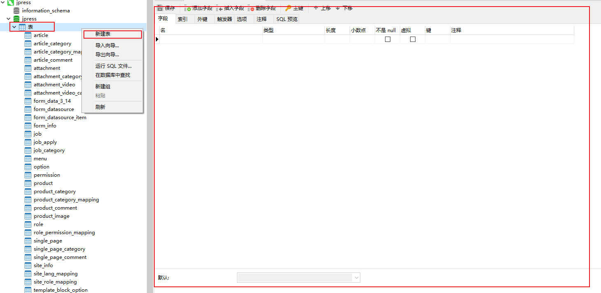
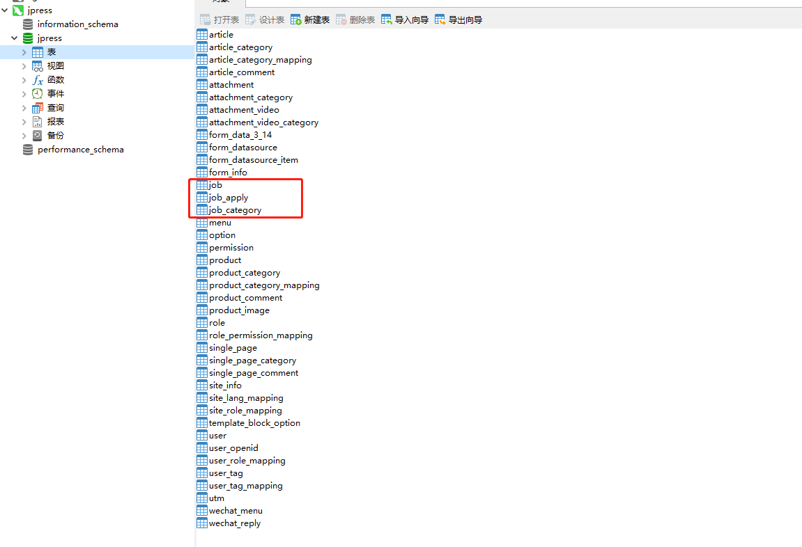

# JPress 模块开发

在开发开发之前，我们需要做好如下的准备：

- 1、下载源码。（文档地址：[jpress_download_source](/manual/jpress_download_source.md)）
- 2、导入源码到编辑器。（文档地址：[jpress_open_compiler](/manual/jpress_open_compiler.md)）
- 3、了解 JPress 如何编译并运行。（文档地址：[jpress_compile_with_run](/manual/jpress_compile_with_run.md)）

>为了方便文档讲解清楚模块开发，这里会有一个模拟模块开发的场景案例
>
> 模块名称：招聘
>
> 模块介绍：用于岗位数据管理的模块
>
> 应用场景：用于发布岗位

招聘模块开发步骤：

* 1、表设计

* 2、使用模块代码生成器

* 3、模块导入编辑器

* 4、后台菜单配置

## 1、表设计
>在jpress编译和运行起来之后 已经在本地建库建表 那么我们使用数据库连接工具来连接上数据库 这里以 **Navicat** 为例 来演示

* 1、下载并安装 **Navicat** 数据库连接工具
  **Navicat下载连接：[https://www.navicat.com.cn/](https://www.navicat.com.cn/)**

* 2、打开 Navicat 软件 **点击左上角新建连接 选择 mysql**
  

* 3、输入对应的信息 点击确定即可 也可点击 连接测试 来测试是否可以连接成功
  

* 4、进入数据库
  

* 5、新建表

> **鼠标选择数据库中的表的选项->鼠标右键->新建表** 就会出现如图 右边的表的编辑页面
> 输入想要建立的表的信息

* 6、保存表
> 编辑好表的信息之后 点击 左上角的保存按钮 然后输入 表名 点击确定即可

* 7、查看表
> 保存好之后 我们就可以在数据库中 看到我们新建的表

