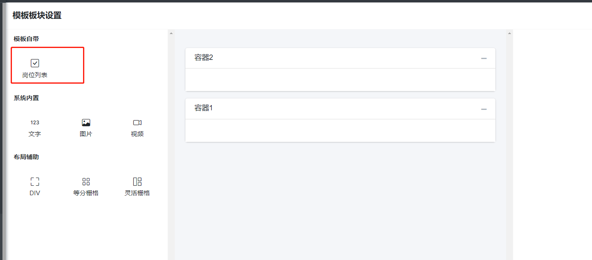
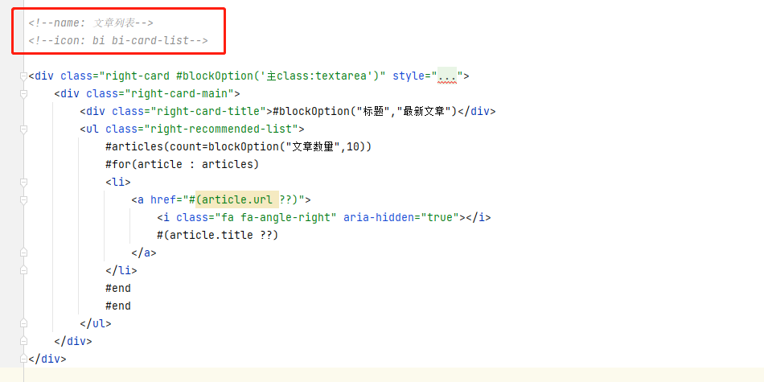
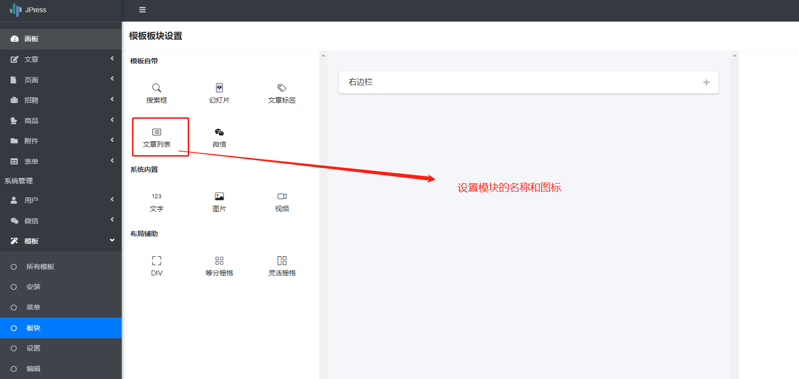
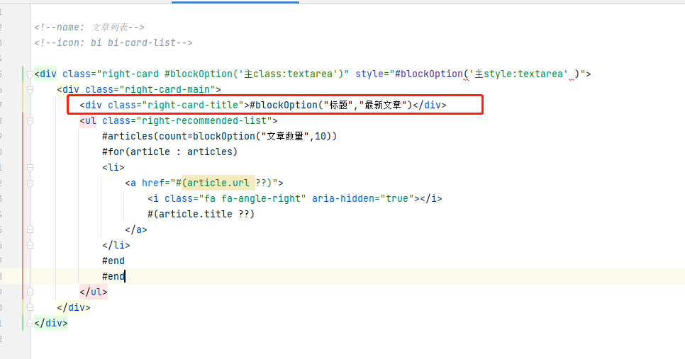
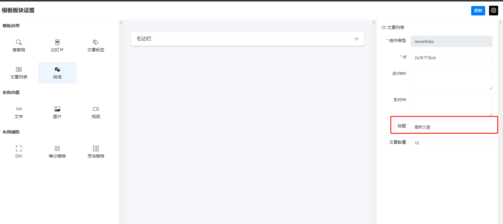
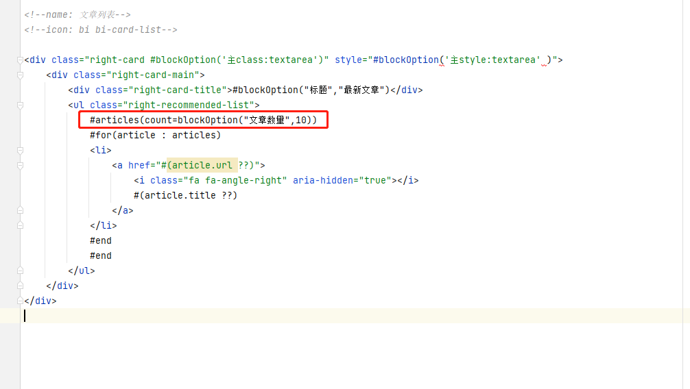
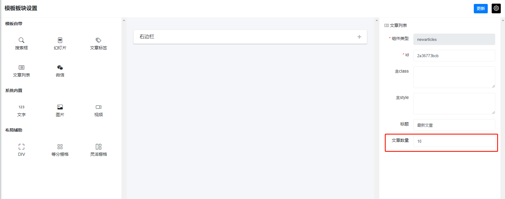
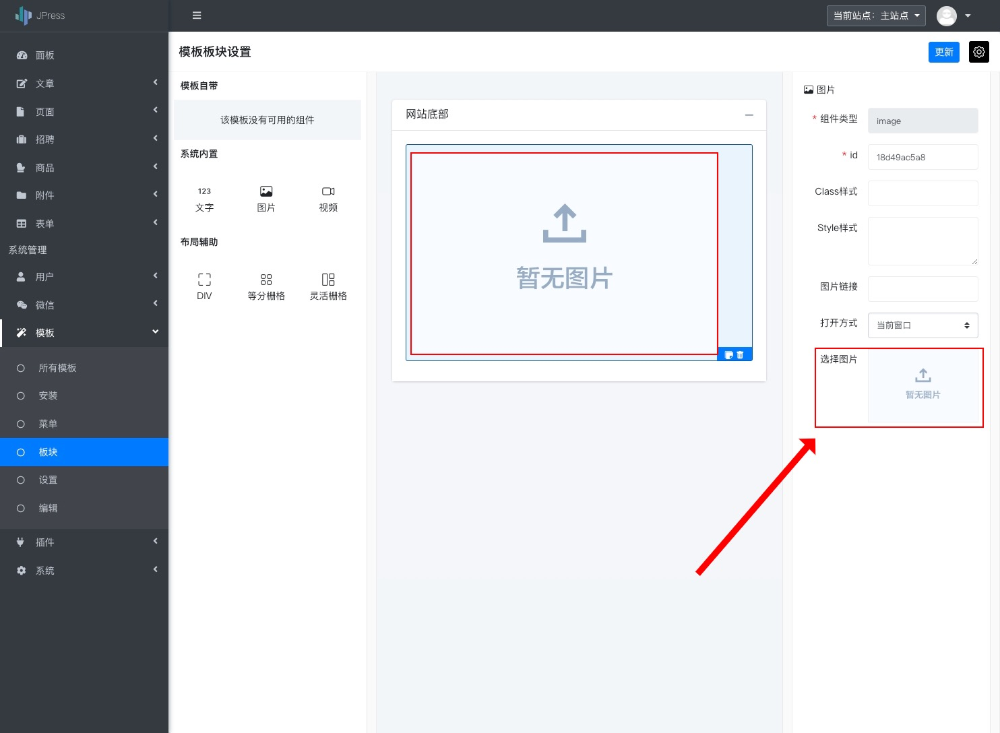
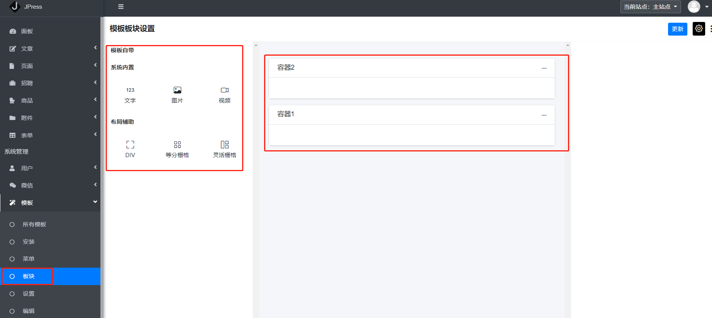
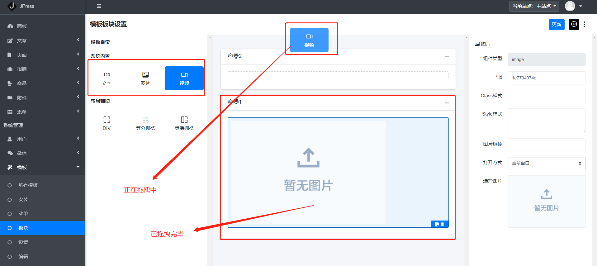

# 模板模块拖拽

在开始 JPress 模板的模块开发之前，需要了解 3 个定义：

- 1、模块：一段 html 片段，在模板里是以 `block_` 开头的 html 文件。
- 2、模块容器：一个可以存放 "模块" 的 html 位置，通常是一个 div。
- 3、模块设置：对模块里的 html 内容进行动态设置。


## 模块

* 1、在模板目录中，创建一个以 `block_` 开头的 html 文件，例如：`block_newjobs.html`


- 使用 `<!--name: 模块名称-->` 来定义一个模块的名称
- 使用 `<!--icon: 模块 ICON-->` 来定义个模块在后台显示的 icon，支持 https://icons.getbootstrap.com 对应的类名

* 2、此时重启项目，进入后台，就可以看到此功能模块已经加入版块设置中。




## 模块设置

* 1、模块名称和图标设置

>  下图中 注释中 name 和 icon 属性 可设置功能模块的 标题以及图标



后台模块显示如下：



----

* 2、 通过 `#blockOption("属性名称","默认值")` 定义模块属性

示例1：



后台显示如下：




示例2：



后台显示如下：



**注意**

`#blockOption("属性名称","默认值")` 的完整支持应该是 `#blockOption("属性名称:后台输入框类型","默认值")`

例如：

- `#blockOption("count:textarea","10")` 后台的属性面板 textarea 来设置
- `#blockOption("count:image","10")` 后台的属性面板 图片选择 来设置

后台输入框类型支持的类型如下：

- input，输入框，也是默认值
- number，数字输入框
- textarea，多行输入框
- image，图片选择器
- video，视频选择器

例如：`#blockOption('选择图片:image','/static/commons/img/nothumbnail.jpg')` 后台显示如下：



## 模块容器

在模板的 html 中，`模块容器` 是通过代码 `#blockContainer('容器名称') 默认显示内容 #end` 来定义。例如：

在任意的 html 中，添加如下内容

```html
<div class="div1">#blockContainer('容器1')  #end</div>
<div class="div2">#blockContainer('容器2')  #end</div>
```

此时，表示我们在模板中定义了两个容器，容器的名称分别为：容器1、容器2。

后台如下图所示：



此时，我们可以拖动左侧的模块放入到模块容器中。



