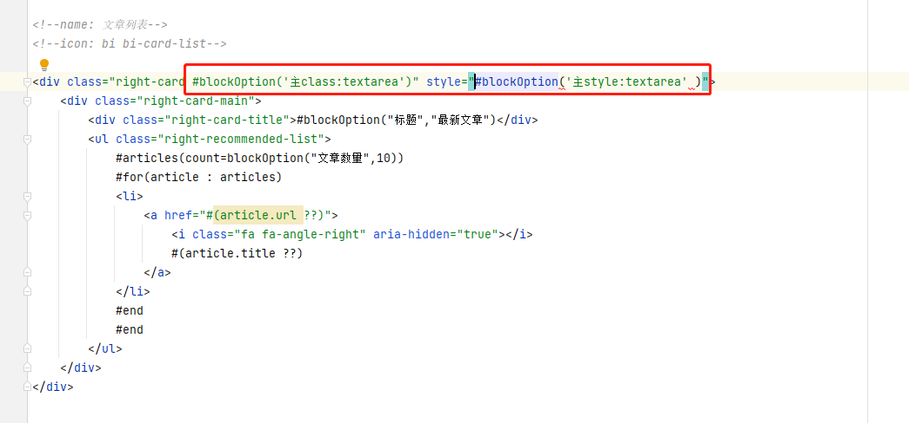

# 模板模块拖拽

在开始 JPress 模板的模块开发之前，需要了解 3 个定义：
- 1、模块容器：就是可以拖动来存放的地方
- 2、模块：一段 html 片段，html 片段所在的 html 文件以 `block_` 开头
- 3、模块设置：对模块里的 html 内容进行动态设置。

## 模块容器 

在模板的 html 中，`模块容器` 是通过代码 `#blockContainer('容器名称') 默认显示内容 #end` 来定义。例如：

在任意的 html 中，添加如下内容 

```html
<div class="div1">#blockContainer('容器1')  #end</div>
<div class="div2">#blockContainer('容器2')  #end</div>
```

此时，表示我们在模板中定义了两个容器，容器的名称分别为：容器1、容器2。后台显示如下：

> 在后台 模板->版块 中就会出现相同的俩个容器 我们可以对容器进行设计 在左边已经存在系统自带的几种功能模块


> 可以通过拖动的方式来将这些功能模块放入到模块容器中
> 
> 那么怎么添加自己需要的功能模块呢 ?


----

## 功能模块

* 1、创建一个 html 文件 ，文件以 `block_` 开头，例如：`block_newjobs.html`


* 2、此时重启项目，进入后台就可以看到此功能模块已经加入版块设置中


## 模块设置

* 1、模块名称和图标设置

>  下图中 注释中 name 和 icon 属性 可设置功能模块的 标题以及图标


* 后台对应设置


----

* 2、 `#blockOption("key","value")` 得多种功能

>  1、放在元素的 class 属性中 可以指定其为不同的元素 不同的样式等 例如：`class="right-card #blockOption('主class:textarea')"`



* 比如 `class="right-card #blockOption('主class:textarea')"` 后台对应的元素就为 textarea

----

>  2、放在元素中 可以在功能模块中添加新的配置 例如：` <div class="right-card-title">#blockOption("标题","最新文章")</div>`


* 后台对应设置


----

>  3、放在其它指令中 可以使指令中的参数与功能模块的配置所绑定 前提是此指令 支持绑定的参数


* 后台对应设置

