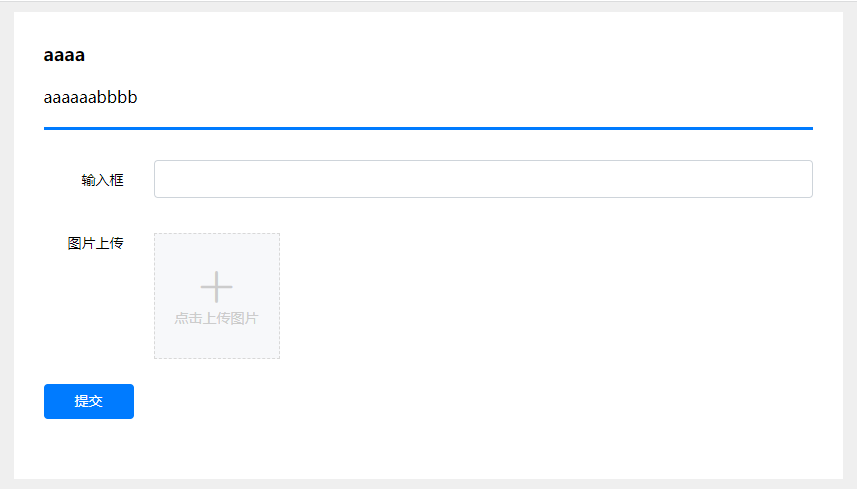
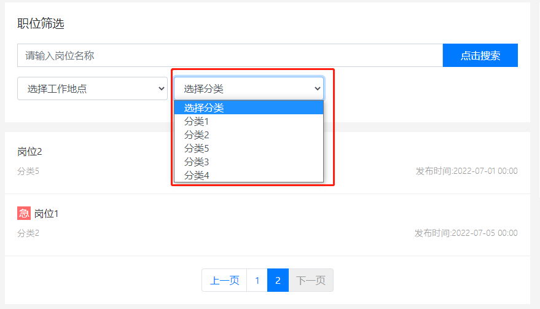
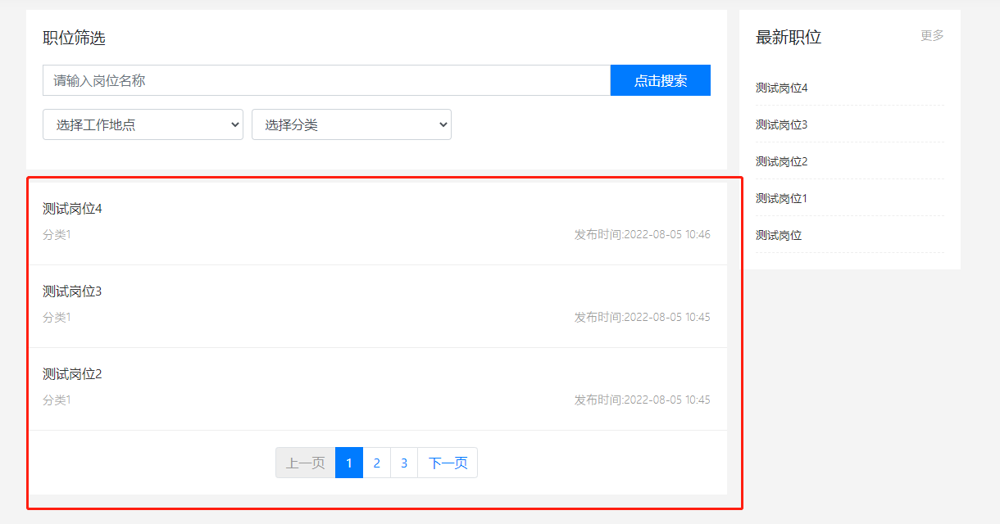

# 模板指令

[[toc]]

## 系统指令：

| 指令名称 | 可用页面 |描述 |  
| --- | --- | --- | 
| #checkedIf() | 任意 | 用于输出 "checked" 字符内容，用于在 checkbox 等标签属性里 |  
| #selectedIf() | 任意 | 用于输出 "selected" 字符内容，用于在 select 下拉菜单属性里 | 
| #maxLength() | 任意 | 用于对字符串内容截取 | 
| #hasAddon() | 任意 | 用于检测是否安装、并启用了某个插件 | 
| #para() | 任意 | 用于接收 url 的参数内容 | 
| #option() | 任意 | 读取后台的配置信息 | 

### #checkedIf() 的使用

* checkedIf()  主要用在 checkbox 或者 radio 等标签属性里，支持的参数只能有 true 和 false。

示例：

```html
<input type="radio" name="..." value="text" #checkedIf(type !=null && type== "text")>
```

* 此时，当 后端输出的 `type` 值等于 “text” 的时候，该单选框就会被选中。

------

### #selectedIf() 的使用

* 其用法与 ` #checkedIf()`  一直，只是 #checkedIf() 用在 `<option><select ...></option>` 里。

------

### #maxLength() 的使用

* maxLength()主要用于限制一些文本的输出长度

例如：

```html

<td>#maxLength(entry.text ??,10)</td>
```

* 此时 不管 entry.text 的文本长度又多少 都只会输出 10 个字符 比如有 100 个字符 但是只会输出 10个字符

------

### #hasAddon() 的使用

* 用于检测是否安装、并启用了某个插件

示例：

```html

<div>

    <!--可以这样直接使用-->
    #hasAddon("key") #end

    <!--可以这样将结果输出-->
    #(hasAddon("key"))

    <!--也可以搭配这其它指令一起使用-->
    #if(hasAddon("key"))
    ...
    #end

</div>

```

------

### #para() 的使用

* 用于接收 url 的参数内容

示例：

```html

<div>

    <p>#para("username")</p>

</div>

```

* 此时 如果当前页面的 URL 是 www.jpress.cn?username="zhangsan" 那么就会获取并输出 zhangsan

------

### #option() 的使用

* 读取后台的配置信息

示例：

```html

<div>

    <p>#option("web_template")</p>

</div>

```

* 此时 如果在后台有配置过 key 为 web_template 的信息 那么就能得到对应的 value

------

## 文章相关指令：

| 指令名称 | 可用页面 |描述 |  
| --- | --- | --- | 
| #article() | 任意 | 用于读取特定的单篇文章 |  
| #articles() | 任意 | 用于读取文章列表，例如：热门文章文章、最新评论文章列表等等 | 
| #tagArticles() | 任意 | 读取某个tag下的文章列表 | 
| #categoryArticles() | 任意 | 读取某个分类下的文章列表 | 
| #articlePage() | 任意 | 用于对文章列表进行的内容和分页进行显示 | 
| #commentPage() | 文章详情：article.html | 用于对文章评论的内容和分页进行显示 | 
| #nextArticle() | 文章详情：article.html | 下一篇文章 | 
| #previousArticle() | 文章详情：article.html | 上一篇文章 | 
| #relevantArticles() | 文章详情：article.html | 相关文章列表，相同标签的的文章 |
| #categories() | 任意 | 读取文章模块的所有分类 | 
| #tags() | 任意 | 用于读取文章标签 |  
| #articleCategories() | 任意 | 用于读取某一篇文章的所属分类，例如：文章的标签、文章的分类等 |  
|#comments()|任意|读取所有评论|
|#userArticles()|任意|读取某个用户的投稿文章内容|
|#articleSearchPage()|搜索结果:artsearch.html|用户显示搜索结果|
|#articleCrumb()|文章相关页面:artsearch.html，article.html|面包屑|

### #article() 的使用

* 根据文章 ID 或者 slug 读取文章数据

示例：

```html

<div>

    #article("1")

    #(article.title ??)

    #end

</div>

```

> 此时 会根据 ID 查询文章信息 并返回一个名为 article 的对象

#### #article() 中支持的参数：

* 参数一：文章ID 或者 slug

------

### #articles() 的使用

* 查询文章列表

示例：

```html

<div>
    #articles(flag = "xxx",style = "xxx",hasThumbnail = false,orderBy = "id desc",count = 1,withRecommend=,withTop=false,withHot=false,withLeadNews=false)

    #for(article :articles)

    <a href="#(article.url)">#(article.title ??)</a>


    #end

    #end
</div>
```

> 此时 会根据提供的条件查询文章信息 并返回一个名为 articles 的 list 对象

#### #articles() 中支持的参数：

* flag：文章 flag(标识)
* style：文章 style(样式)
* hasThumbnail：是否有缩略图 boolean类型
* orderBy：根据属性进行排序 例如 "id desc"
* count：需要查询的数量
* withRecommend:是否推荐文章 boolean类型
* withTop:是否置顶文章 boolean类型
* withHot：是否热门文章 boolean类型
* withLeadNews:是否是头条 boolean类型
* withSite:读取哪些站点的内容，不传入默认为当前站带你，传入 * 为所有站点，可以传入站点 id，例如： withSite = "1,2,3"

------

### #tagArticles() 的使用

* 根据文章分类的 slug 查询文章列表

示例：

```html

<div>
    #tagArticles(tag="jpress",hasThumbnail = false,orderBy = "id desc",count = 1)

    #for(article : articles)

    <a href="#(article.url)">#(article.title ??)</a>

    #end

    #end
</div>
```

> 此时 会根据提供的条件查询文章信息 并返回一个名为 articles 的 list 对象

#### #tagArticles() 中支持的参数：

* tag：文章分类的 slug
* hasThumbnail：是否有缩略图 boolean类型
* orderBy：根据属性进行排序 例如 "id desc"
* count：需要查询的数量

------

### #categoryArticles() 的使用

* 读取某个分类下的文章列表

示例：

```html

<div>
    #categoryArticles(categoryId = 1,orderBy="id desc",count = 3)

    #for(article : articles)

    <a href="#(article.url ??)">#(article.title ??)</a>

    #end

    #end
</div>
```

> 此时 会根据提供的条件查询文章信息 并返回一个名为 articles 的 list 对象

#### #categoryArticles() 中支持的参数：

* categoryId：文章分类的ID
* categoryFlag：文章分类的标识
* hasThumbnail：是否有缩略图 boolean类型
* orderBy：根据属性进行排序 例如 "id desc"
* count：需要查询的数量
* withRecommend：是否推荐
* withTop：是否指定
* withHot：是否热门
* withLeadNews：是否头条
* includeChildren：是否包含子分类内容
------

### #articlePage() 的使用

* 用于对文章列表进行的内容和分页进行显示

示例：

```html
#articlePage()
#for(article : articlePage.list)

<div class="ll-card">
    <div class="row">
        <div class="col-lg-3 col-md-3 col-sm-12 ll-card-image">
            <a href="#">
                
            </a>
        </div>
        <div class="col-lg-9 col-md-9 col-sm-12 ll-card-main">
            <a href="#(article.url ??)">
                <div>
                    <h3 class="ll-card-main-title">
                        #(article.title ??)
                    </h3>
                    <p class="ll-card-main-info">
                        #maxLength(article.text,100)
                    </p>
                </div>
                <div class="ll-card-tag">
                    <div><i class="fa fa-clock-o"></i>#date(article.created)</div>
                    <div><i class="fa fa-eye"></i>#(article.view_count)</div>
                    <div><i class="fa fa-commenting-o"></i>#(article.comment_count)</div>
                </div>
            </a>
        </div>
    </div>
</div>
#end


#articlePaginate(firstGotoIndex=true)
<nav aria-label="Page navigation example">
    <ul class="pagination justify-content-center ">
        #for(page : pages)
        <li class="page-item #(page.style ??)">
            <a class="page-link" href="#(page.url ??)">
                #(page.text ??)
            </a>
        </li>
        #end
    </ul>
</nav>
#end

#end
```

> 此时 会根据提供的条件查询文章信息 并返回一个名为 articlePage 的 page 对象 内部又包含了另一个指令 #articlePaginate()，#articlePaginate()是用于显示上一页和下一页

#### #articlePage() 支持的参数有

* categoryId 文章分类的ID
* pageSize 用来指定当前页面有多少条数据，默认值为10，也就是不填写这个参数的话，默认为10条数据
* orderBy 根据属性进行排序 例如 "id desc"

#### 分页指令 #articlePaginate() 的参数有

* previousClass ：上一页的样式，默认值：previous
* nextClass ：下一页的样式，默认值：next
* activeClass ：当前页面的样式，默认值：active
* disabledClass ：禁用的样式（当下一页没有数据的时候，会使用此样式），默认值：disabled
* anchor ：锚点链接
* onlyShowPreviousAndNext ：是否只显示上一页和下一页（默认值为false，一般情况下在手机端才会把这个值设置true）
* previousText ：上一页按钮的文本内容，默认值：上一页
* nextText ：下一页按钮的文本内容，默认值：下一页
* firstGotoIndex : 是否让第一页进入首页，默认值：false

------

### #commentPage() 的使用

* 用于对文章评论的内容和分页进行显示

> 此指令 用于文章详情：article.html 需在对应的 controller 中传入当前的 article 对象 以获取该文章的评论内容
>
> 用法与 #articlePage() 类似 也同样 内部又包含了另一个指令 #commentPaginate()，#commentPaginate()是用于显示上一页和下一页

#### #commentPage() 支持的参数有

* article：文章对象
* pageSize：用来指定当前页面有多少条数据，默认值为10，也就是不填写这个参数的话，默认为10条数据

#### 分页指令 #commentPaginate() 的参数有

* previousClass ：上一页的样式，默认值：previous
* nextClass ：下一页的样式，默认值：next
* activeClass ：当前页面的样式，默认值：active
* disabledClass ：禁用的样式（当下一页没有数据的时候，会使用此样式），默认值：disabled
* anchor ：锚点链接
* onlyShowPreviousAndNext ：是否只显示上一页和下一页（默认值为false，一般情况下在手机端才会把这个值设置true）
* previousText ：上一页按钮的文本内容，默认值：上一页
* nextText ：下一页按钮的文本内容，默认值：下一页
* firstGotoIndex : 是否让第一页进入首页，默认值：false

------

### #nextArticle() 的使用

* 用于获取下一篇文章

示例：

```html

<div>
    #nextArticle()

    <a href="#(next.url)">#(next.title ??)</a>

    #end
</div>
```

> 此指令 用于文章详情：article.html 
> 
------

### #previousArticle() 的使用

* 用于获取上一篇文章

示例：

```html

<div>
    #previousArticle()

    <a href="#(previous.url)">#(previous.title ??)</a>

    #end
</div>
```

> 此指令 用于文章详情：article.html
------

### #relevantArticles() 的使用

* 查询相关文章列表，相同标签的的文章

示例：

```html

<div>
    #relevantArticles(article,5)

    #for(article :relevantArticles)
    
    <a href="#(article.url)">#(article.title ??)</a>

    #end

    #end
</div>
```

> 此指令 用于文章详情：article.html 此时会根据传入的信息 查询相关文章信息 返回名为 relevantArticles 的 list 对象

#### #relevantArticles() 支持的参数有

* article：文章对象
* count：需要查询的数量

------

### #categories() 的使用

* 读取文章模块的所有分类

示例：

```html

<div>
    #categories(flag = "jpress",parentFlag="parent",parentId = 1,asTree = false)

    #for(category : categories)

    <a href="#(category.url)">#(category.title ??)</a>

    #end

    #end
</div>
```

> 此时 会根据传入的信息 查询 文章的所有分类信息 返回名为 categories 的 list 对象

#### #categories() 支持的参数有

* flag：文章标识
* parentFlag：父级文章标识
* parentId：父级ID
* asTree 是否以树状的数据格式返回,默认是false,返回全部分类,可通过 item.childs 方式获取子级分类列表

------

### #tags() 的使用

* 用于读取文章标签

示例：

```html

<div>
    #tags(orderBy = "id desc",count = 1)

    #for(tag : tags)

    <a href="#(tag.url)"> #(tag.title ??)</a>

    #end

    #end
</div>
```

> 此时 会根据传入的信息 查询 文章的所有分类信息 返回名为 tags 的 list 对象

#### #tags() 支持的参数有

* orderBy：根据属性进行排序 例如 `created desc` 默认值为 `id des`
* count：需要查询的数量 默认值为 10

------

### #articleCategories() 的使用

* 用于读取某一篇文章的所属分类，例如：文章的标签、文章的分类等

示例：

```html

<div>
    #articleCategories(1,"category")

    #for(category : categories)

    <a href="#(category.url)">#(category.title ??)</a>

    #end

    #end
</div>
```

> 此时 会根据传入的信息 查询 文章的分类信息 返回名为 categories 的 list 对象

#### #articleCategories() 支持的参数有

* 参数一：文章ID
* 参数二：分类的 type

------

### #comments() 的使用

* 读取所有评论

示例：

```html

<div>
    #comments(orderBy = "id desc",count = 1)

    #for(comment : comments)

    #(comment.title ??)

    #end

    #end
</div>
```

> 此时 会根据传入的信息 查询所有的评论信息 返回名为 comments 的 list 对象

#### #comments() 支持的参数有

* orderBy：根据属性进行排序 例如 `created desc` 默认值为 `id des`
* count：需要查询的数量 默认值为 10

------

### #userArticles() 的使用

* 读取某个用户的投稿文章内容

示例：

```html

<div>
    #userArticles(userId = 1,orderBy = "id desc",status ="normal",count = 5,withRecommend=,withTop=false,withHot=false,withLeadNews=false)

    #for(article : articles)

    #(article.title ??)

    #end

    #end
</div>
```

> 此时 会根据传入的信息 查询所有的评论信息 返回名为 articles 的 list 对象

#### #userArticles() 支持的参数有

* userId: 用户id 可以直接传入 也可通过 controller 传入 user 对象 会自动获取 user 对象的 id 信息
* status：文章状态 例如 `status ="normal"`
* orderBy：根据属性进行排序 例如 `created desc` 默认值为 `id des`
* count：需要查询的数量 默认值为 10
* withRecommend:是否推荐文章 boolean类型
* withTop:是否置顶文章 boolean类型
* withHot：是否热门文章 boolean类型
* withLeadNews:是否是头条 boolean类型

------

### #articleSearchPage() 的使用

* 用户显示文章搜索结果

示例：

```html

<div>
    #articleSearchPage()
    #for(article : articlePage.list)

    <div class="ll-card">
        <div class="row">
            <div class="col-lg-3 col-md-3 col-sm-12 ll-card-image">
                <a href="#">
                    
                </a>
            </div>
            <div class="col-lg-9 col-md-9 col-sm-12 ll-card-main">
                <a href="#(article.url ??)">
                    <div>
                        <h3 class="ll-card-main-title">
                            #(article.title ??)
                        </h3>
                        <p class="ll-card-main-info">
                            #maxLength(article.text,100)
                        </p>
                    </div>
                    <div class="ll-card-tag">
                        <div><i class="fa fa-clock-o"></i>#date(article.created)</div>
                        <div><i class="fa fa-eye"></i>#(article.view_count)</div>
                        <div><i class="fa fa-commenting-o"></i>#(article.comment_count)</div>
                    </div>
                </a>
            </div>
        </div>
    </div>
    #end


    #articleSearchPaginate(firstGotoIndex=true)
    <nav aria-label="Page navigation example">
        <ul class="pagination justify-content-center ">
            #for(page : pages)
            <li class="page-item #(page.style ??)">
                <a class="page-link" href="#(page.url ??)">
                    #(page.text ??)
                </a>
            </li>
            #end
        </ul>
    </nav>
    #end

    #end
</div>
```

> 此指令 用于搜索结果页:artsearch.html 需在对应的 controller 中传入 keyword(搜索关键字) 以及 page(页码) 信息
>
> 用法与 #articlePage() 类似 也同样 内部又包含了另一个指令 #articleSearchPaginate()，#articleSearchPaginate()是用于显示上一页和下一页

#### #articleSearchPage() 支持的参数有

* pageSize：用来指定当前页面有多少条数据，默认值为10，也就是不填写这个参数的话，默认为10条数据

#### 分页指令 #articleSearchPaginate() 的参数有

* previousClass ：上一页的样式，默认值：previous
* nextClass ：下一页的样式，默认值：next
* activeClass ：当前页面的样式，默认值：active
* disabledClass ：禁用的样式（当下一页没有数据的时候，会使用此样式），默认值：disabled
* anchor ：锚点链接
* onlyShowPreviousAndNext ：是否只显示上一页和下一页（默认值为false，一般情况下在手机端才会把这个值设置true）
* previousText ：上一页按钮的文本内容，默认值：上一页
* nextText ：下一页按钮的文本内容，默认值：下一页
* firstGotoIndex : 是否让第一页进入首页，默认值：false

------

### #articleCrumb() 的使用

* 用于显示面包屑

示例：

```html

<div>
    #articleCrumb(aClass = "class",indexUrl="/",indexText="首页")
</div>
```

> 此时 就会在页面中显示 相关的面包屑

#### #articleCrumb() 支持的参数有

* aclass：a标签的 class
* indexUrl：首页的 URL
* indexText:首页的显示文字

------

## 表单相关指令：

| 指令名称 | 可用页面 |描述 |  
| --- | --- | --- | 
| #formInfo() | 任意 | 用于读取相关表单数据 |  

### #formInfo() 的使用

* 用于读取相关表单数据

示例：

```html

<div class="jpress-form-content">
    #formInfo(id = 1,flag="jpress",withForm =
    true,formClass="formInfo",formMethod="post",submitText="提交",submitClass="class")
</div>
```

> 此时 会根据提供的信息 来查找对应的 form 信息 并显示在页面中



#### #formInfo() 支持的参数有

* id: 表单ID
* flag：表单标识
* withForm：如果为 true 则在表单中 会生成提交按钮 提供提交数据功能 等 如果为 false 则生成的表单中 返回的数据 只能做展示功能 不提供修改 提交等功能 **默认值为 true**
* formClass：可自定义表单的 class 内容
* formMethod：可自定义表单的 提交类型
* submitText：当 withForm 为 true 时生效 可自定义提交按钮的 value值
* submitClass：当 withForm 为 true 时生效 可自定义提交按钮的 class

----

## 招聘相关指令：

| 指令名称 | 可用页面 |描述 |  
| --- | --- | --- | 
| #jobAddress() | 任意 | 用于读取招聘相关地址列表 |  
| #jobCategories() | 任意 | 用于读取招聘相关分类列表 |  
| #job() | 任意 | 用于读取招聘相关岗位信息 |  
| #jobs() | 任意 | 用于查询相关岗位列表  | 
| #jobPage() | 岗位列表页：joblist.html | 用于对岗位列表进行的内容和分页进行显示  |  

### #jobAddress() 的使用

* 此指令是在任何页面,用来读取岗位的地址列表

```html

<div>
    #jobAddress()
    <select>
        #for(item : addressList)
        <option value="#(item.id ??)">#(item.name ??)</option>
        #end
    </select>
    #end
</div>
```

> 此时就会根据提供的信息 查询数据 返回名为 addressList 的 list 对象


----

### #jobCategories() 指令的用法

* 此指令用来读取岗位的分类列表

```html

<div>
    #jobCategories(parentId = id,isTree= false)
    <select>
        #for(item : categoryList)
        <option value="#(item.id ??)">#(item.name ??)</option>
        #end
    </select>
    #end
</div>
```

> 此时就会根据提供的信息 查询数据 返回名为 categoryList 的 list 对象



#### #jobCategories() 中支持的参数有：

* parentId:读取指定父级分类
* isTree:是否以树状的数据格式返回,默认是false,返回全部分类,可通过 item.childs 方式获取子级分类列表

----

### #job() 指令的用法

* 此指令是根据岗位ID来查找岗位信息

```html

<div>
    #job(1)
    <p>#(job.name ??)</p>
    <p>#(job.category.name ??)</p>
    <p>#(job.address.name ??)</p>
    <p>...</p>
    #end
</div>
```

> 此时就会根据 提供的信息 查询数据 返回一个名为 job 的 job 对象


#### #job() 中支持的参数有：

* id：岗位的id，直接输入id即可
* 查询出来的对象中内置了该岗位对应的：
* category 分类对象信息，使用job.category 即可获得
* address 地址对象信息，使用job.address 即可获得

----

### #jobs() 指令的用法

* 此指令是根据自定义条件来查询岗位列表信息

```html          
<div>
    #jobs(categoryId = 1,deptId = 1,addressId = 1,education = 1,workYear = 1,workType = 1,recruitmentType = 1,
    orderBy = "id desc",count = 10)
    #for(item : jobList)
    <p>#(item.name ??)</p>
    <p>#(item.category.name ??)</p>
    <p>#(item.dept.name ??)</p>
    <p>#(item.address.name ??)</p>
    <p>....</p>
    #end
    #end
</div>
```

> 此时就会根据 提供的信息 查询数据 返回一个名为 jobList 的 list 对象


#### #jobs() 中支持的参数有：

* categoryId:岗位分类ID
* deptId：岗位部门ID
* addressId：岗位地区ID
* education：学历 tinyint类型 支持 0~7 分别代表 0-不限制学历，1-初中及以下，2-中专/中技术，3-高中，4-大专，5-本科，6-硕士，7-博士
* workYear：工作年限 tinyint类型 支持 0~7 分别代表 0-不限制，1-在校生，2-应届生，3-一年以内，4-1~3年，5-3~5年，6-5~10年，7-10年以上
* workType：工作类型 tinyint类型 支持 0~2 分别代表 0-全职，1-兼职，2-钟点工
* recruitmentType：招聘类型 tinyint类型 支持0~2 分别代表 0-社招，1-校招，2-实习
* orderBy：根据属性进行排序 例如 "id desc"
* count：需要查询的数量
* 此指令查出的对象中，内置了category，address对象

----

### #jobPage() 指令的用法

* 此指令 #jobPage() 只能用在岗位列表页

```html

<div>
    #jobPage(pageSize = 1)

    #for(job : jobPage.list)
    <a href="#(job.url ??)">
        岗位标题是：#(job.name ??)
    </a>

    <div>
        岗位的描述是：#maxLength(job.summary,100)
    </div>
    #end

    #jobPaginate()
    #for(page : pages)
    <a class="page-link" href="#(page.url ??)">
        #(page.text ??)
    </a>
    #end
    #end

    #end
</div>
```

> 此指令 用于岗位列表页:joblist.html 需在对应的 controller 中传入 categoryId,addressId,education,workYear,recruitmentType,workType,title 等 信息
>
> 用法与 #articlePage() 类似 指令 #jobPage() 内部又包含了另一个指令 #jobPaginate()，#jobPaginate()是用于显示上一页和下一页



#### #jobPage() 支持的参数有

* pageSize 用来指定当前页面有多少条数据，默认值为10，也就是不填写这个参数的话，默认为10条数据
* orderBy 根据属性进行排序 例如 "id desc"
* 此指令查出的对象中，内置了category，address对象

#### 分页指令 #jobPaginate() 的参数有

* previousClass ：上一页的样式，默认值：previous
* nextClass ：下一页的样式，默认值：next
* activeClass ：当前页面的样式，默认值：active
* disabledClass ：禁用的样式（当下一页没有数据的时候，会使用此样式），默认值：disabled
* anchor ：锚点链接
* onlyShowPreviousAndNext ：是否只显示上一页和下一页（默认值为false，一般情况下在手机端才会把这个值设置true）
* previousText ：上一页按钮的文本内容，默认值：上一页
* nextText ：下一页按钮的文本内容，默认值：下一页
* firstGotoIndex : 是否让第一页进入首页，默认值：false

----

## 页面相关指令：

| 指令名称 | 可用页面 |描述 |  
| --- | --- | --- | 
| #page() | 任意 | 用于读取某个页面相关信息 |  
| #pageList() | 任意 | 用于读取相关页面列表 |  
| #pages() | 任意 | 用于读取某个页面列表 |  
| #pageCommentPage() | page列表页：pagelist.html，page详情页：page.html | 获取评论列表 分页展示  | 

### #page() 的使用

* 用于读取某个页面相关信息

示例：

```html

<div>
    #page(slug = "ces")

    #(page.title ??)

    #end
</div>
```

> 此时 就会根据提供的信息 查询相关的页面数据 返回一个 名为 page 的 page 对象


输出: `<div>测试页面</div>`

#### #page() 支持的参数有

* slug：页面的 slug

----

### #pageList() 的使用

* 用于读取相关页面列表并分页显示

示例：

```html

<div>
    #pageList(pageSize = 2,orderBy="id desc",categoryId = 1)

    #for(page : singlePages.list)

    <p>#(page.title ??)</p>

    #end

    #end
</div>
```

> 此时就会根据 提供的信息 查询相关列表数据 返回 名为 singlePages 的 page 分页对象
>
> 使用 singlePages.list 可获取其中的 list 对象


#### #pageList() 支持的参数有

* pageSize 用来指定当前页面有多少条数据，默认值为10，也就是不填写这个参数的话，默认为10条数据
* orderBy 根据属性进行排序 例如 "id desc"
* categoryId:分类ID

#### 分页指令#pagePaginate() 的参数有

* previousClass ：上一页的样式，默认值：previous
* nextClass ：下一页的样式，默认值：next
* activeClass ：当前页面的样式，默认值：active
* disabledClass ：禁用的样式（当下一页没有数据的时候，会使用此样式），默认值：disabled
* anchor ：锚点链接
* onlyShowPreviousAndNext ：是否只显示上一页和下一页（默认值为false，一般情况下在手机端才会把这个值设置true）
* previousText ：上一页按钮的文本内容，默认值：上一页
* nextText ：下一页按钮的文本内容，默认值：下一页
* firstGotoIndex : 是否让第一页进入首页，默认值：false

----

### #pages() 的使用

* 用于读取某个页面列表

示例：

```html

<div>
    #pages(flag="jpress")

    #for(page : pages)

    <p>#(page.title ??)</p>

    #end

    #end
</div>
```

> 此时就会根据 提供的信息 查询相关列表数据 返回 名为 pages 的 list 对象


#### #pages() 支持的参数有

* flag:页面标识

----

### #pageCommentPage() 的使用

* 获取评论列表 分页展示

示例：

```html

<div>
    #pageCommentPage(pageSize = 5)

    #for(comment : commentPage)

    <p>#(comment.content ??)</p>

    #end

    #end
</div>
```

> 此时就会根据 提供的信息 来查询 相关的评论内容 返回名为 commentPage 的对象
>
> 因为 此指令只能 用在 `pagelist.html` 或者 `page.html` 页面 所以需要在对应的 controller 中设置一个 page 对象 否则数据为 null
>
> 用法与 #articlePage() 类似 指令 #pageCommentPage() 内部又包含了另一个指令 #pageCommentPaginate()，#pageCommentPaginate()是用于显示上一页和下一页


#### #pageCommentPage() 支持的参数有

* pageSize 用来指定当前页面有多少条数据，默认值为10，也就是不填写这个参数的话，默认为10条数据

#### 分页指令#pageCommentPaginate() 的参数有

* previousClass ：上一页的样式，默认值：previous
* nextClass ：下一页的样式，默认值：next
* activeClass ：当前页面的样式，默认值：active
* disabledClass ：禁用的样式（当下一页没有数据的时候，会使用此样式），默认值：disabled
* anchor ：锚点链接
* onlyShowPreviousAndNext ：是否只显示上一页和下一页（默认值为false，一般情况下在手机端才会把这个值设置true）
* previousText ：上一页按钮的文本内容，默认值：上一页
* nextText ：下一页按钮的文本内容，默认值：下一页
* firstGotoIndex : 是否让第一页进入首页，默认值：false

----

## 商品相关指令：

| 指令名称 | 可用页面 |描述 |  
| --- | --- | --- | 
| #allProductCategories() | 任意 | 获取商品的所有分类信息  |  
| #categoryProducts() | 任意 | 读取某个分类下的商品列表 |  
| #nextProduct() | 商品详情页：product.html | 读取下一个商品 |  
| #previousProduct() | 商品详情页：product.html | 读取上一个商品  | 
| #productCategories() | 任意 | 用于读取某一个商品的所属分类列表  | 
| #productCommentPage() | 商品列表页：prolist.html，商品详情页：product.html |  获取评论列表 分页展示| 
| #product() | 任意 |  获取某个商品信息 | 
| #productPage() | 任意  | 获取商品信息 分页显示  | 
| #products() | 任意 | 获取商品列表  | 
| #productSearchPage() | 商品搜索页:prosearch.html | 商品显示搜索结果  | 
| #productTags() | 任意 | 获取所有 标签 的信息  | 
| #relevantProducts() | 任意 | 获取该商品相关的商品列表 | 

### #allProductCategories() 的使用

* 获取商品的所有分类信息

```html

<div>
    #allProductCategories(flag = "jpress",parentFlag="jpress",parentId=1,asTree=false)

    #for(category : categories)

    <p>#(category.title ??)</p>

    #end

    #end
</div>
```

> 此时 就会根据提供的信息 查询所有分类的数据 返回名为 categories 的 list 对象


#### #allProductCategories() 支持的参数有

* flag：文章标识
* parentFlag：父级文章标识
* parentId：父级ID
* isTree 是否以树状的数据格式返回,默认是false,返回全部分类,可通过 item.childs 方式获取子级分类列表

------

### #categoryProducts() 的使用

* 读取某个分类下的商品列表

示例：

```html

<div>
    #categoryProducts(categoryId = 1,categoryFlag = "jpress",hasThumbnail = false,orderBy="id desc",count = 1)

    #for(product : products)

    <p>#(product.title ??)</p>

    #end

    #end
</div>
```

> 此时 会根据提供的条件查询文章信息 并返回一个名为 products 的 list 对象


#### #categoryProducts() 中支持的参数：

* categoryId：商品分类的ID
* categoryFlag：商品分类的标识
* hasThumbnail：是否有缩略图 boolean类型
* orderBy：根据属性进行排序 例如 "id desc"
* count：需要查询的数量

------ 

### #previousProduct() 的使用

* 读取下一个商品

示例：

```html

<div>
    #previousProduct()

    <p>#(next.title ??)</p>

    #end
</div>
```

> 此时 会根据提供的条件查询文章信息 并返回一个名为 next 的 product 对象
>
> 因为此指令只能 用在商品详情页：`product.html` 所以需要在对应的 controller 中 设置一个 名为 product 的 product 对象


------ 

### ##previousProduct()() 的使用

* 读取下一个商品

示例：

```html

<div>
    ##previousProduct()()

    <p>#(previous.title ??)</p>

    #end
</div>
```

> 此时 会根据提供的条件查询文章信息 并返回一个名为 previous 的 product 对象
>
> 因为此指令只能 用在商品详情页：`product.html` 所以需要在对应的 controller 中 设置一个 名为 product 的 product 对象


------ 

### #productCategories() 的使用

* 用于读取某一个商品的所属分类列表

示例：

```html

<div>
    #productCategories(1,"category")

    #for(category : categories)

    #(category.title ??)

    #end

    #end
</div>
```

> 此时 会根据传入的信息 查询 文章的分类信息 返回名为 categories 的 list 对象


#### #productCategories() 支持的参数有

* 参数一：文章ID
* 参数二：分类的 type

------

### #productCommentPage() 的使用

* 获取评论列表 分页展示

示例：

```html

<div>
    #productCommentPage(pageSize = 5)

    #for(comment : commentPage)

    <p>#(comment.content ??)</p>

    #end

    #end
</div>
```

> 此时就会根据 提供的信息 来查询 相关的评论内容 返回名为 commentPage 的对象
>
> 因为 此指令只能 用在 `productlist.html` 或者 `product.html` 页面 所以需要在对应的 controller 中设置一个 product 对象 否则数据为 null
>
> 用法与 #articlePage() 类似 指令 #productCommentPage() 内部又包含了另一个指令 #productCommentPaginate()，#productCommentPaginate()是用于显示上一页和下一页


#### #productCommentPage() 支持的参数有

* pageSize 用来指定当前页面有多少条数据，默认值为10，也就是不填写这个参数的话，默认为10条数据

#### 分页指令#productCommentPaginate() 的参数有

* previousClass ：上一页的样式，默认值：previous
* nextClass ：下一页的样式，默认值：next
* activeClass ：当前页面的样式，默认值：active
* disabledClass ：禁用的样式（当下一页没有数据的时候，会使用此样式），默认值：disabled
* anchor ：锚点链接
* onlyShowPreviousAndNext ：是否只显示上一页和下一页（默认值为false，一般情况下在手机端才会把这个值设置true）
* previousText ：上一页按钮的文本内容，默认值：上一页
* nextText ：下一页按钮的文本内容，默认值：下一页
* firstGotoIndex : 是否让第一页进入首页，默认值：false

----

### #product() 的使用

* 获取某个商品信息

示例：

```html

<div>
    #product("1")

    <p>#(product.title ??)</p>

    #end
</div>
```

> 此时会根据提供的信息 查询对应的 produce 数据 返回名为 product 的 product 对象


#### #produce() 支持的参数有

* 参数一： 商品ID 或者 商品 slug

----

### #productPage() 的使用

* 用于读取相关页面列表并分页显示

示例：

```html

<div>
    #productPage(pageSize = 2,orderBy="id desc",categoryId = 1)

    #for(product : productPage.list)

    <p>#(product.title ??)</p>

    #end

    #end
</div>
```

> 此时就会根据 提供的信息 查询相关列表数据 返回 名为 productPage 的 page 分页对象
>
> 使用 productPage.list 可获取其中的 list 对象


#### #productPage() 支持的参数有

* pageSize 用来指定当前页面有多少条数据，默认值为10，也就是不填写这个参数的话，默认为10条数据
* orderBy 根据属性进行排序 例如 "id desc"
* categoryId:分类ID

#### 分页指令#productPaginate() 的参数有

* previousClass ：上一页的样式，默认值：previous
* nextClass ：下一页的样式，默认值：next
* activeClass ：当前页面的样式，默认值：active
* disabledClass ：禁用的样式（当下一页没有数据的时候，会使用此样式），默认值：disabled
* anchor ：锚点链接
* onlyShowPreviousAndNext ：是否只显示上一页和下一页（默认值为false，一般情况下在手机端才会把这个值设置true）
* previousText ：上一页按钮的文本内容，默认值：上一页
* nextText ：下一页按钮的文本内容，默认值：下一页
* firstGotoIndex : 是否让第一页进入首页，默认值：false

----

### #products() 的使用

* 查询商品列表

示例：

```html

<div>
    #products(flag = "xxx",style = "xxx",hasThumbnail = false,orderBy = "id desc",count = 1)

    #for(product :products)

    #(product.title ??)

    #end

    #end
</div>
```

> 此时 会根据提供的条件查询文章信息 并返回一个名为 products 的 list 对象


#### #products() 中支持的参数：

* flag：商品 flag(标识)
* style：商品 style(样式)
* hasThumbnail：是否有缩略图 boolean类型
* orderBy：根据属性进行排序 例如 "id desc"
* count：需要查询的数量

------

### #productSearchPage() 的使用

* 用户显示商品搜索结果

示例：

```html

<div>
    #productSearchPage()
    #for(product : productPage.list)

    <div class="ll-card">
        <div class="row">
            <div class="col-lg-3 col-md-3 col-sm-12 ll-card-image">
                <a href="#">
                    
                </a>
            </div>
            <div class="col-lg-9 col-md-9 col-sm-12 ll-card-main">
                <a href="#(article.url ??)">
                    <div>
                        <h3 class="ll-card-main-title">
                            #(product.title ??)
                        </h3>
                        <p class="ll-card-main-info">
                            #maxLength(product.text,100)
                        </p>
                    </div>
                    <div class="ll-card-tag">
                        <div><i class="fa fa-clock-o"></i>#date(product.created)</div>
                        <div><i class="fa fa-eye"></i>#(product.view_count)</div>
                        <div><i class="fa fa-commenting-o"></i>#(product.comment_count)</div>
                    </div>
                </a>
            </div>
        </div>
    </div>
    #end


    #productSearchPaginate(firstGotoIndex=true)
    <nav aria-label="Page navigation example">
        <ul class="pagination justify-content-center ">
            #for(page : pages)
            <li class="page-item #(page.style ??)">
                <a class="page-link" href="#(page.url ??)">
                    #(page.text ??)
                </a>
            </li>
            #end
        </ul>
    </nav>
    #end

    #end
</div>
```

> 此指令 用于搜索结果页:prosearch.html 需在对应的 controller 中传入 keyword(搜索关键字) 以及 page(页码) 信息
>
> 用法与 #articlePage() 类似 也同样 内部又包含了另一个指令 #productSearchPaginate()，#productSearchPaginate()是用于显示上一页和下一页

#### #productSearchPage() 支持的参数有

* pageSize：用来指定当前页面有多少条数据，默认值为10，也就是不填写这个参数的话，默认为10条数据

#### 分页指令 #productSearchPaginate() 的参数有

* previousClass ：上一页的样式，默认值：previous
* nextClass ：下一页的样式，默认值：next
* activeClass ：当前页面的样式，默认值：active
* disabledClass ：禁用的样式（当下一页没有数据的时候，会使用此样式），默认值：disabled
* anchor ：锚点链接
* onlyShowPreviousAndNext ：是否只显示上一页和下一页（默认值为false，一般情况下在手机端才会把这个值设置true）
* previousText ：上一页按钮的文本内容，默认值：上一页
* nextText ：下一页按钮的文本内容，默认值：下一页
* firstGotoIndex : 是否让第一页进入首页，默认值：false

------

### #productTags() 的使用

* 获取所有 标签 的信息

示例：

```html

<div>
    #productTags(orderBy = "id desc",count = 1)

    #for(tag :tags)

    #(tag.title ??)

    #end

    #end
</div>
```

> 此时就会根据 提供的信息 查询标签信息 返回名为 tags 的 list 对象

输出：`<div>标签1</div>`

#### #productSearchPage() 支持的参数有

* orderBy：根据属性进行排序 例如 "id desc"
* count：需要查询的数量

----

### #relevantProducts() 的使用

* 获取相关的商品列表

示例：

```html

<div>
    #relevantProducts(product,2)

    #for(product :relevantProducts)

    #(product.title ??)

    #end

    #end
</div>
```

> 此时就会根据 提供的信息 查询商品信息 返回名为 relevantProducts 的 list 对象


#### #relevantProducts() 支持的参数有

* 参数一：商品对象
* count：需要查询的数量

----