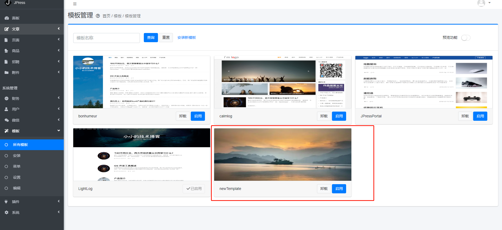

# 模板开发

在开发JPress模板之前，先做好JPress的环境搭建，前端开发人员建议用 Docker 的方式，可以免除 Java 等环境的安装和配置。

通过 Docker 安装 JPress 请参考：[《Docker下安装启动JPress》](/manual/install_docker.md)，其他请参考：
- [《Windows下安装启动JPress(tomcat部署)》](/manual/windows-tomcat-deploy.md)
- [《Windows下安装启动JPress(undertow部署)》](/manual/windows_undertow_deploy.md)
- [《Linux下安装启动JPress(tomcat部署)》](/manual/linux-tomcat-deploy.md)
- [《Linux下安装启动JPress(undertow部署)》](/manual/linux_undertow_deploy.md)
- [《宝塔下安装启动JPress》](/manual/ces_bt_config.md)

## 模板的组成

**想要开发一套模板 那么肯定需要对模板的组成有一定的了解**

一个完整的模板，文件内容如下：

```
newtemplate
├── index.html
├── screenshot.png
└── template.properties
```

其中 `index.html` 、 `screenshot.png` 、`template.properties` 是模板的必须文件，一个模板最少由这三个文件组成。如下所示：

> 更多文件请参考: [模板的目录结构](template_directory.md)

- index.html : 网站首页的模板
- screenshot.png : 后台的模板缩略图
- template.properties 模板的配置信息

::: tip 提示
当我们开始开发一个新的模板的时候，可以先用这三个文件，打包成 zip 包之后，通过 JPress 后台进行上传安装，看一下效果。

或者可以把 `NewTemplate` 文件夹直接复制到 JPress 的 `templates` 目录下也等同于安装。
:::

模板的配置文件 `template.properties` 内容如下

```
id = cn.jeanstudio.bluelight
title = BlueLight
description = BlueLight是JeanStudio工作室为JPress设计的官网模板
author = jeanStudio
authorWebsite = http://www.jeanstudio.cn
version = 1.0
versionCode = 1
updateUrl =
screenshot = screenshot.png
```

* id ：模板ID，全网唯一，建议用 `域名+名称` 的命名方式
* title ：模板名称
* description ：模板简介
* author ：模板作者
* authorWebsite ：模板作者的官网
* version ：版本（不添加默认为1.0.0）
* versionCode ：版本号（只能是数字，不填写默认为1）
* screenshot ：此模板的缩略图图片（不填写默认为：screenshot.png）

> 当至少我们拥有这三个文件之后 重启我们的程序 那么新的模板 就会出现在后台模板中


