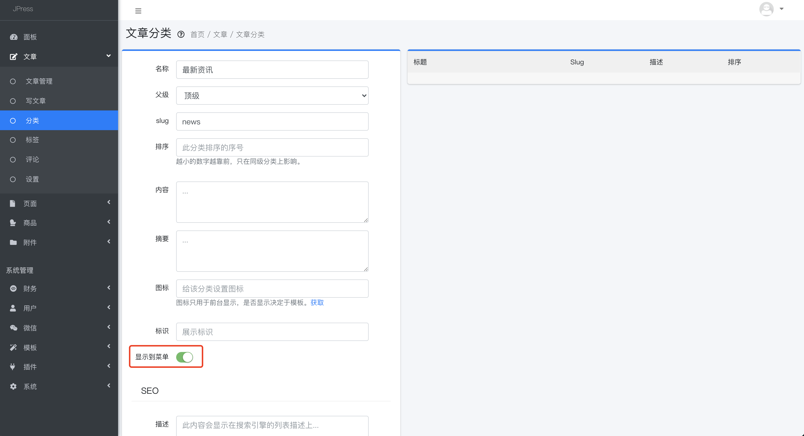
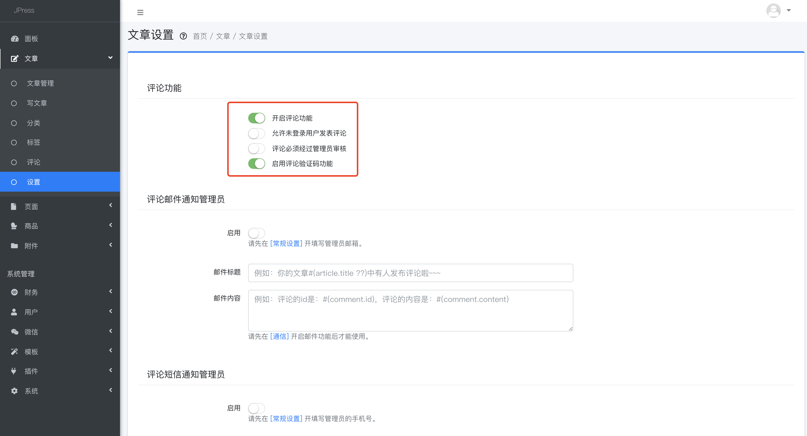
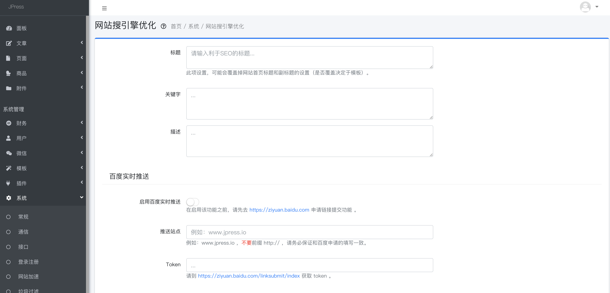
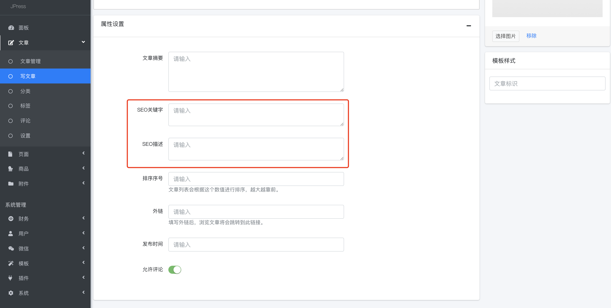

# 常见问题

## 如何配置导航（菜单）？

### 有2种方式添加：
1.  > 模板 > 菜单

在这里设置菜单名称、要跳到的URL地址、是一级还是二级菜单、在导航上的排序、以及菜单前面的图标，
还有点击是否打开新页面。

其中的URL是一篇文章、一个分类的链接、一个页面的链接，所以填写之前，要提前发布一篇文章或者建好一个分类；

图标的设置需要模板的支持，模板支持图标，方可设置，否则设置无效；

如果对添加完成的菜单进行编辑，删除等操作，只需要将鼠标移到右侧菜单上即可显示对应操作文字。

2.  > 文章 > 分类

新建分类，slug是自定义的，是显示在网址的后缀，建议尽量用拼音或者英文。

然后将【显示到菜单】的开关打开，这个分类就会显示在导航上了。

## 菜单和分类的区别？

菜单指的是网站的导航，导航可以连接到一篇文章，一个页面，或者一个分类等；

分类是指某一类型文章的集合，可以选择是否将这个分类放到导航上；

## 如何开启/关闭评论功能？
 > 文章 > 设置
 
 如果模板支持评论功能，那么可以在这里控制开启/关闭评论功能、是否允许未登录客户发表评论、
 评论是直接显示在页面上，还要经过管理员的审核才能显示、以及评论的时候是否开启验证码。
 

## 当有用户评论能否邮件或者短信通知管理员？
## JPress如何配置SEO相关？
JPress目前对SEO方面的支持已经相当友好，我们从以下几个方面看看
1. > 系统 > 搜索优化

可以在这里设置SEO需要的标题、关键字、描述；

除了搜索引擎的被动抓取，这里还可以主动将网站信息推送到百度，Google，以及开启网站地图功能，让搜索引擎更好的抓取；

另外，网站也可以设置伪静态，对搜索引擎更友好。

除此之外，当新建文章、新建分类、新建页面时，可以对当前文章、分类、页面做针对性的SEO关键字和描述设置：

## 如何配置单页面，比如关于我们，招聘页面，或者营销落地页？
## 文章元信息功能如何使用？
## 发表文章的时候，想添加作者，付款二维码等选项怎么办？
## 支持分销功能吗？如何设置？
## 是否支持给所有图片打水印？
## 如何给某些用户发送优惠券？
## JPress支持哪些收款方式？
## 当有客户付款的时候，是否可以收到通知？
## 如何给会员加特殊标识？
## 文章是否可以只给会员展示？
## 如何通过JPress来配置公众号？
## 如何安装/卸载模板和插件？
## 如何进行模板设置？
## 如何对模板进行二次开发？
## 如何将WordPress文章导入到JPress？
## 如何将微信公众号的文章导入到JPress？
## 如何将Hexo / Jekyll / Markdown文章导入到JPress？
## 如何对用户发的垃圾关键字过滤？
## 如何支持关注公众号登录网站的功能？
## JPress为公众号涨粉？

> 阿斯顿发生两地分居

常见有3 中方式

1. aaa
1.  aaa
1. aaa

