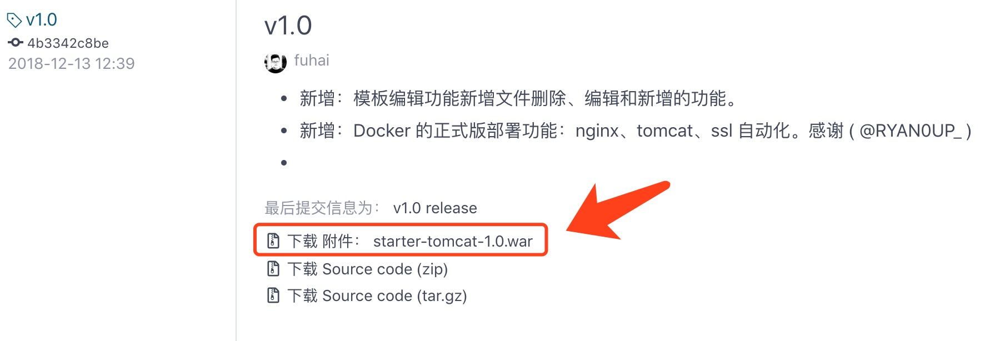
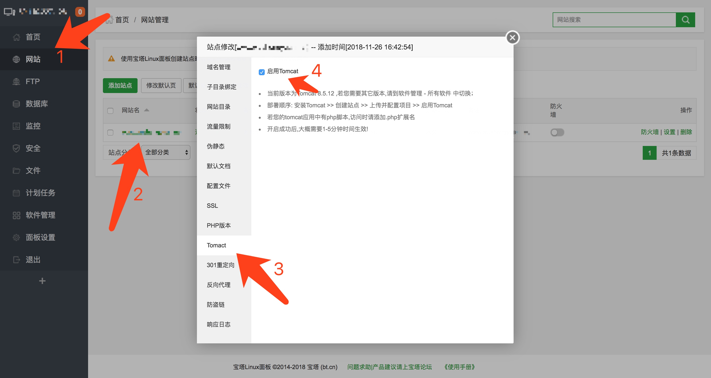

# JPress 安装

## 目录
- 下载 JPress
- 通过 Docker 进行安装
- 通过 宝塔 进行安装
- 手动进行安装
- 安装过程注意事项
- JPress的配置简介
- 常见问题

## 下载JPress

- 下载源码
- 下载tomcat压缩包
- 下载运行包

**注意：** 若您通过 Docker 运行JPress，则无需下载，通过 Docker 的相关命令可以直接安装，详细请查看《通过 Docker 进行安装》章节。

#### 下载源码

通过git命令下载

```
git clone https://gitee.com/fuhai/jpress.git
```
下载完成后，你需要通过 maven 进行编译才能使用，maven编译命令：

```
mvn clean install
```

执行该命令，稍等片刻，待命令执行完毕后，会在 `starter/target` 目录下生成一个 `starter-2.0` 的文件夹和 `starter-2.0.zip` 的压缩包，通过执行 `starter-2.0` 里的 `jpress.sh` 可以直接运行 JPress。

倘若在执行maven编译的过程中出错，请对maven进行如下配置：
 
 * maven版本建议用3.0 以上，2.x没有测试过
 * java版本1.8
 * maven注意添加aliyun的源，修改 `maven/conf/setting.xml`文件，找到 mirrors 节点 ，修改如下：

 ```xml
<mirrors>
        <mirror>  
              <id>alimaven</id>  
              <name>aliyun maven</name>  
              <url>http://maven.aliyun.com/nexus/content/groups/public/</url>  
              <mirrorOf>central</mirrorOf>  
        </mirror>
</mirrors>

 ```

#### 下载tomcat压缩包
进入 Gitee 的 JPress 发行页面进行下载

>链接地址： https://gitee.com/fuhai/jpress/releases

在每个版本的发行下方，会有对应版本的下载链接，点击即可下载，如下图所示：



## 通过 Docker 安装 JPress

通过 Docker 进行安装 JPress , 需要提前在本地安装好 Docker。

#### Docker 的安装


* [Mac](https://docs.docker.com/docker-for-mac/install)
* [Windows](https://docs.docker.com/docker-for-windows/install)
* [Ubuntu](https://docs.docker.com/install/linux/docker-ce/ubuntu)
* [Debian](https://docs.docker.com/install/linux/docker-ce/debian)
* [CentOS](https://docs.docker.com/install/linux/docker-ce/centos)
* [Fedora](https://docs.docker.com/install/linux/docker-ce/fedora)
* [其他 Linux 发行版](https://docs.docker.com/install/linux/docker-ce/binaries)

通过以上链接，下载 docker 并安装完毕后，就可以开始安装 JPress 了。

#### 在 Linux 上安装 JPress :

```
wget https://gitee.com/fuhai/jpress/raw/master/docker-compose.yml
docker-compose up -d
```

#### 在 Mac OS（苹果电脑）上安装 JPress :

```
curl -O https://gitee.com/fuhai/jpress/raw/master/docker-compose.yml
docker-compose up -d
```

执行完毕以上命令之后，访问 `http://127.0.0.1:8080` 即可。


## 通过 宝塔 进行安装 JPress

宝塔是一个优秀的可视化服务器管理工具，提供了web操作面板，方便我们通过宝塔的web面板对服务器进行管理，例如

1、数据库安装、账号密码管理和数据管理
2、FTP账号的管理
3、各种服务器软件的安装，php、tomcat、nginx等
4、文件管理

宝塔的官网网站： http://wwww.bt.cn

通过宝塔进行安装 JPress，大概分为以下几个步骤：

1、购买服务器并安装宝塔
2、通过宝塔的后台面板安装nginx、Mysql和tomcat。
3、创建网站，并启用tomcat功能
4、上传JPress的war包，并解压缩
5、访问网站，走jpress自动安装过程

#### 1、购买服务器并安装宝塔
购买服务器建议购买阿里云的 centos 7.4 以上 ，里面不要安装其他任何功能（笔者在centos 7.2 下安装宝塔，nginx是无法使用的，centos 7.4 没问题）

安装宝塔非常简单，用 root 账号进入Linux服务，然后执行如下命令即可自动安装宝塔：

```
yum install -y wget && wget -O install.sh http://
download.bt.cn/install/install_6.0.sh && bash install.sh
```

需要注意的是：安装的过程中控制台会打印安装的过程，在安装完成后，控制台会输出宝塔的登陆地址、账号和密码。

重要事情说三遍：

>登陆地址、账号和密码，这部分务必要记住。
>登陆地址、账号和密码，这部分务必要记住。
>登陆地址、账号和密码，这部分务必要记住。


#### 2、通过宝塔的后台，安装nginx、mysql和tomcat

可以在宝塔的后台，通过 `软件管理 > 运行环境` 可以找到 nginx、mysql 和 tomcat。

点击安装即可。

需要注意的是各个软件的版本号：

* nginx ： 1.14
* tomcat ： 8.5
* mysql ： 5.6

#### 3、创建网站

在宝塔后台，通 `网站 > 添加网站` 创建一个新的网站。

创建网站的时候需要注意的是，创建mysql数据库的时候，版本要选择 `utf8mb4` 编码。

在宝塔后台的 `网站` 里，点击网站域名，在 `tomcat` 菜单里，启用 tomcat 功能。


#### 4、上传war，并解压缩

在宝塔后台的 `网站` 里，点击根目录对应的目录链接，然后上传 jpress.war 到此目录。


因为宝塔无法对 .war 这种文件格式解压缩，所以需要重命名为 jpress.zip ，当然也可以在本地先把 jpress.war 先重命名为 jpress.zip 然后再上传也可以。

操作完成后，点击 jpress.zip 的解压缩即可。

#### 5、访问网站走jpress自动安装过程

访问你的域名，JPress自动引导进行安装，在JPress安装向导的过程中，只需要填写宝塔创建完毕的数据库账号和密码即可。

## 手动进行安装
