## 宝塔下载安装

宝塔下载地址[https://www.bt.cn/new/index.html](https://www.bt.cn/new/index.html)

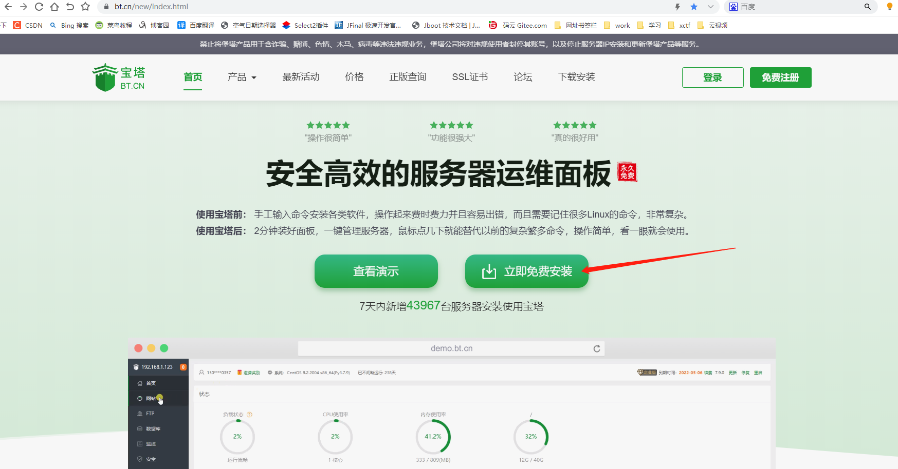

1. Linux 虚拟机创建

    1.1 打开VMware，选择创建新的虚拟机

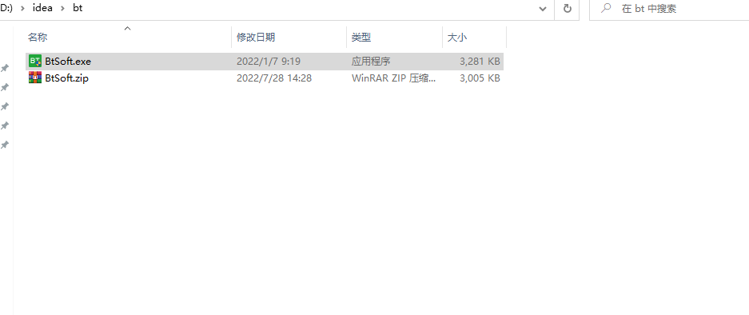

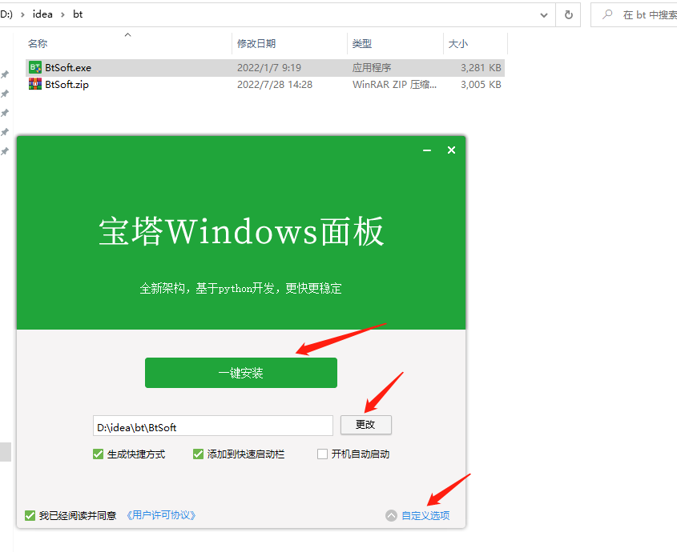

    选择自己下载的centos镜像

    自定义用户名和密码

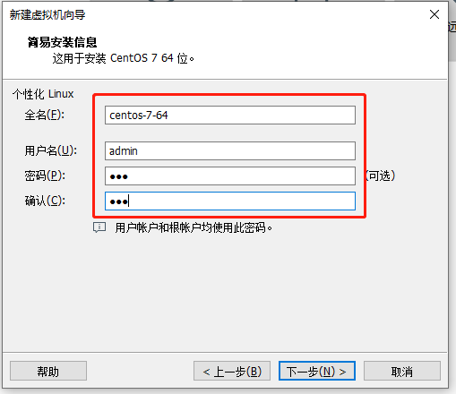

    处理器配置

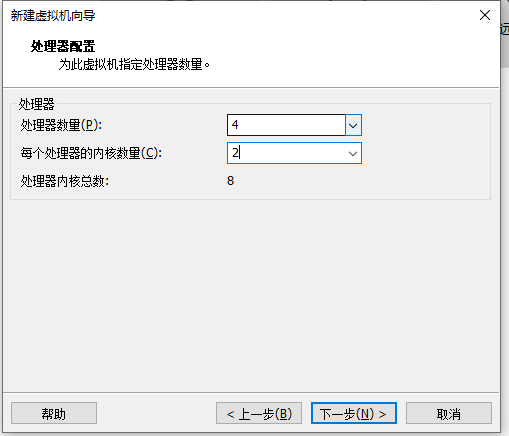

    指定虚拟机的内存

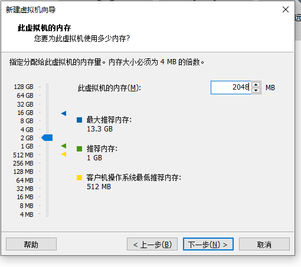

    网络类型：默认使用网络地址转换；
    SCSI控制器：默认LSI Logic(L) ；
    虚拟磁盘类型：默认SCSI(S)；
    磁盘：默认选择创建新的磁盘 。

    指定磁盘容量
    
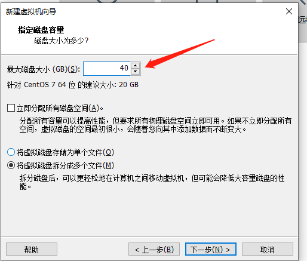

    磁盘文件，默认即可。
    

    自定义硬件

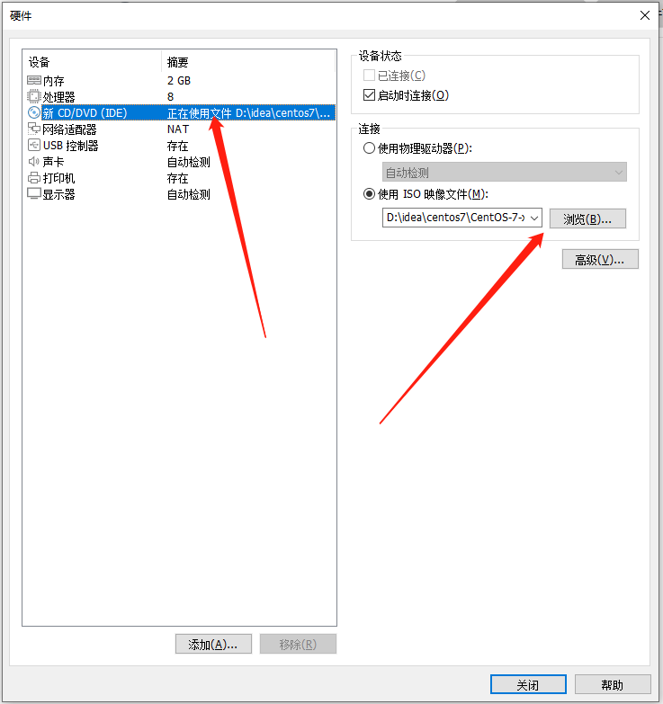

    最后点击完成；创建完毕；
    进入虚拟机页面，因为你添加得有centos7镜像，要等待其安装完毕。

    centos7镜像安装完毕，进入用户登录页面

    输入设置的密码,点击登录

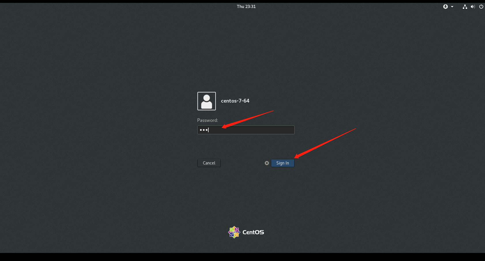

    进入虚拟机页面

    1.2 虚拟机语言设置（更换为中文）

    点击左上角Applications->System Tools -> Setting

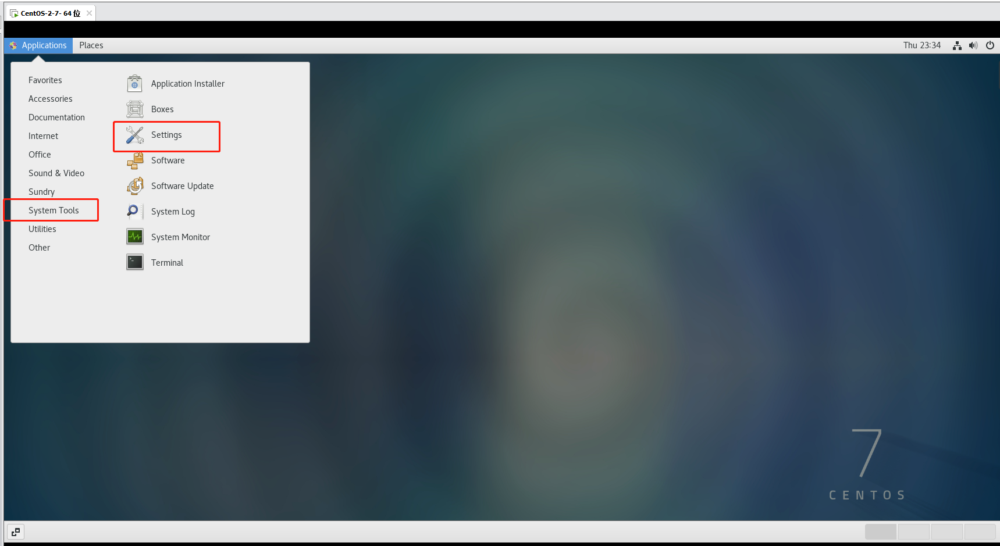

    选择Region & Language

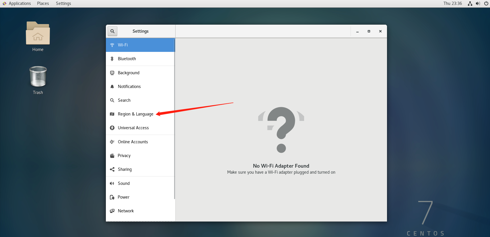

    点击Language那一栏进行语言设置

    选择 汉语（中国），再点击 Done

    再点击Restart 进行重置
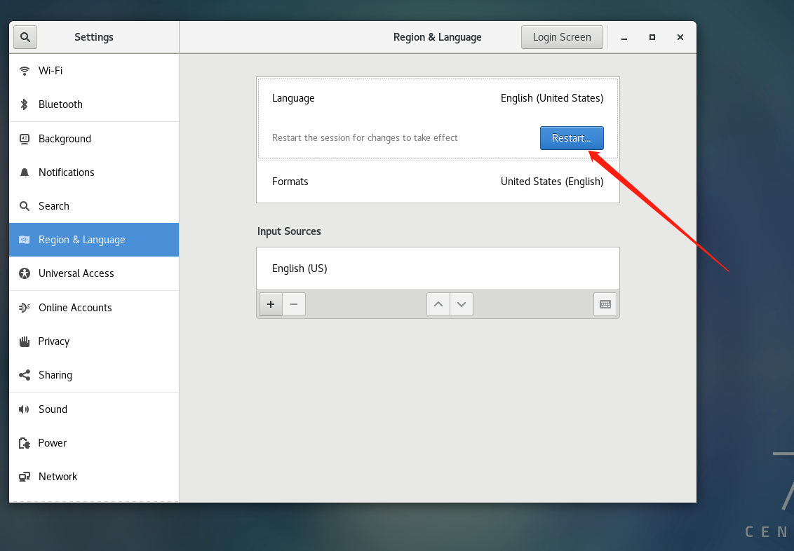

    点击Log Out，然后重新登录

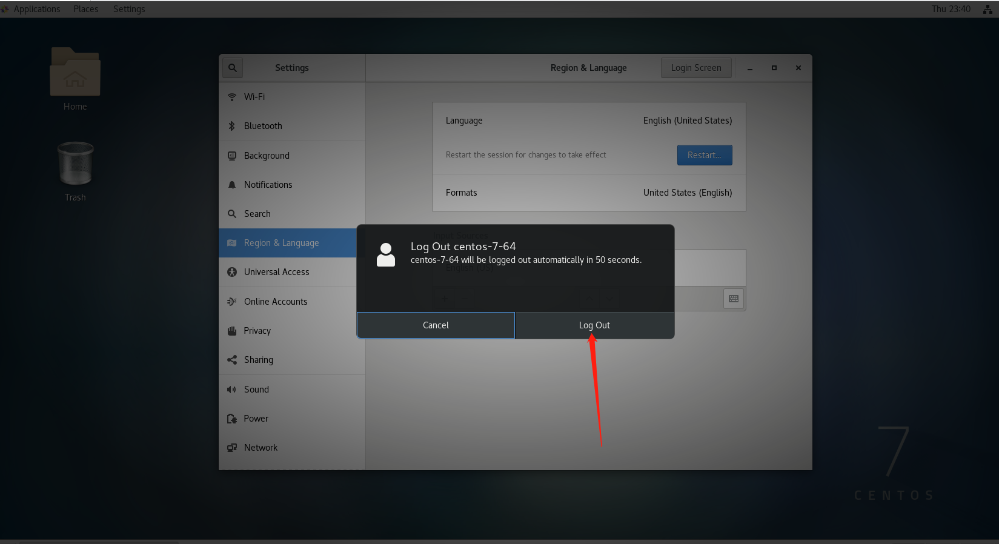

    语言设置完成，重新登录

    1.3 操作虚拟机

    鼠标放在虚拟机页面，单击鼠标右键，选择 打开终端

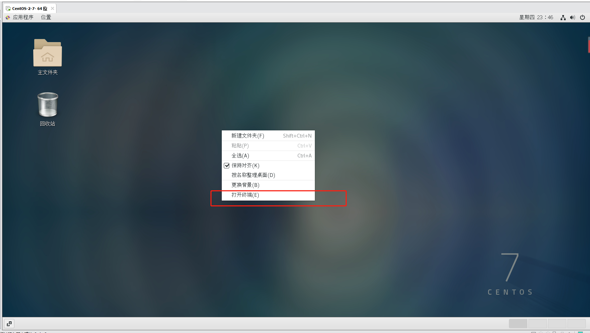

    进入终端页面

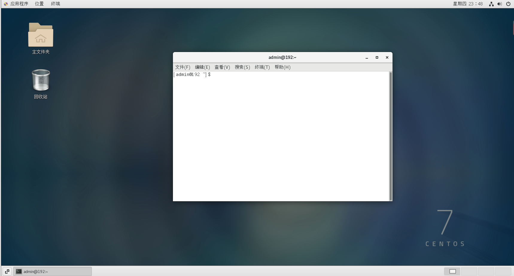

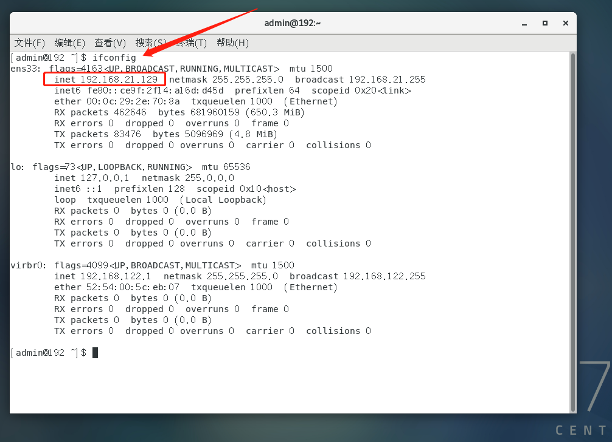