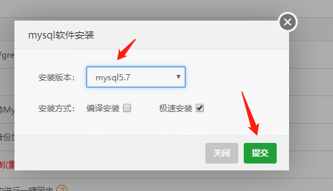
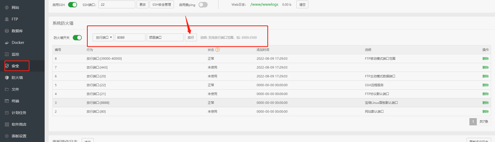
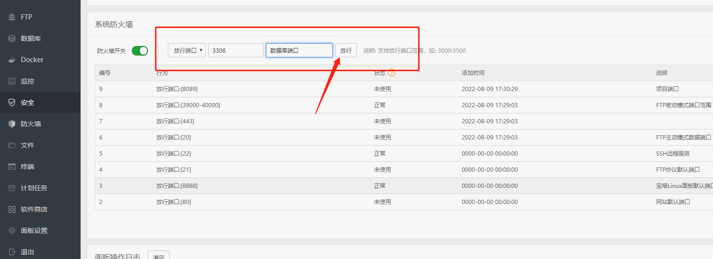
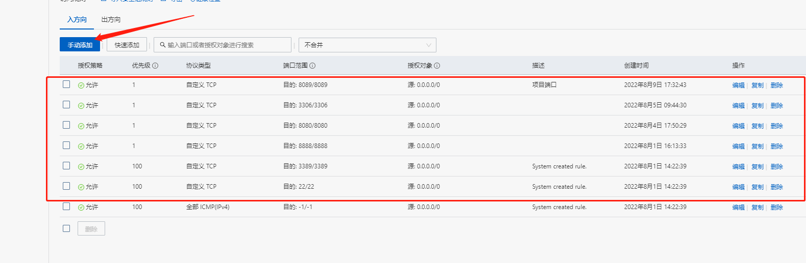
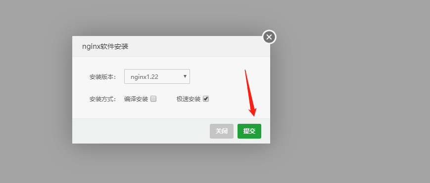
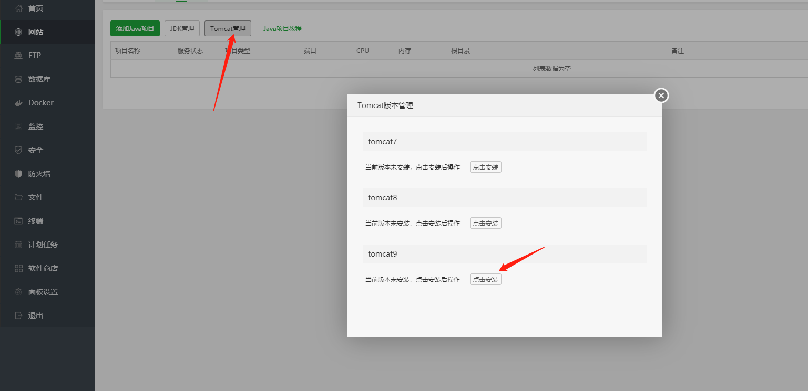
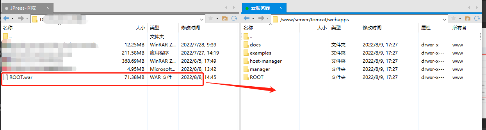
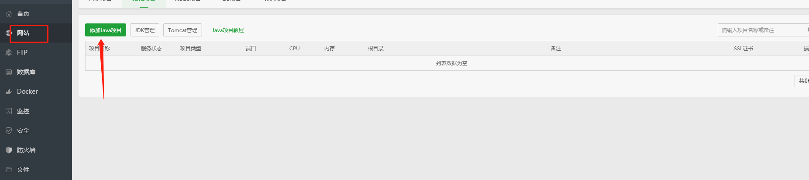
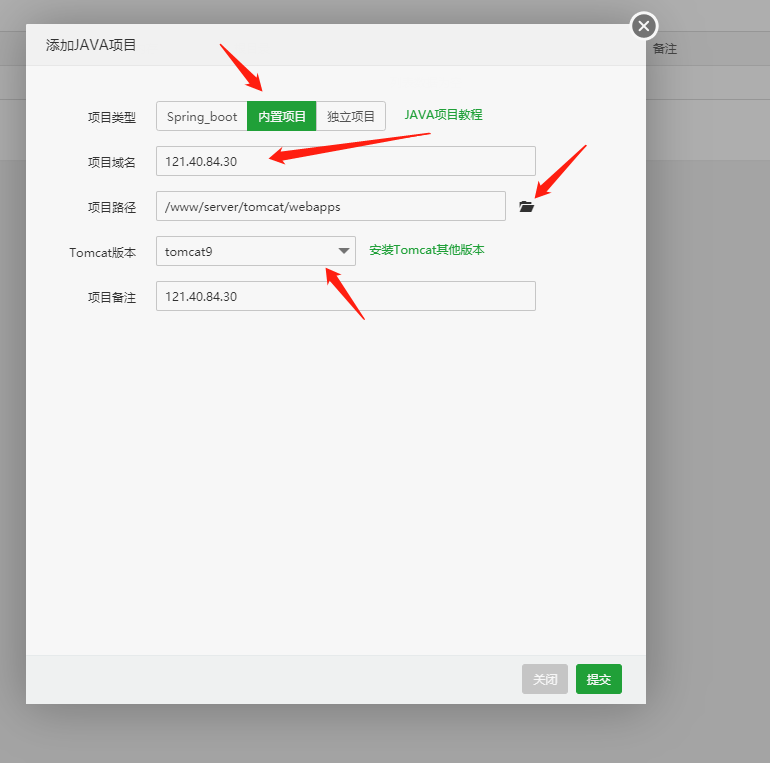

# 云服务器安装宝塔

## 1、安装宝塔
    
    1.1 输入云服务器安装指令
        yum install -y wget && wget -O install.sh http://download.bt.cn/install/install_6.0.sh && sh install.sh

    1.2 安装完毕

    
## 2、配置登录
    2.1 配置云服务器放行 8888 端口
        打开云服务器 ECS 控制台
        如下图所示：

    2.2 选择安全组，点击配置规则
        如下图所示：

    2.3 点击手动添加；
        输入：目的和源，点击保存；
        如下图所示：

    2.4 测试是否放行成功 
        输入外网地址，登录宝塔面板
        如下图所示：

    2.5 登录成功，安装配置完毕。

## 3、宝塔部署项目

    3.1 登录宝塔面板的主界面，不推荐使用一键安装，如下图所示：

    3.2 安装数据库，选择 mysql5.7 版本，如下图所示：

    安装完成会在消息盒子中显示，如下图所示：

    3.3 宝塔放行端口，如下图所示：

    3.4 云服务器有要放行端口，如下图所示：

    3.5 安装 Nginx

    3.6 点击 tomcat 管理，安装 tomcat9，如下图所示：

     安装完成，如下图所示：

    3.7 项目的 war 包，通过 xftp 上传到云服务器
        找到宝塔安装的 tomcat 目录，把 war 包放在 webapps 文件夹下，
        修改 war 包的名称为 ROOT.war，注意 ROOT 是大写，如下图所示：

    3.8 在宝塔中添加 Java 项目

    3.9 选择内置项目
        输入域名，找到 war 包所在目录，如下图所示：

