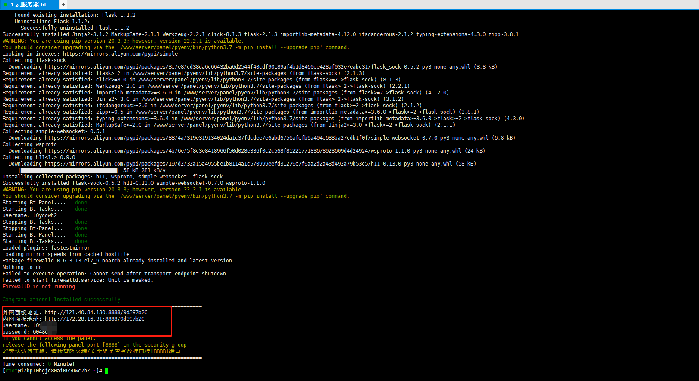
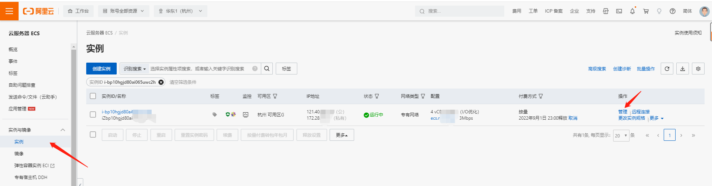
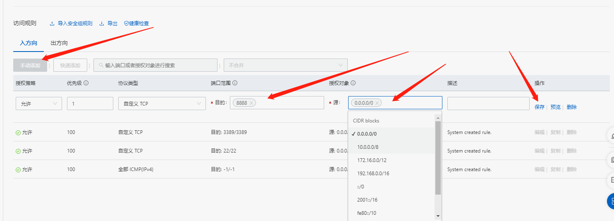
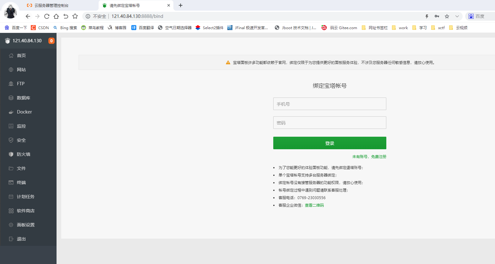

# 云服务器安装宝塔

## 1、安装宝塔
    
    1.1 输入云服务器安装指令
        yum install -y wget && wget -O install.sh http://download.bt.cn/install/install_6.0.sh && sh install.sh

    1.2 安装完毕

    
## 2 配置登录
    2.1 配置云服务器放行 8888 端口
        打开云服务器 ECS 控制台
        如下图所示：

    2.2 选择安全组，点击配置规则
        如下图所示：

    2.3 点击手动添加；
        输入：目的和源，点击保存；
        如下图所示：

    2.4 测试是否放行成功 
        输入外网地址，登录宝塔面板
        如下图所示：

    2.5 登录成功，安装配置完毕。

