# Linux 上 Tomcat 部署项目

## 1、Linux 下载安装，xShell 和 xftp 下载安装（略）

官网地址：[https://www.xshell.com/zh/free-for-home-school/](https://www.xshell.com/zh/free-for-home-school/)

## 2、xftp 连接云服务器

    2.1 Xftp新建连接 

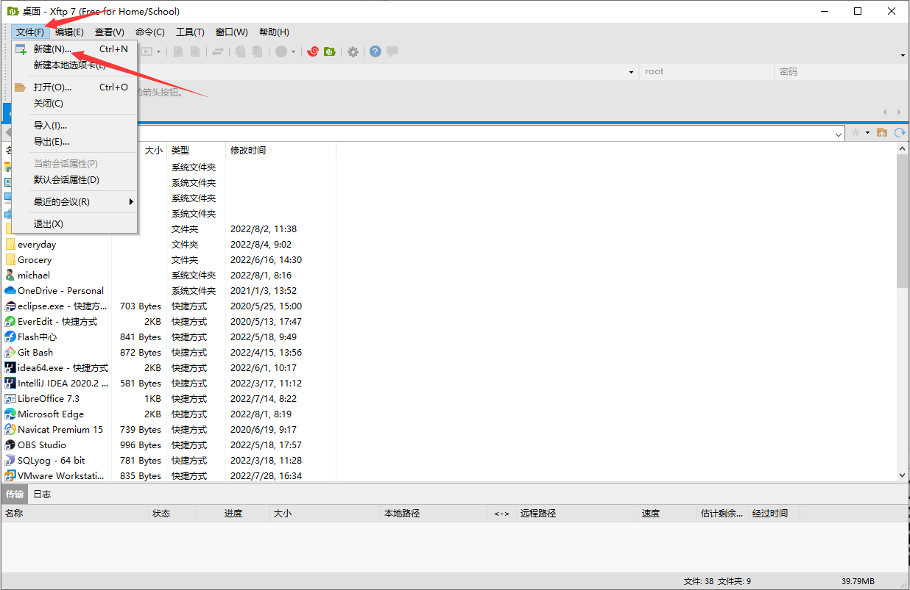
    
    2.2 连接会话属性
    名称：自定义
    主机：云服务器公网IP

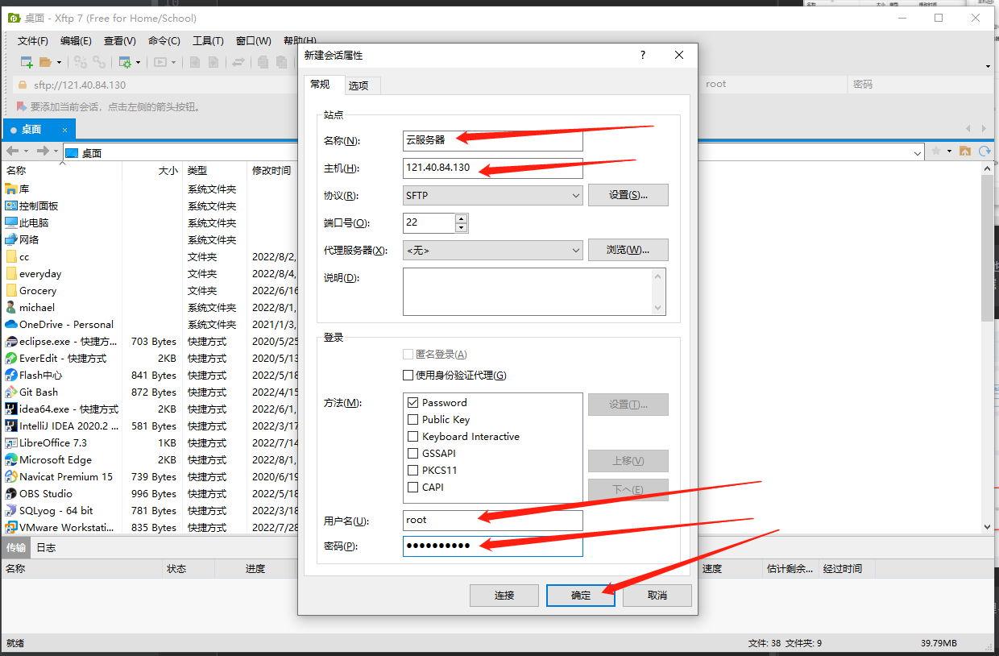

    上图中的用户名和密码，在两种地方可以设置
    (1)更换操作系统时，如下图所属：

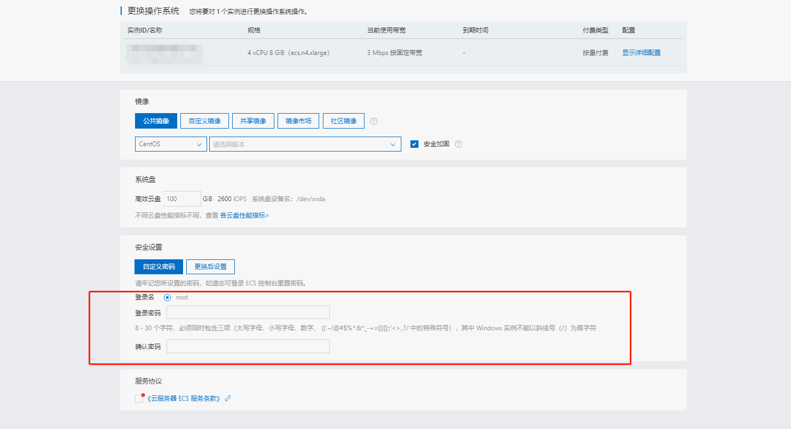

    (2)对云服务器的实例操作：管理-->重置实例密码
    如下图所示：

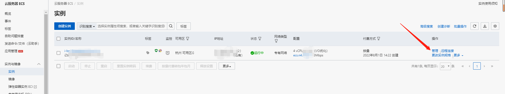

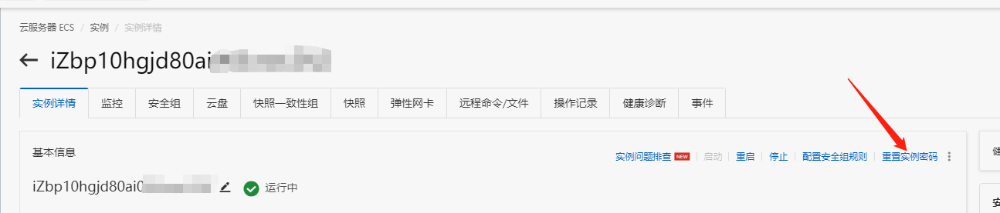

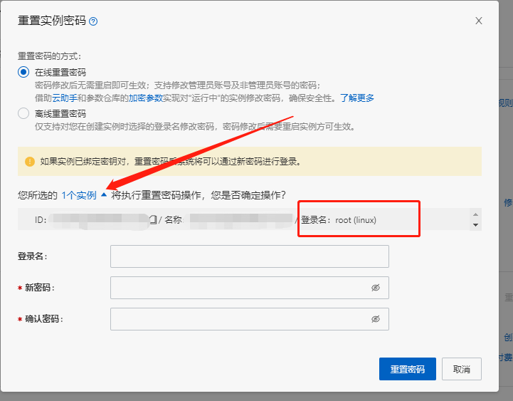

    (3)数据填写完毕，最后点击确定，弹出会话列表
    选择你添加的会话，点击连接，如下图所示：

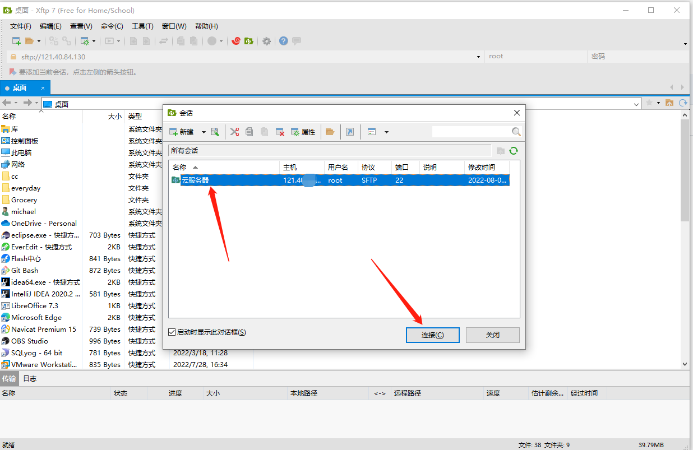

    连接成功

## 3、JDK 压缩包下载

    3.1 以 jdk 1.8 为例

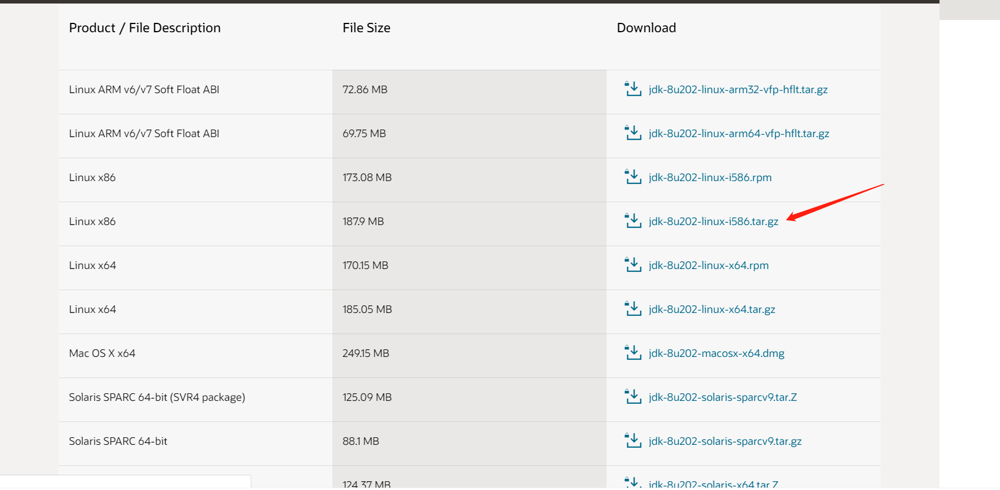

    3.2 在xftp 界面找到 Windows 桌面下载好的 jdk 压缩包，
        把 jdk 压缩包拖动到云服务器界面，直接鼠标选中文件拖动即可
        如下图所示：

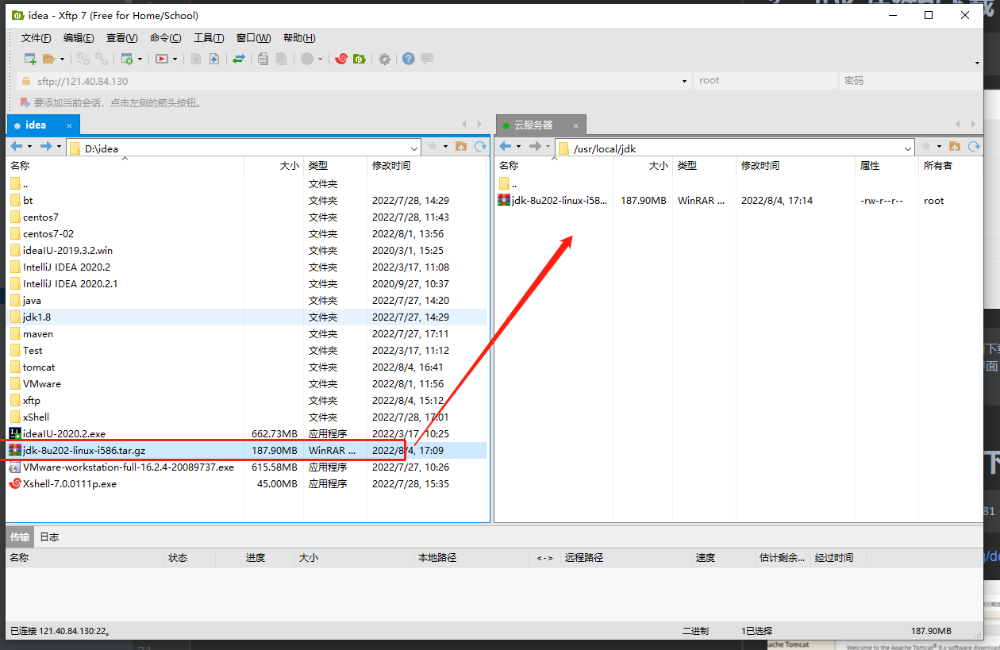

    3.3 xShell 连接云服务器
        输入指令：tar -xvf jdk-8u202-linux-i586.tar.gz 解压 jdk 压缩包

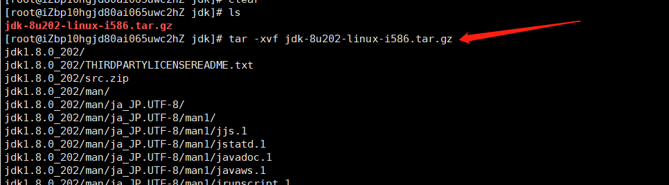

    3.4 检查 jdk 是否安装成功
        输入指令：java -version

    3.5 配置jdk环境
    输入指令：vim /etc/profile，进入编辑页面，输入 i 开始编辑

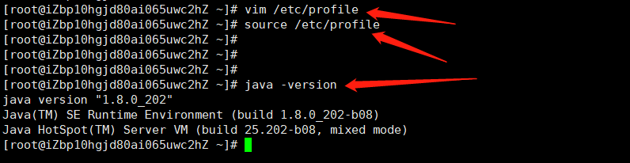

    在最后一行加上环境：
    #set java enviroment
    JAVA_HOME=/usr/local/jdk/jdk1.8 
    CLASSPATH=.:$JAVA_HOME/lib.tools.jar
    PATH=$JAVA_HOME/bin:$PATH
    export JAVA_HOME CLASSPATH PATH
    
    JAVA_HOME= jdk 的安装路径
    编辑完毕，按下键盘的 Esc 退出编辑模式，再输入 ：wq 保存并退出
    如下图所示：

## 4、Tomcat 压缩包下载

    4.1 tomcat 下载，以 tomcat-8.5.81 为例
下载地址[https://tomcat.apache.org/download-80.cgi](https://tomcat.apache.org/download-80.cgi)

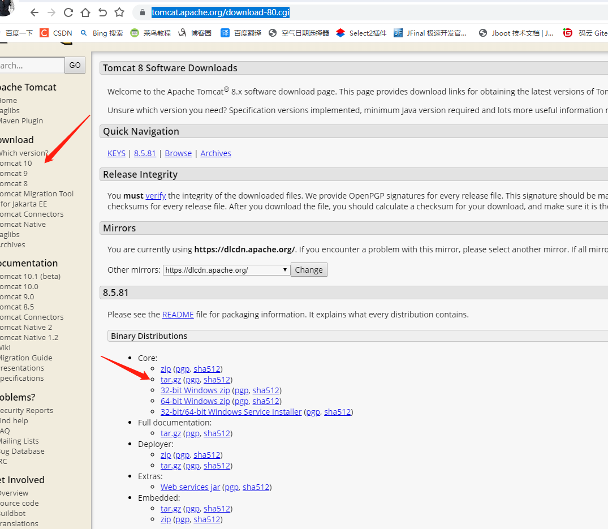

    4.2 在 xftp 界面找到 Windows 桌面下载好的 tomcat 压缩包，
        把 tomcat 压缩包拖动到云服务器界面，直接鼠标选中文件拖动即可
        如下图所示：    

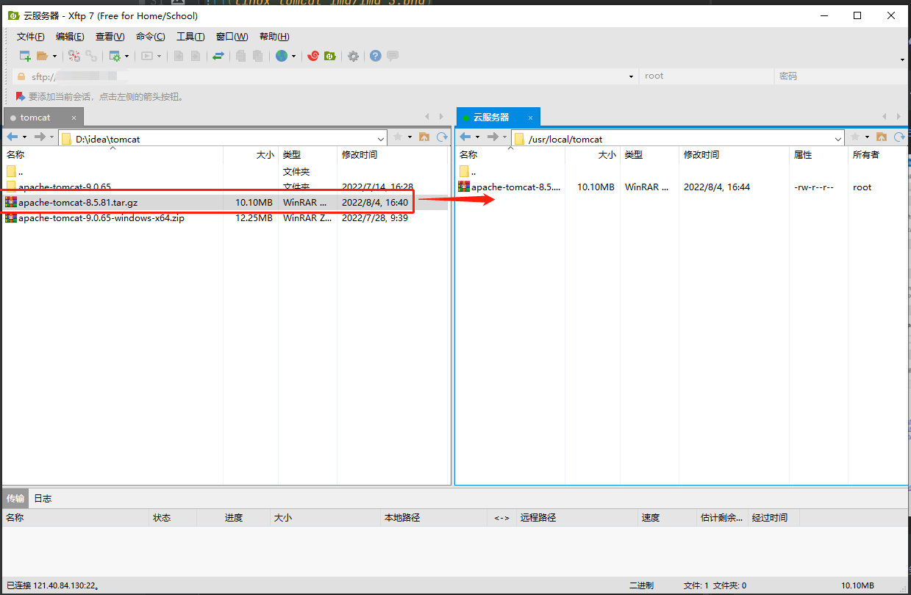

    4.3 xShell 连接云服务器
        输入指令：tar -xvf apache-tomcat-8.5.81.tar.gz 解压 tomcat 压缩包

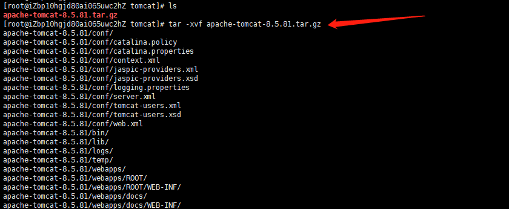

    4.4 开放 8080 端口
    

    4.5 启动tomcat，进入 tomcat 的 bin 目录，并启动tomcat
        输入指令： ./startup.sh

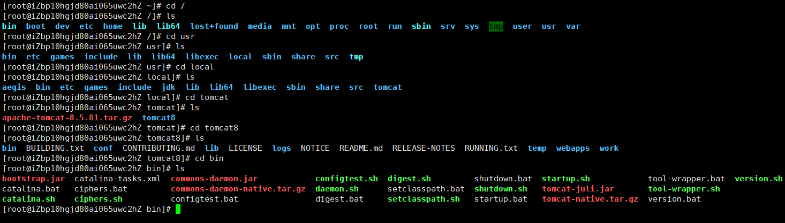

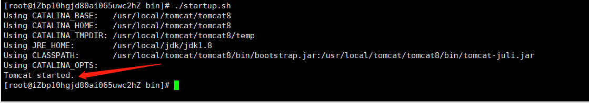

    4.6 测试是否启动成功，在浏览器中输入：云服务器公网IP:8080
        如下图所示：

