##centos 下载地址：

可以去官网下载最新版本：https://www.centos.org/download/

###1.下载centos

    1.1 进入下载页面，选择x86 64

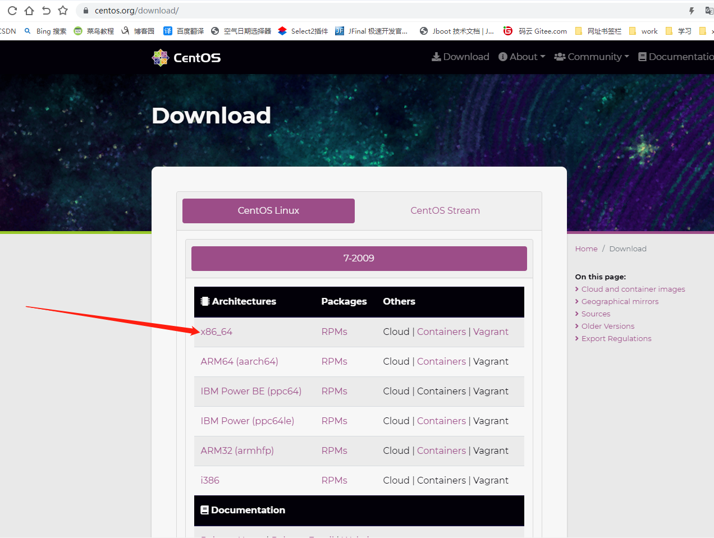

    1.2 根据需要选择，此处以aliyun镜像示例

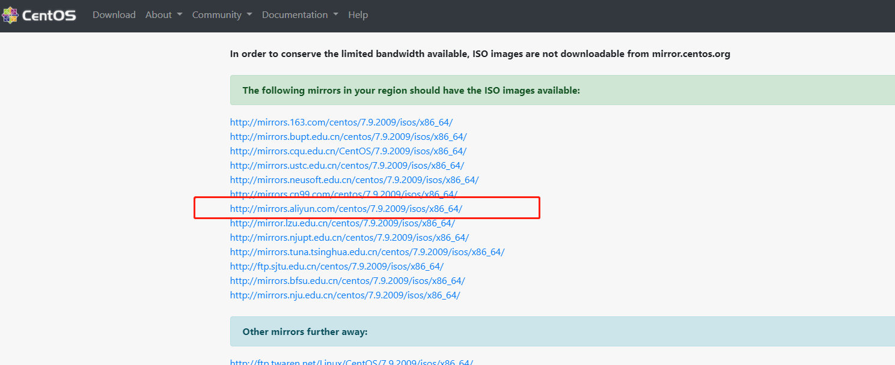

    文件过大，下载时间长

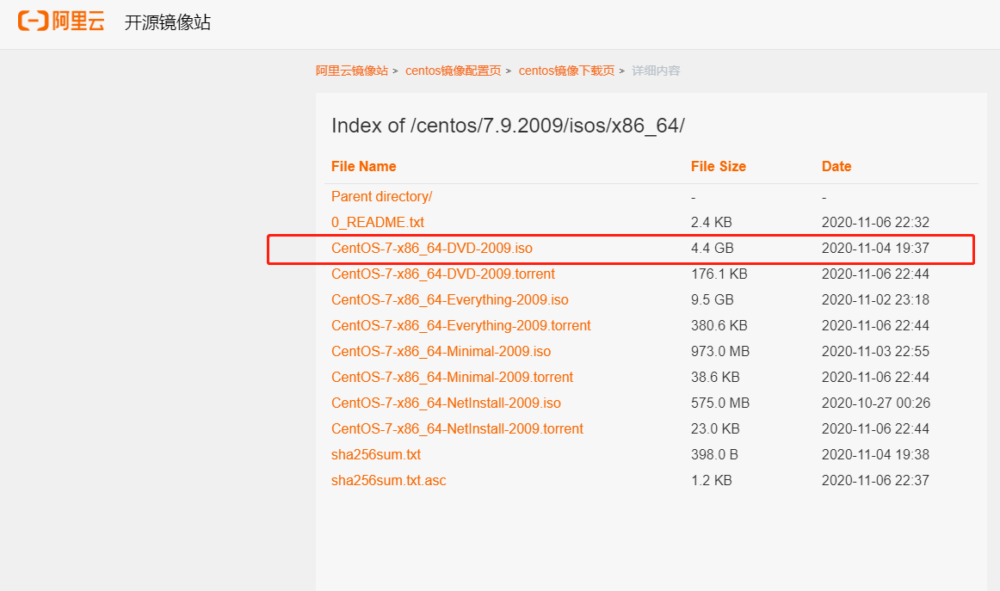

    镜像下载完毕

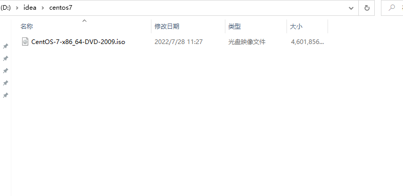

###2 下载VMware 

官网下载地址[https://www.vmware.com/cn/products/workstation-pro.html](https://www.vmware.com/cn/products/workstation-pro.html)

    2.1 选择Workstation Pro，
        点击进入下载页面

    2.2 此处选择试用版为示例

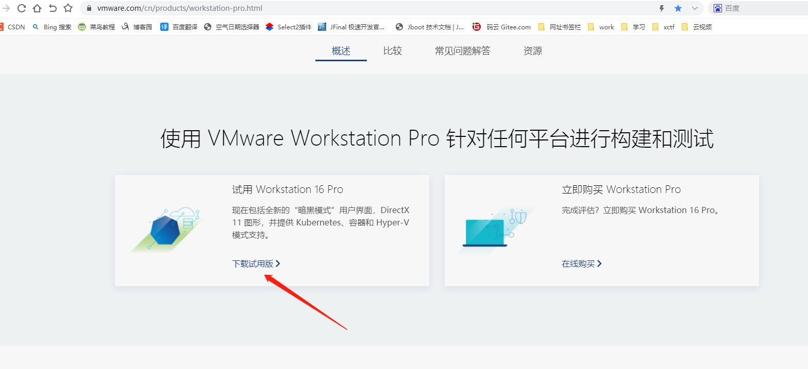

    2.3 打开下载好的 .exe 文件， 即可开始安装
        安装位置默认在 C 盘下，也可以自定义安装路径，安装路径尽量不要有中文
        安装时一路next即可。

    2.4 安装成功后
        若你是购买的，点击 许可证 输入密钥激活软件

        安装后可能要求重启系统，重启后进入软件。依次点击导航栏中的 帮助 -> 关于 VMware Workstation ，查看许可证信息的状态，如下图所示即为激活成功。

        试用版直接点击完成即可
        打开VMware，创建新的虚拟机，
        注：以下皆为示例内容，实际看自身需求

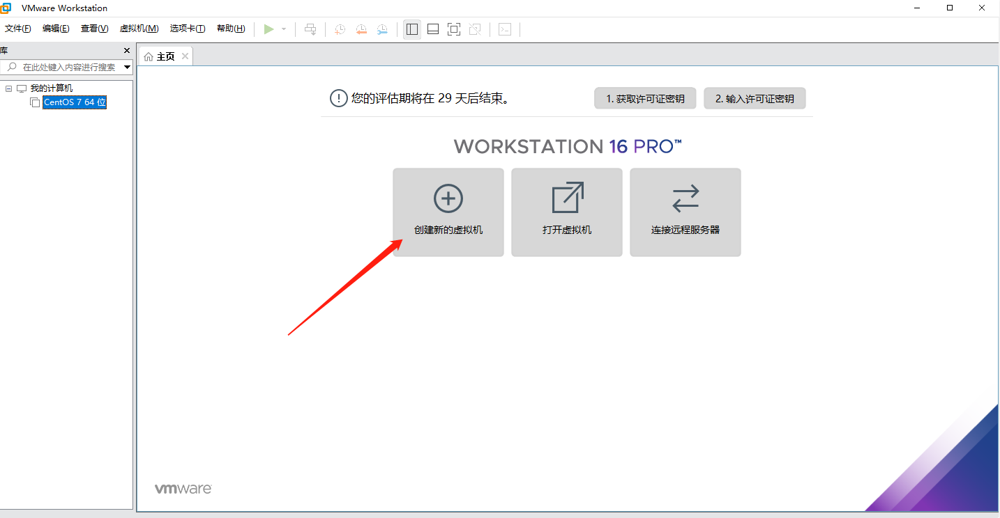

    2.5 选择自定义

    2.6 选择下载的CentOS 7镜像

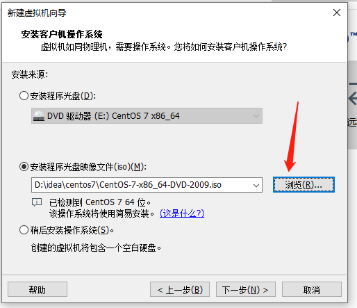
    
    继续点击下一步，会弹出下图所示内容

    点击下一步，可以自定义位置

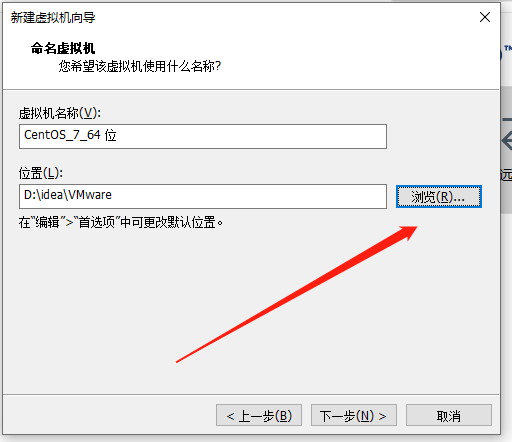

    点击下一步，配置处理器数量，和核心数分配根据自己电脑来配，
    重点是：内核数不要超过自己电脑内核数。

    点击下一步，进行内存分配（默认为1024MB），分配大小为2GB，即2048MB

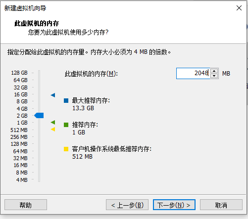

    下面几步默认即可
    （网络类型：默认使用网络地址转换；SCSI控制器：默认LSI Logic(L) ；虚拟磁盘类型：默认SCSI(S)；磁盘：默认选择创建新的磁盘 ）
    为磁盘分配大小    

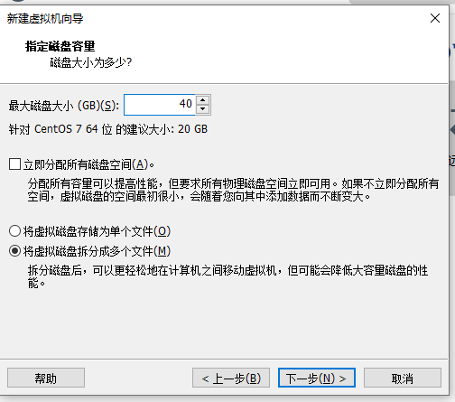

    下一步“指定磁盘”文件默认即可，到自定义硬件，

    最后点击完成，即会生成新的虚拟机，正在安装CentOS 7 64位，如下图所示：

    CentOS 7 64位安装完成，点击中间用户就可以进行登录操作了

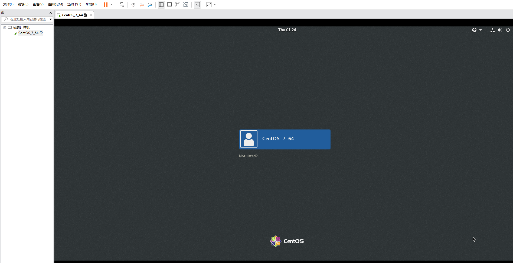

