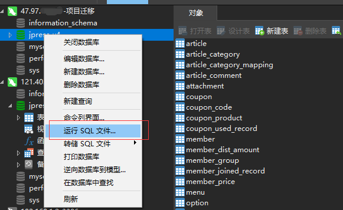

# 项目迁移

## 1、云服务器 CentOS 7 上 undertow 部署的项目迁移到另一台云服务器

    1.1 两台服务器的运行环境相同

    1.2 打包要迁移的云服务器上的 JPress 项目
        输入指令：zip -r start-v4.0.zip starter-4.0
        start-v4.0 ：自定义打包名称
        starter-4.0 ：要打包的文件
        如下图所示 ：

    1.3 数据备份

    1.4 数据迁移
        连接新的服务器，并创建数据库，数据库名称要和旧的相同
        运行SQL文件，选择你备份的 .sql 文件
        如下图所示：

    1.5 上一台服务器配置的后台运行，不用重新配置，启动项目

    1.6 迁移成功

