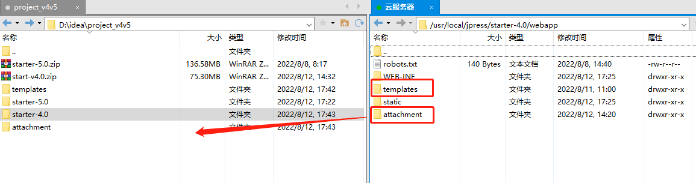
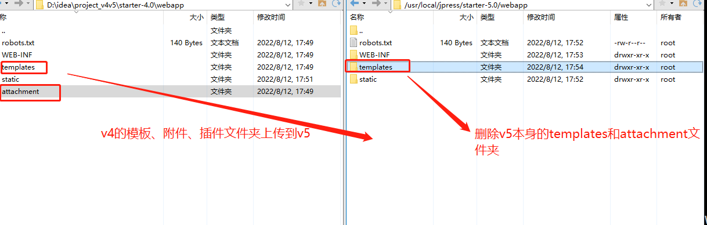
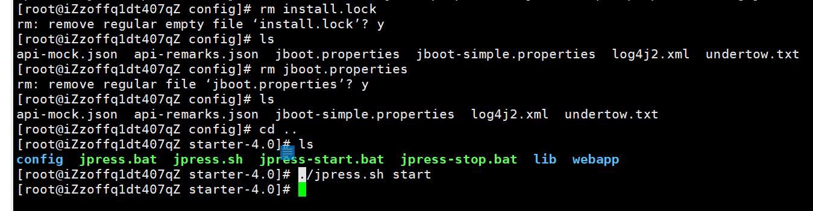
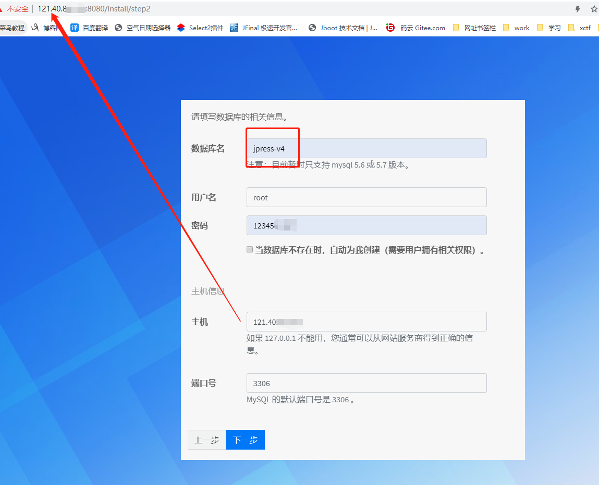

# 项目升级

## 云服务器上的 JPress 项目从版本 v4 升级到 v5

    1.1 数据库数据备份

    1.2 停止项目

    1.3 找到项目的 webapp 下的模板、附件、插件的文件夹，
        保留备份到本地，把 v5 的项目包上传到云服务器
        如下图所示：

        把 v4 的模板、附件、插件的文件夹上传到 v5

    1.6 启动项目

    1.7 浏览器访问：公网 IP:8080，如下图所示：

    1.8 数据库名称必须和之前的一样，点击下一步

    1.9 

    1.10 