# windows 通过 tomcat 部署项目

## 部署环境准备
## JDK下载安装及配置

## 进入 Oracle官网 的 Java 界面
Oracle官网地址 [https://www.oracle.com/java/](https://www.oracle.com/java/)

### 1、JDK下载

    1.1 在网站页面滚动鼠标下拉定位到 Java，选择 Oracle JDK

    1.2 选择 Java archive，再滚动鼠标下拉，选择 Java SE 8 (8u202 and earlier)

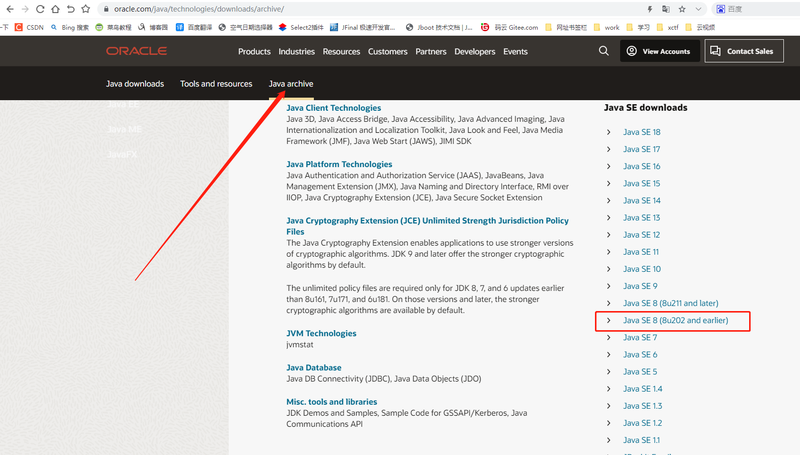

    1.3 选择你需要下载的 jdk-8u202-windows-x64.exe

### 2、JDK 安装

    2.1 下载完 JDK 到本地后，找到该文件，双击运行 JDK 安装程序

    2.2 等待一会，进入 JDK 安装界面，点击下一步

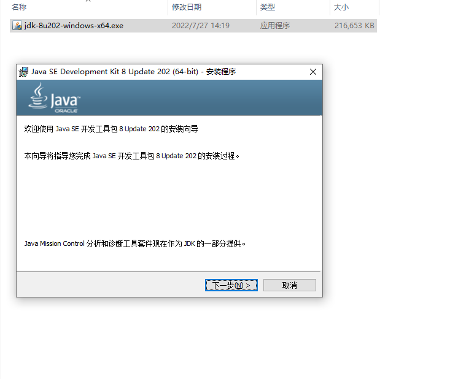

    2.3 安装位置可以默认，也可以选择自己想要存放的位置，然后一直点击下一步直到完成即可。

### 3、配置环境变量

    3.1 首先在电脑左下角搜索框搜索控制面板并打开。

    3.2 之后打开系统与安全面板下面的系统菜单。

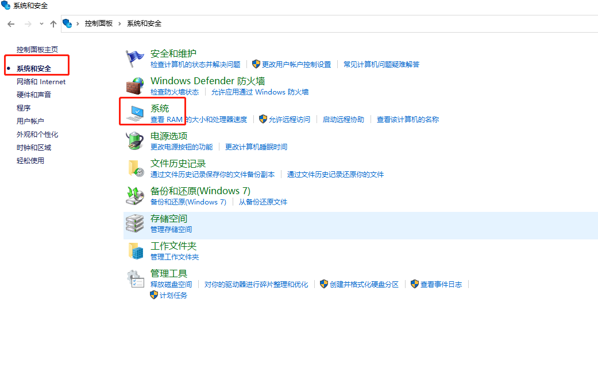

    3.3 接着打开高级系统设置弹窗里面的高级-环境变量即可。

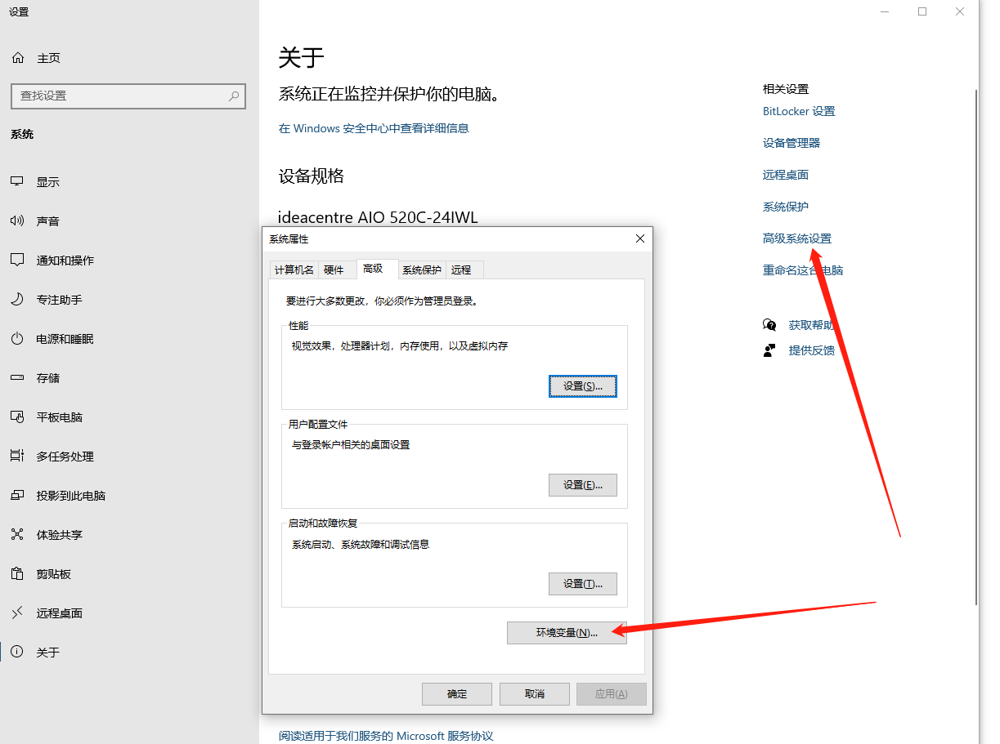

    3.4 新建环境变量，变量名为 JAVA_HOME，变量值为刚刚 JDK 安装的路径，点击确定

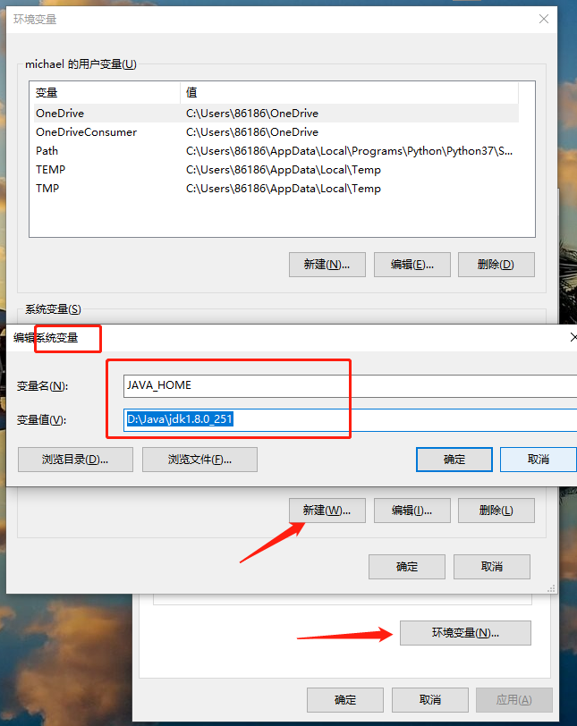

    3.5  双击 path，进入界面后，点击编辑文本

### 4、验证 JDK 是否配置成功

    4.1 按 win+r 快捷键，打开命令窗口，输入 cmd 指令，点击确定

    4.2 输入指令：java -version，可以查看到安装的 JDK 版本则成功。

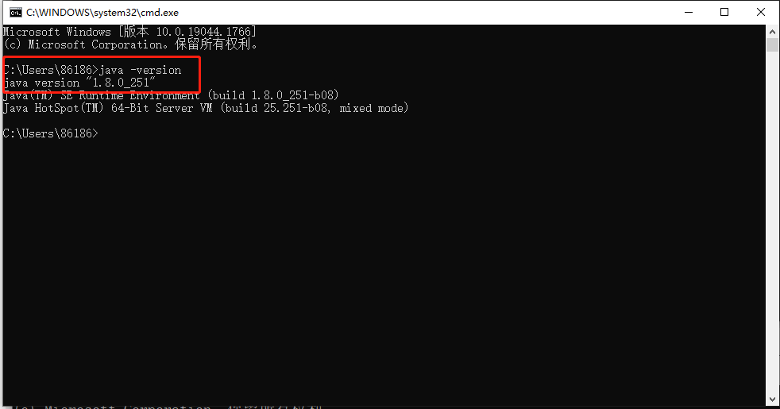

## Tomcat 下载安装及配置

### 1、Tomcat 下载

    1.1 官网下载 apache-tomcat-9.0.65
官网地址[https://tomcat.apache.org/](https://tomcat.apache.org/)
        

    1.2 点击选择 tomcat 9 进入下载页面，再点击下载 64-Bit Windows zip（Win64）

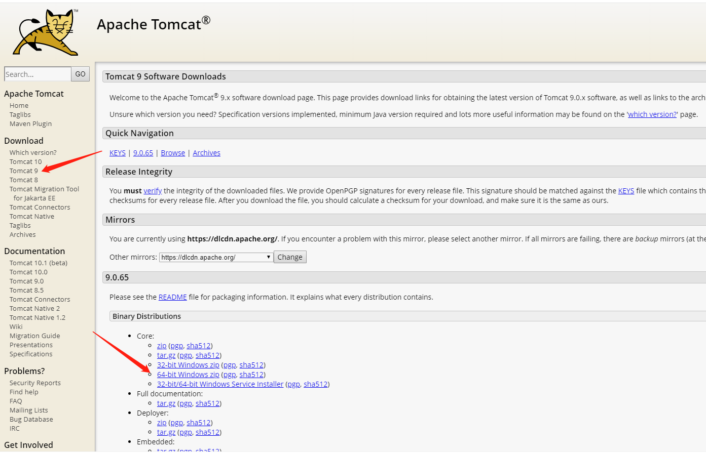

    1.3 找到下载的压缩包，并解压
        可选个磁盘自定义一个文件夹来放置，解压文件所在的路径配置环境变量时会用到

### 2、Tomcat 配置环境变量

    2.1 首先在电脑左下角搜索框搜索控制面板并打开。

    2.2 之后打开系统与安全面板下面的系统菜单。

    2.3 接着打开高级系统设置弹窗里面的高级-环境变量即可。

    2.4 新建环境变量，变量名为 TOMCAT_HOME，变量值为 tomcat 解压后所在的路径，点击确定

    2.5 双击 path，进入界面后，点击编辑文本

### 3、验证是否配置成功

    3.1 按 win+r 快捷键，打开命令窗口，输入 cmd 指令，点击确定

    3.2 输入指令：startup.bat，看能否正常启动

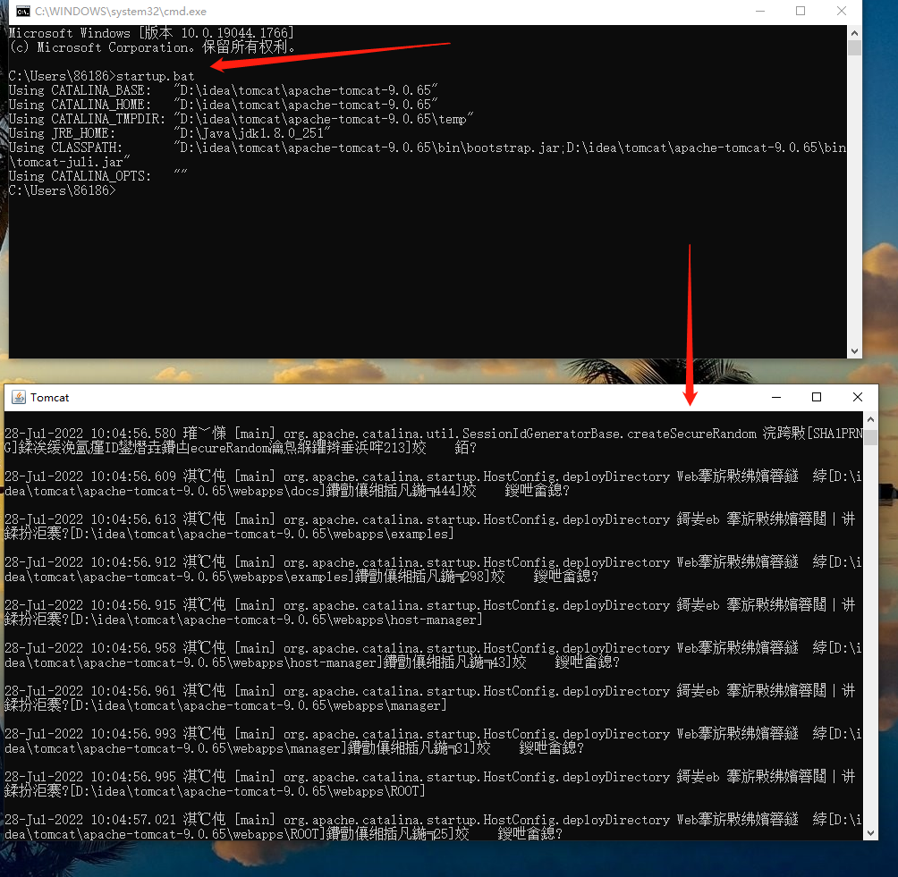

    3.3  上图启动 tomcat 后乱码的问题
        打开解压后的文件 apache-tomcat-9.0.65->conf->logging.properties

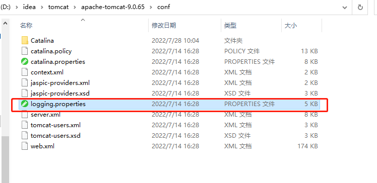

    3.4 打开 logging.properties
        找到这一行代码：java.util.logging.ConsoleHandler.encoding = UTF-8

    3.5 修改为：java.util.logging.ConsoleHandler.encoding = GBK

    3.6 再重新启动 tomcat，输入指令：startup.bat，乱码问题得到解决。

    3.7 验证是否配置成功 

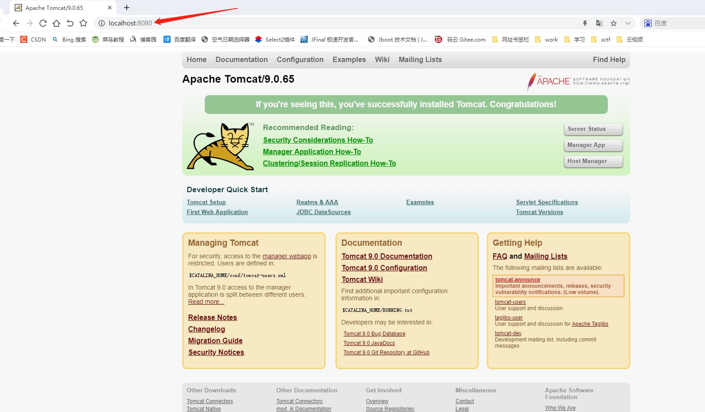

    注：上图测试时，下图输入指令：startup.bat 启动的 tomcat 页面不能关闭，否则会报错

    3.8 tomcat 默认端口号为 8080，若 8080 被占用或者你想换一个端口号
        找到 apache-tomcat-9.0.65->conf->server.xml

    3.9 打开 server.xml，找到 Connector 标签所在位置，如下图所示

    3.10 端口号修改

    重新启动 tomcat

    测试

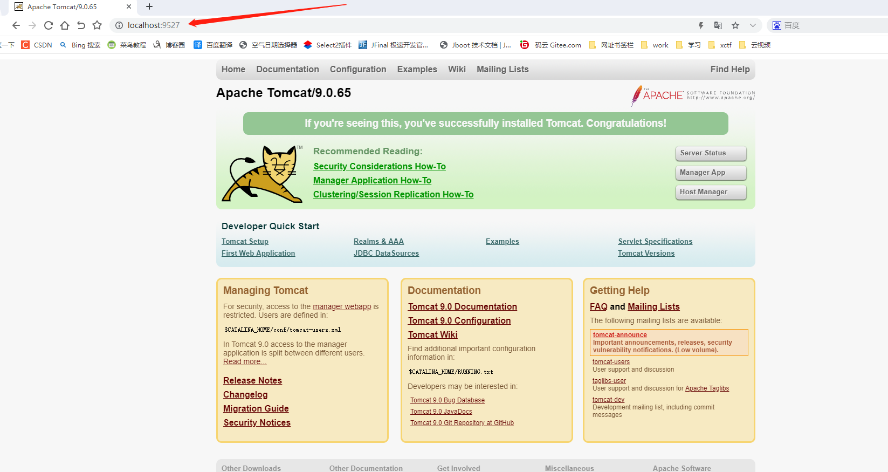

    3.11 配置 tomcat 开机自启动
        (1)进入 tomcat 文件的bin 目录
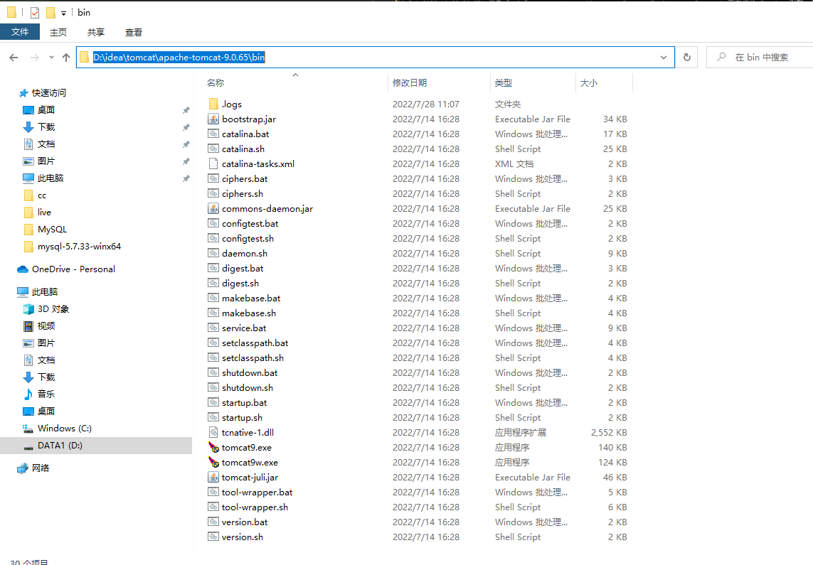

        (2)输入 cmd

        (3)进入命令页面
        输入指令：service.bat install Tomcat

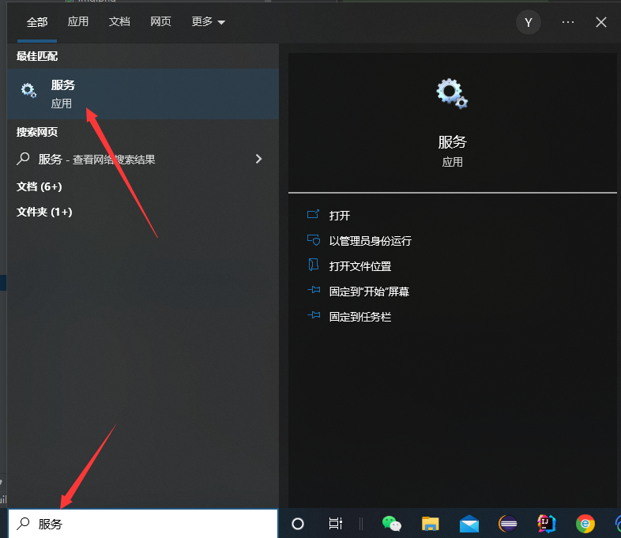

        (4)找到 tomcat
           单击鼠标右键，选择属性，把启动类型选择自动，点击确定，如下图所示： 

## MYSQL 下载安装及配置

### 1、MySQL 下载

官网下载地址:[https://dev.mysql.com/downloads/mysql/](https://dev.mysql.com/downloads/mysql/)

    1.1 进入官网下载页面，点击 Archives 进入选择版本页面

    1.2 选择版本和下载

    1.3 找到下载的压缩包，并解压

### 2、配置环境变量

    2.1 鼠标右键单击此电脑，选择属性，弹出设置页面

    2.2 高级系统设置-环境变量

    2.3 系统变量->Path，双击打开->新建，
        路径为 mysql 的安装路径，如下图所示：
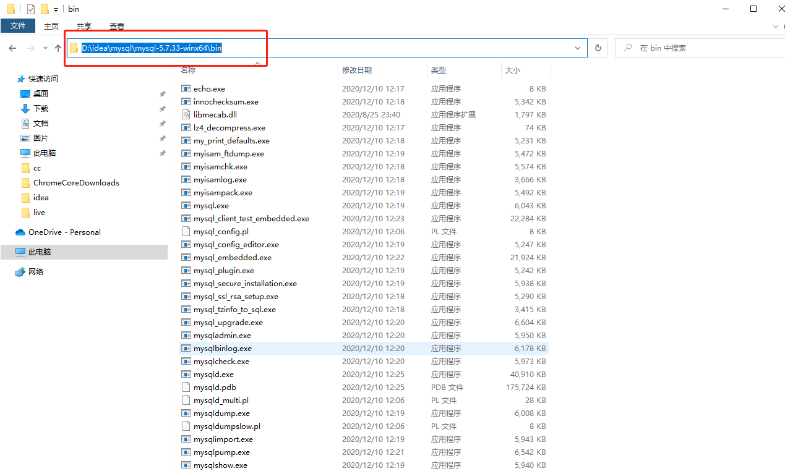

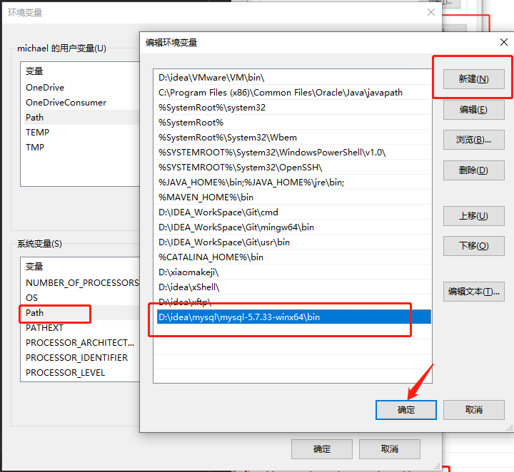

    2.4 mysql 安装（略）

## 3、Windows 环境下 tomcat 部署项目

    3.1 删除 tomcat 文件中 webapps 文件夹下所有文件，
        再把项目的 war 包放进去，并修改名称为 ROOT，如下图所示：
    
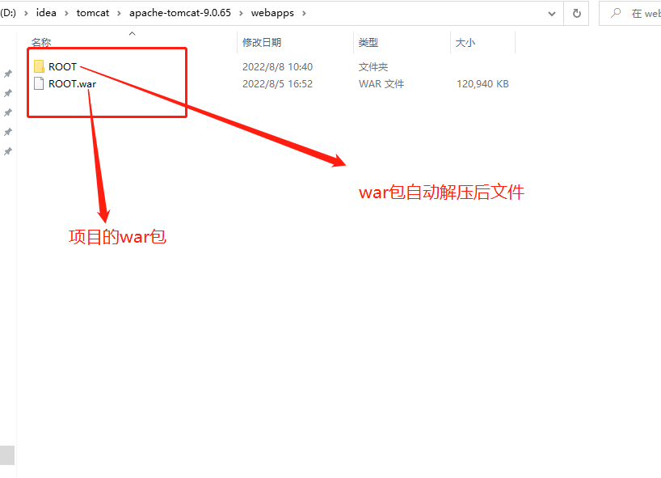

    3.2 输入网站地址，按下回车键，如下图所示：

        
        部署成功
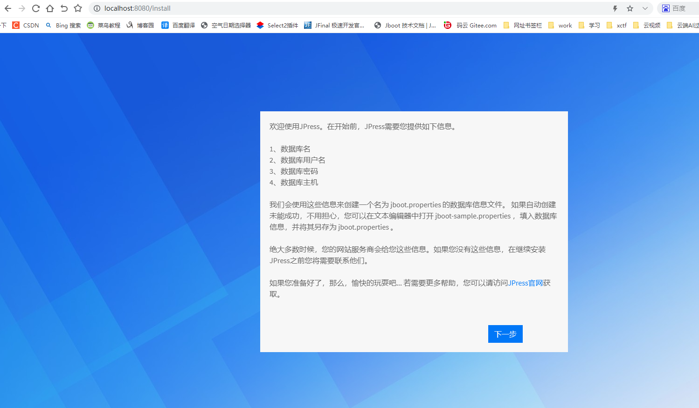