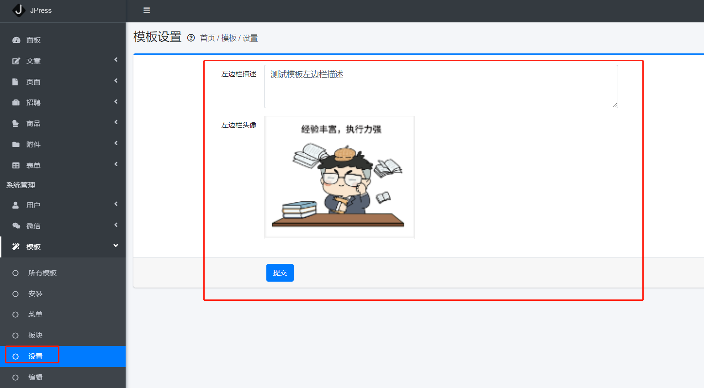
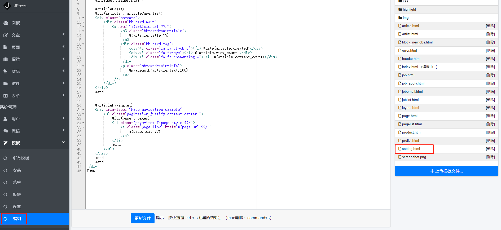

# 模板后台设置

* **在 JPress 的后台 模板下有个设置的功能 可以使用此功能对网站的页面进行一些通用的设置**



> 比如上图 我们可以通过 设置功能配置网站首页的图片以及描述
>

* 就是如下效果：


----

## 自定义设置

> 其实 不管是设置的数量还是功能 都是可以自定义的
>
> 如下图所示 找到编辑功能 在右边文件目录中找到 `setting.html` 可以通过在线编辑 setting.html 来编辑设置页面 从而实现 编辑的功能




## 注意事项

> 在编辑 `setting.html` 的时候 是有一些必须要注意的事项的

* 1、如果编辑中没有 `setting.html` 文件 那么就需要新建一个 html 文件 **名字必须为 setting.html** 可通过上传模板文件按钮上传，也可直接放进项目模板目录中重启即可                      
* 2、如果想要实现 提交并且保存的功能的话 那么此页面中 必须要有一个表单 **且表单ID 必须为 `optionForm`**
* 3、此表单也必须拥有一个 提交按钮 按钮没有特定要求 可自定义
* 4、示例如下所示：

```html

<section class="content-header">
    <div class="container-fluid">
        <div class="row">
            <div class="col-sm-6">
                <div class="row mb-2">
                    <div class="col-sm-12">
                        <h1>
                            模板设置
                            <small data-toggle="tooltip" title="" data-placement="right" data-trigger="hover"
                                   data-original-title=""><i class="nav-icon far fa-question-circle"></i></small>
                            <small> 首页 / 模板 / 设置</small>
                        </h1>
                    </div>
                </div>
            </div>
        </div>
    </div>
</section>

<section class="content">

    <div class="container-fluid">
        <div class="card card-outline card-primary">


            <form class=" form-setting" autocomplete="off" id="optionForm">
                <div class="card-body">
                    <div class="form-group row">
                        <label class="col-sm-2 col-form-label">左边栏描述</label>
                        <div class="col-sm-6">
                                    <textarea class="form-control"
                                              placeholder="可以想象下那些让人印象深刻的文章..."
                                              name="bonhumeur_web_desc"
                                              rows="3">#option('bonhumeur_web_desc')</textarea>
                        </div>
                    </div>

                    <div class="form-group row">
                        <label class="col-sm-2 col-form-label">左边栏头像</label>
                        <div class="col-sm-6">
                            <div class="jpress-image-browser">
                                <input type="hidden" name="bonhumeur_web_avatar"
                                       value="#option('bonhumeur_web_avatar')"/>
                                
                                <a class="image-reset"> <i class="fa fa-edit"></i></a>
                            </div>
                        </div>
                    </div>
                </div>

                <div class="card-footer">
                    <div class="offset-sm-2 col-sm-10 submit-block">
                        <div class="card-submit">
                            <button type="submit" class="btn btn-primary">提交</button>
                        </div>
                    </div>
                </div>
            </form>
        </div>
    </div>
    </div>

</section>
```