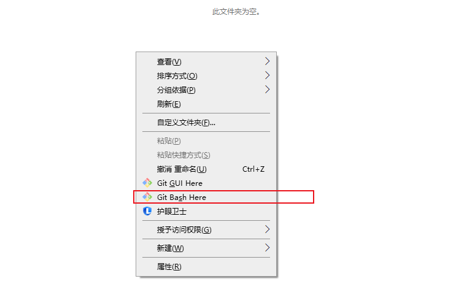

#jpress源码获取

## 首先进入 jpress 的 gitee 界面
**jpress源码获取地址：[https://gitee.com/JPressProjects/jpress](https://gitee.com/JPressProjects/jpress)**

* 点击图注1的（克隆/下载）按钮 有俩种获取jpress源码的方式
* 第一种 **直接下载 zip 包 然后再本地解压即可**
* 第二种 **复制链接 使用 git 拉取源码（推荐）**

## 使用 git 拉取项目流程
### 1-下载 git 工具
**git下载地址：[https://git-scm.com/download](https://git-scm.com/download)**
* 将 git 下载并安装

### 2-在本地新建文件夹

### 3-拉取jpress源码

* 1-鼠标对着空白处点击反手键

  
* 2-使用 **git clone + 复制的链接** 的命令来拉取源码

  
* 3-输入命令后 点击回车 源码拉取到本地

  

