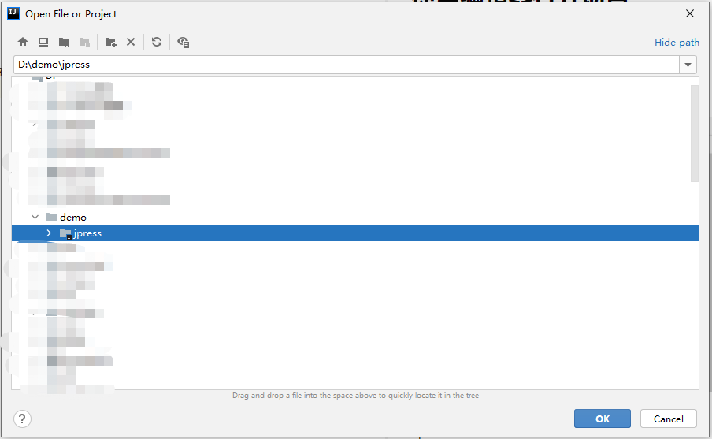

# 使用编辑器打开项目
##使用 idea 打开

* 1- 打开 IDEA 客户端
* 2- 点击左上角 **file->open**

  
* 3-在弹出的文件选择框中**选择 jpress 源码文件夹** 点击ok

  
* 4-选择信任项目

  
* 5-打开项目 选择 **This Window(使用此窗口打开) 或者 New Window(使用新窗口打开)** 都可

   
  
* 6-成功打开项目

  
## 使用 eclipse 打开
* 1- 打开 eclipse 客户端

