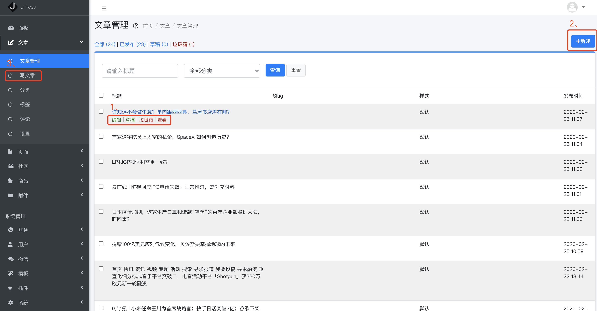
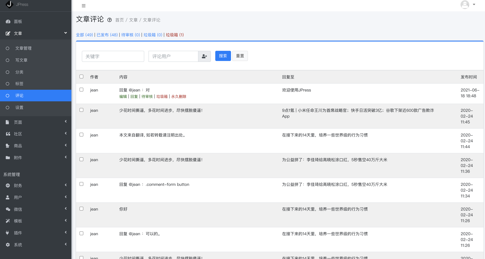
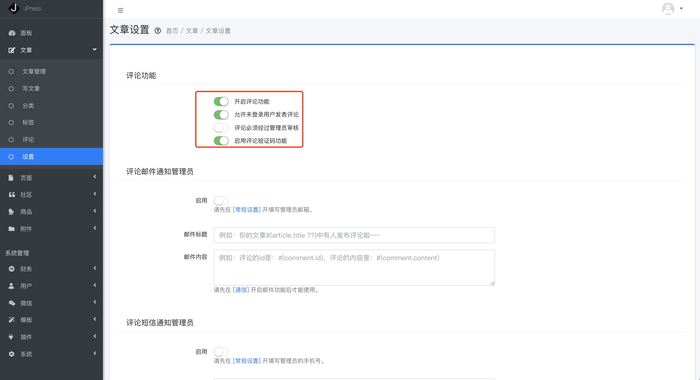
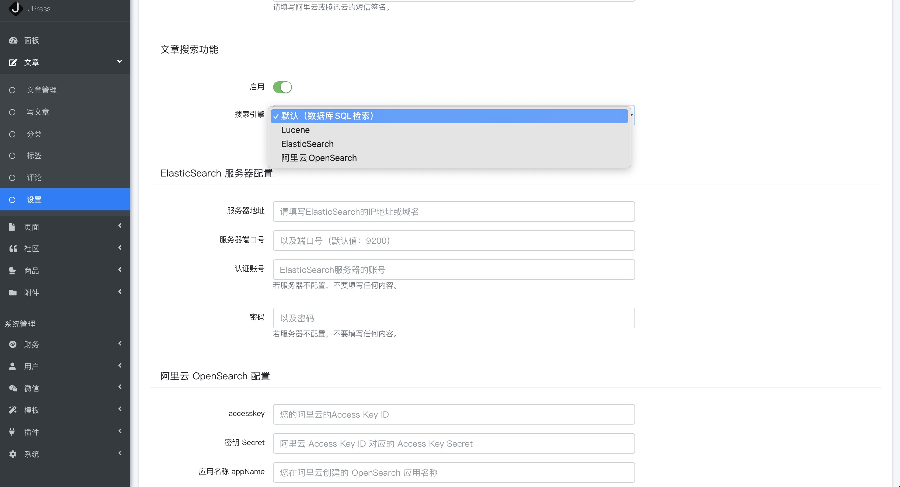

# 文章板块

如下图所示，是一个用JPress搭建的网站，里面的文章，都是通过JPress后台发布：

[[toc]]

## 如何发布、管理文章

> 文章-文章管理

如下图：

图注1：鼠标移到文章标题上，可以编辑、删除、查看该篇文章，也可将该篇文章放入草稿箱，下次继续编辑。

图注2、图注3：新建文章；

新建文章的页面如下图：

文章编辑器支持 markdown；

每篇文章支持SEO设置

## 如何创建文章分类
> 文章-分类

比如：公告、招聘信息、关于我们等等都属于分类。分类建好后，在新建文章页面就会将分类列表显示出来。

每个分类都可以配置SEO信息，更便于搜索引擎的抓取；

也可以将该分类放在导航上，如下图:

标签与分类的设置方法类似。

## 如何管理文章评论
> 文章-评论

这里是用户的评论列表，将鼠标移到评论上，就会出现一系列操作按钮，可以对这条评论进行回复、编辑、删除，或者将这条评论进入到待审核的状态、放入垃圾箱，或者永久删除。
如下图：

## 如何开启、关闭文章评论
> 文章-设置

1、可以关闭/开启评论功能；

2、可以规定是否允许未登录用户评论；

3、用户评论第一时间显示，还是需要管理员审核后再显示；

4、评论是否启用验证码功能

> 小提示：使用评论功能的前提是确保使用的模板支持评论功能。

## 如何设置评论通知管理员
> 文章-设置

功能解释：当有用户评论时，是否发邮件或者短信通知管理员。

如开启，根据页面提示设置即可。

## 如何设置文章搜索功能
> 文章-设置

此功能用户，对网站搜索功能要求较高，希望能自己配置。
JPress支持的4种搜索方式各有利弊：

1、默认SQL数据库检索，只能搜索标题，无法对内容进行搜索；

2、Lucene 可以全面搜索，但是性能一般；

3、ElasticSearch 对运维要求比较高，有一些技术含量；

4、阿里云 OpenSearch 是收费产品。

一般建议用默认SQL，或者Lucene即可。

> 小提示：如果JPress是4.x以前的版本，那么当你切换到Lucene搜索了之后，
只能搜索出来切换以后新发布的文章。如果是4.x版本，则不存在这个问题。

