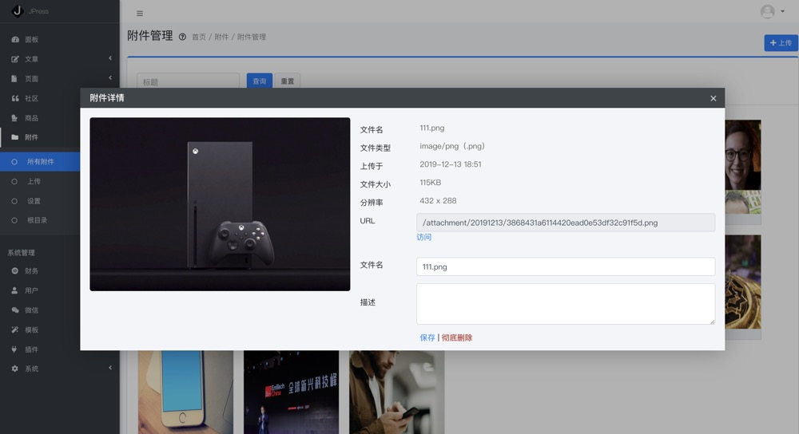

# 附件

[[toc]]
## 阐述

附件相当于存储网站素材的地方，存储的类型包含但不限于图片、音频、
视频、zip包、word文件等。

## 附件管理

下图图注1、图注2，可以上传附件：

点击图注3可以查看附件详情：

附件详情里面可以找到附件链接、附件大小等，并可以删除该附件。如下图：

## 附件设置

> 附件-设置

#### 附件大小限制

如果网站所在服务器比较小，而用户又传超大附件到网站上，就会造成网页速度打开慢
或者网站性能下降等隐患。
这里可以限制附件的大小，如果超出此限制的文件，将无法上传成功。

#### 阿里云OSS同步

附件上传到自己服务器的同时，也能同步到阿里云，让文件更安全。

#### 图片水印

让网站上的所有附件图片，打上自己的水印，确保版权。

## 根目录

> 附件-根目录

#### 应用场景

主要用在对网站权限的验证，比如说你将网站授权到公众号，微信需要将某个特定文件
传到网站的根目录，以验证你对网站的所有权，就在该地上传即可。