# 宝塔下载安装

宝塔下载地址[https://www.bt.cn/new/index.html](https://www.bt.cn/new/index.html)

## 1、Linux 虚拟机创建

    1.1 打开VMware，选择创建新的虚拟机

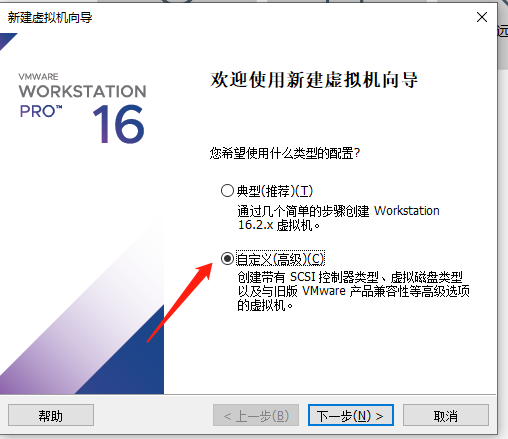

    1.2 选择自己下载的centos镜像

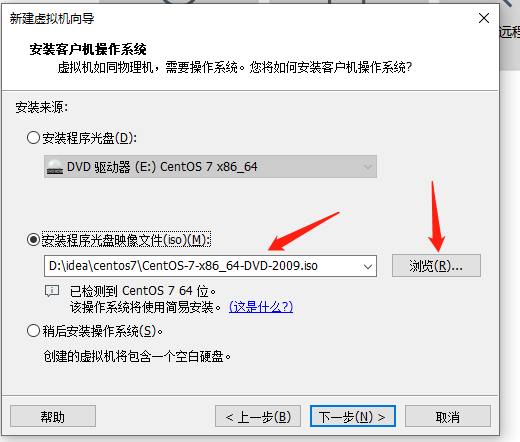

    1.3 自定义用户名和密码

    1.4 处理器配置

    1.5 指定虚拟机的内存

    网络类型：默认使用网络地址转换；
    SCSI控制器：默认LSI Logic(L) ；
    虚拟磁盘类型：默认SCSI(S)；
    磁盘：默认选择创建新的磁盘 。

    1.6 指定磁盘容量
    

    1.7 磁盘文件，默认即可。
    
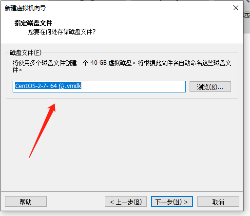

    1.8 自定义硬件

    1.9 最后点击完成；创建完毕；
    进入虚拟机页面，因为你添加得有centos7镜像，要等待其安装完毕。

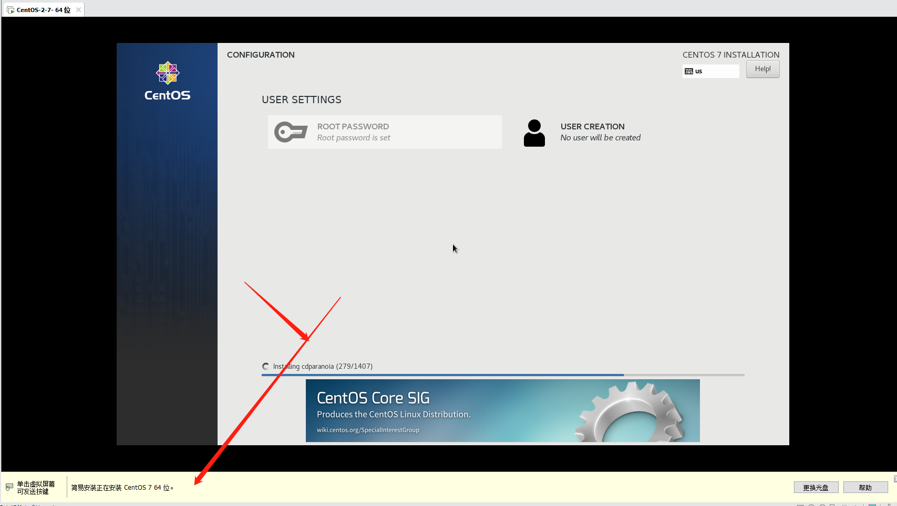

    1.10 centos7镜像安装完毕，进入用户登录页面

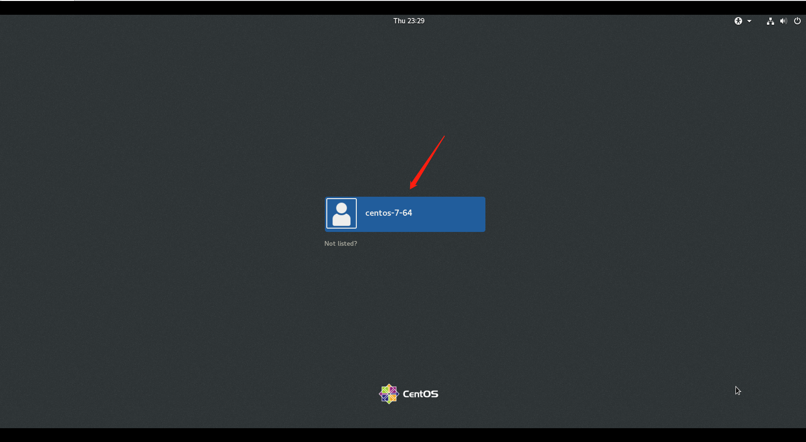

    1.11 输入设置的密码,点击登录

    1.12 进入虚拟机页面

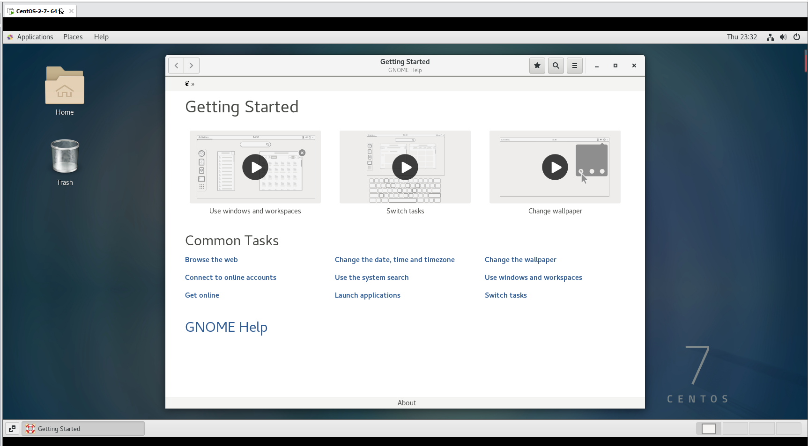

## 2、虚拟机语言设置（更换为中文）

    2.1 点击左上角Applications->System Tools -> Setting

    2.2 选择Region & Language

    2.3 点击Language那一栏进行语言设置

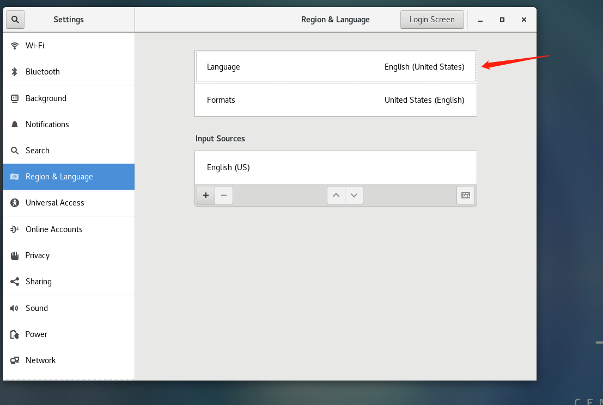

    2.4 选择 汉语（中国），再点击 Done

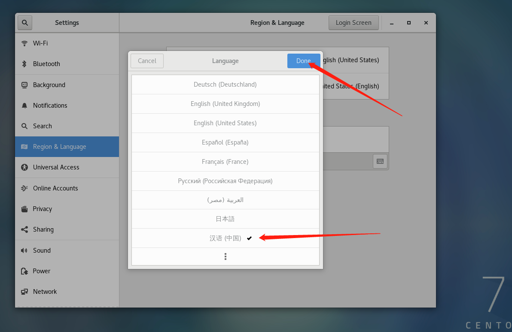

    2.5 再点击Restart 进行重置

    2.6 点击 Log Out，然后重新登录

    2.7 语言设置完成，重新登录

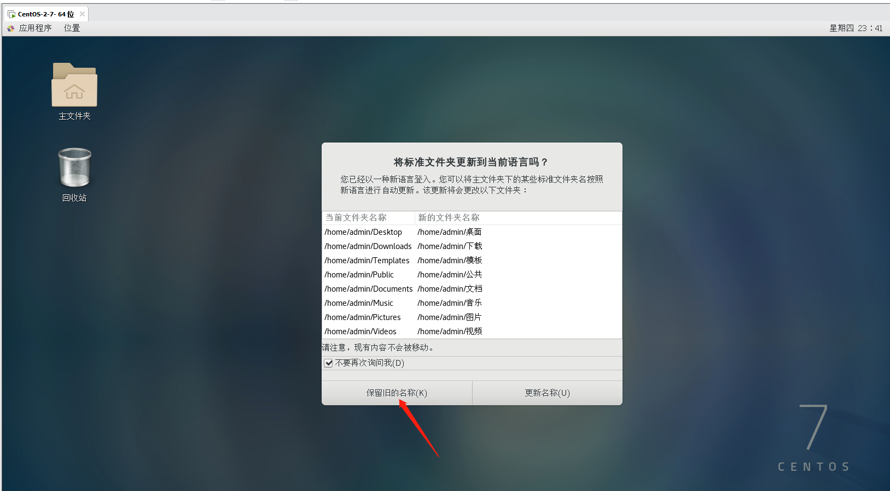

## 3、虚拟机网络连接配置

    3.1 鼠标放在虚拟机页面，单击鼠标右键，选择 打开终端

    3.2 进入终端页面

    3.3 网络连接配置，需编辑 ifcfg-ens33 文件，需要管理员权限才可编辑，
    用户区分：
    $ 普通用户
    # root 用户
    输入指令：su ，按回车键，再输入你的登录密码，如下图显示，则切换成功

    3.4 找到虚拟机，左上角编辑按钮，点击选择虚拟网络编辑器
    操作如下图所示，点击更改设置进入编辑模式

    3.5 网络编辑
    步骤如下：
    1、选择类型为NAT模式的点击进行编辑
    2、取消使用本地 DHCP 服务将 IP 地址分配给虚拟机
    3、记下NAT设置的 IP 、掩码、网关，编辑 ifcfg-ens33 文件时会用到
    4、点击应用
    5、点击确定
    如下图所示：

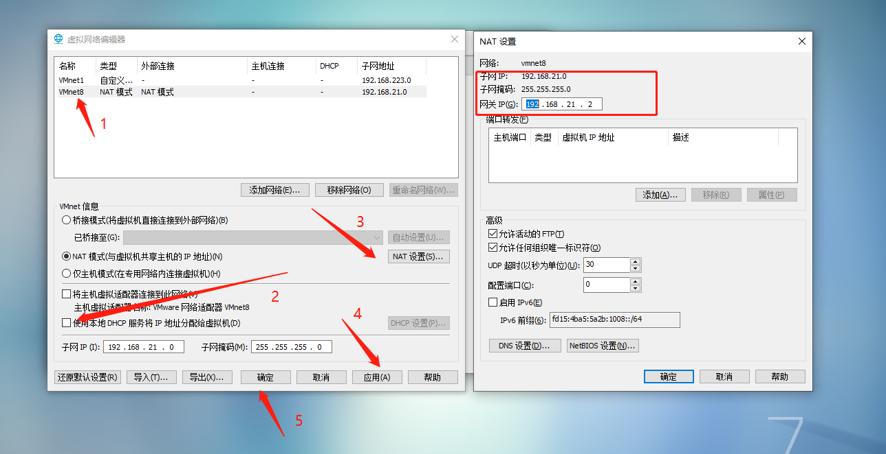
    
    3.6 查找 ifcfg-ens33 文件
    在虚拟机终端输入指令：cd /etc/sysconfig/network-scripts 进入目录
    再输入 ls ，查看当前目录下文件
    找到要编辑的文件：ifcfg-ens33
    如下图所示：

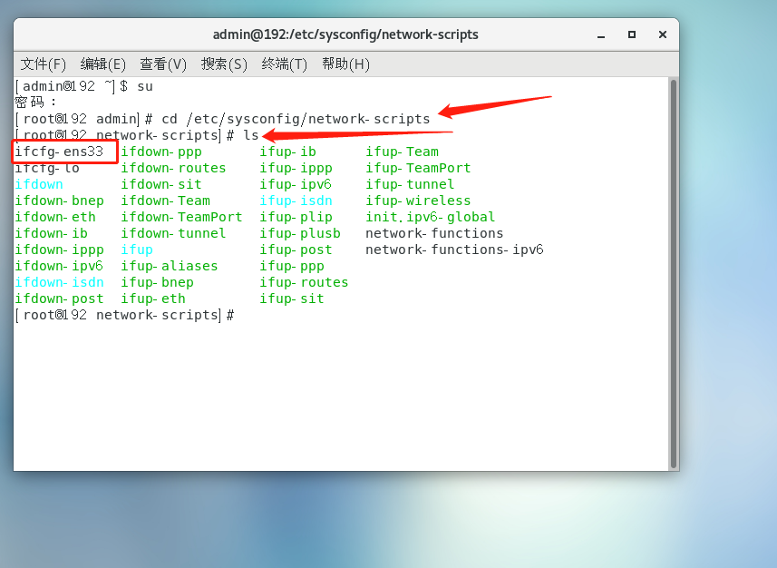

    3.7 输入指令：vi ifcfg-ens33 进入编辑页面

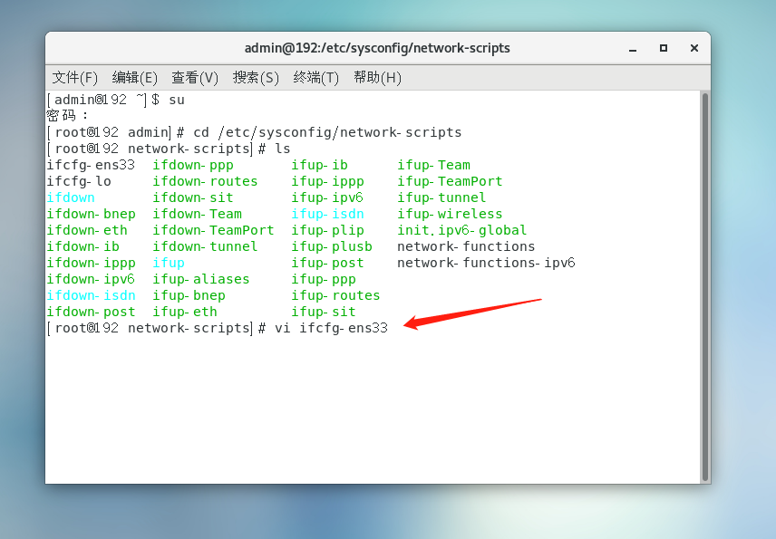

    3.8 编辑 ifcfg-ens33 文件
    进入编辑页面按下键盘上的 i 进入编辑模式
    IPADDR IP 地址，NETWORK 子网掩码，GATEWAY 网关 IP，DNS
    在最下方输入相应的数据：

    IPADDR=192.168.21.129
    NETWORK=255.255.255.0
    GATEWAY=192.168.21.2
    DNS=192.168.21.2

    输入完毕后，再按下键盘上的 Esc 按钮，再输入指令 （:wq），再点击回车键保存并退出
    如下图所示：

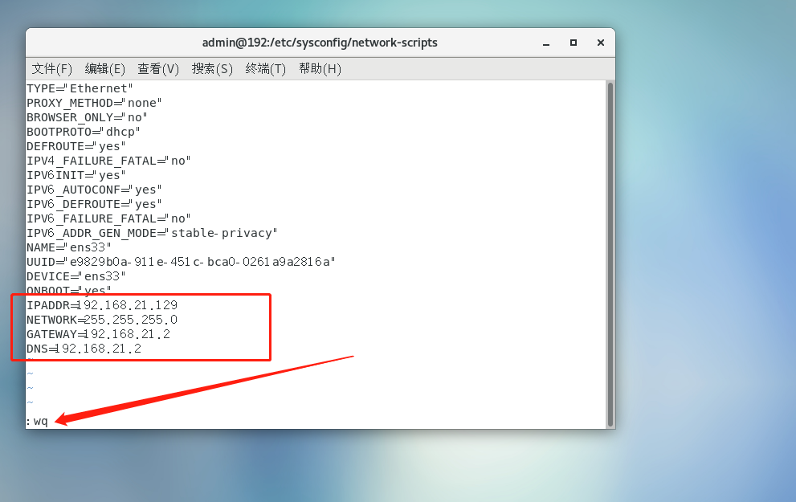

    3.9 测试是否配置成功
    输入指令 ：ping www.baidu.com
    如下图显示 ping 成功则网络连接成功：

## 4、安装宝塔

    4.1 宝塔linux面板命令大全
网址：[https://www.bt.cn/btcode.html](https://www.bt.cn/btcode.html)

    4.2 示例安装的镜像为CentOS 7
    输入CentOS 安装脚本指令
    yum install -y wget && wget -O install.sh http://download.bt.cn/install/install_6.0.sh && sh install.sh

