# 云服务器通过宝塔部署项目

## 1、安装宝塔
    
xShell 连接云服务器，输入云服务器安装指令：

    yum install -y wget && wget -O install.sh http://download.bt.cn/install/install_6.0.sh && sh install.sh

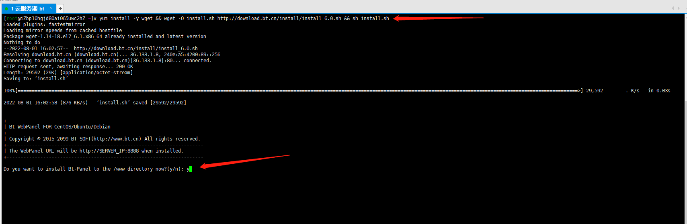

安装完毕

    
## 2、配置登录

云服务器放行宝塔登录的端口，如上图的 8888，打开云服务器 ECS 控制台

如下图所示：

选择安全组，点击配置规则

如下图所示：

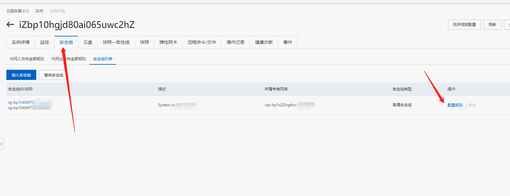

点击手动添加，输入：目的和源，点击保存；

如下图所示：

测试是否放行成功，输入外网地址，登录宝塔面板

如下图所示：

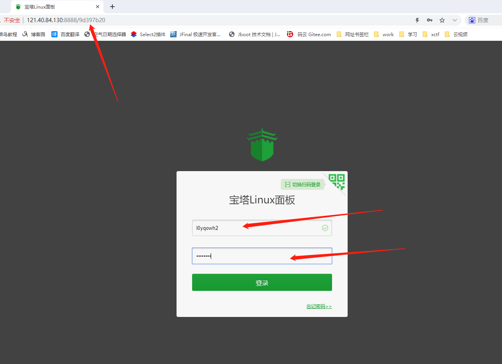

登录成功，安装配置完毕

## 3、宝塔部署项目

登录宝塔面板的主界面，不推荐使用一键安装，如下图所示：

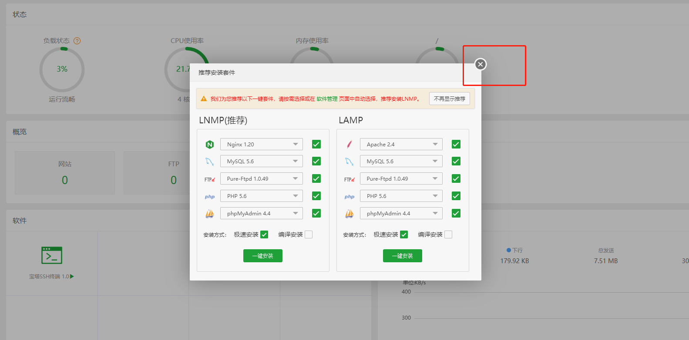

安装数据库，选择 mysql 5.7 版本，如下图所示：

安装完成会在消息盒子中显示，如下图所示：

安装 Nginx

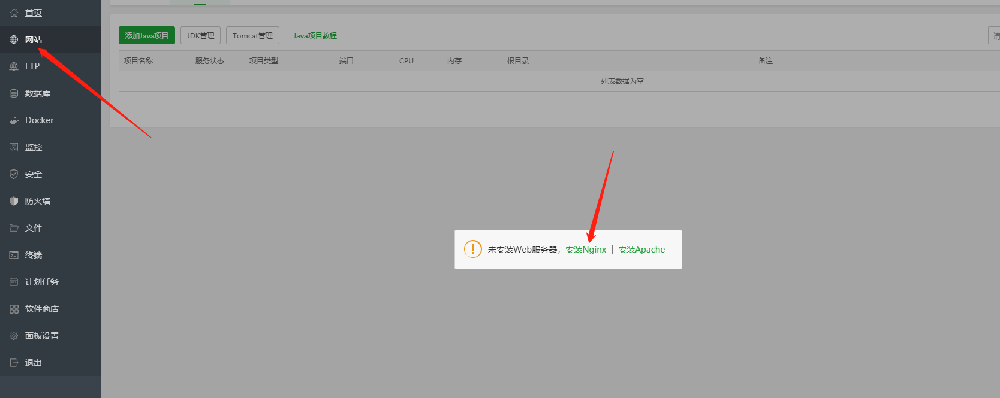

安装 tomcat 9，如下图所示：

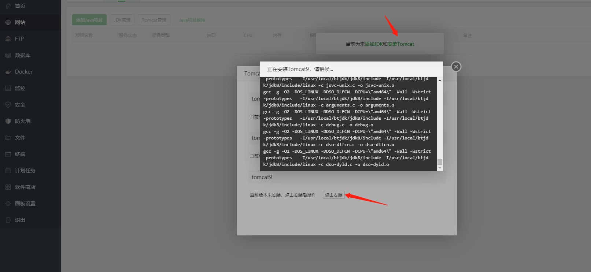

安装完成，如下图所示：

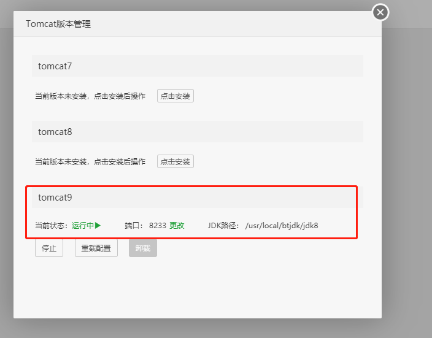

找到项目的 war 包，通过 xftp 上传到云服务器

找到宝塔安装的 tomcat 目录，把 war 包放在 webapps 文件夹下

修改 war 包的名称为 ROOT.war，注意 ROOT 是大写，如下图所示：

打开宝塔页面，找到 tomcat 文件夹下的 webapps，删除 ROOT.war 包以外的所有文件

如下图所示：

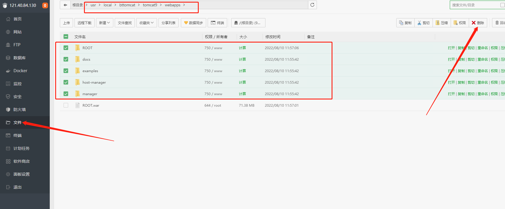

添加本地数据库

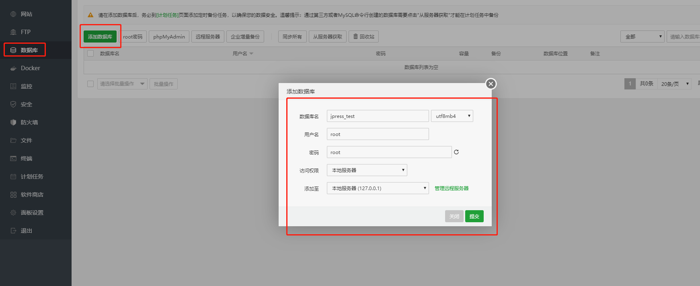

宝塔放行端口，如下图所示：

云服务器有也要放行宝塔放行的端口，如下图所示：

重启 tomcat，先停止，再重新启动，如下图所示：

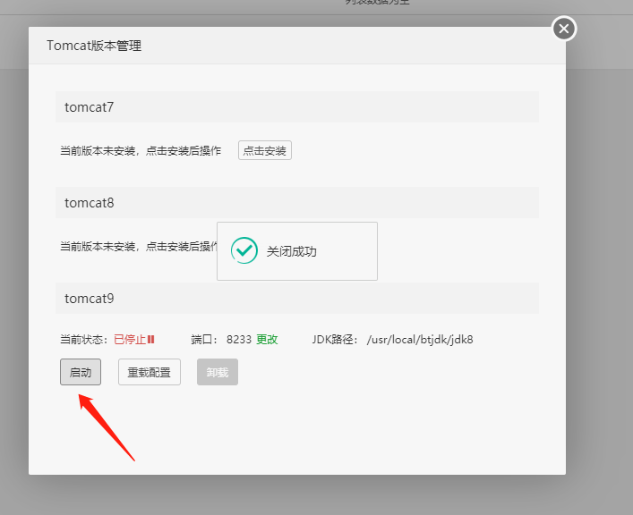

网址输入：公网IP:tomcat端口号，能正常访问则部署成功

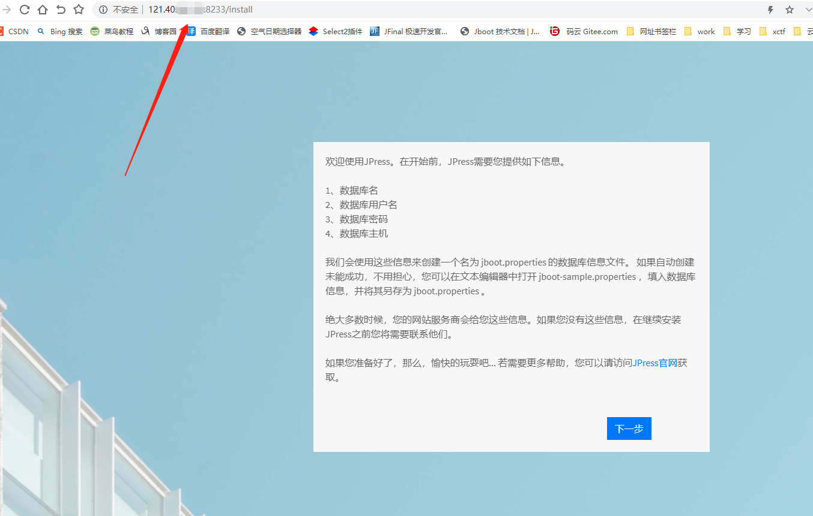

填写数据库相关信息，要连接的数据库就是宝塔创建的数据库，主机：云服务器公网 IP，如下图所示：

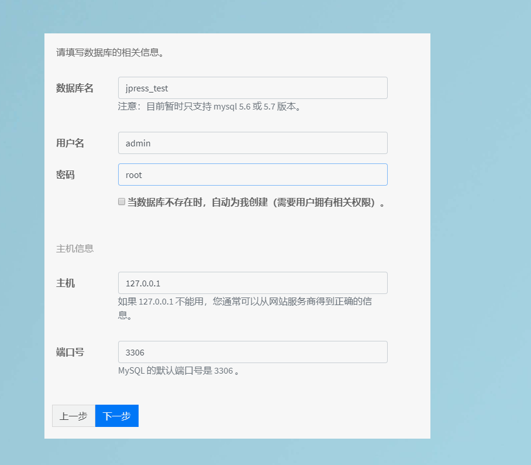

自定义网站信息，超级管理员信息，填写完毕后点击完成，如下图所示：

进入登录页面，输入自定义的超级管理员的账号和密码

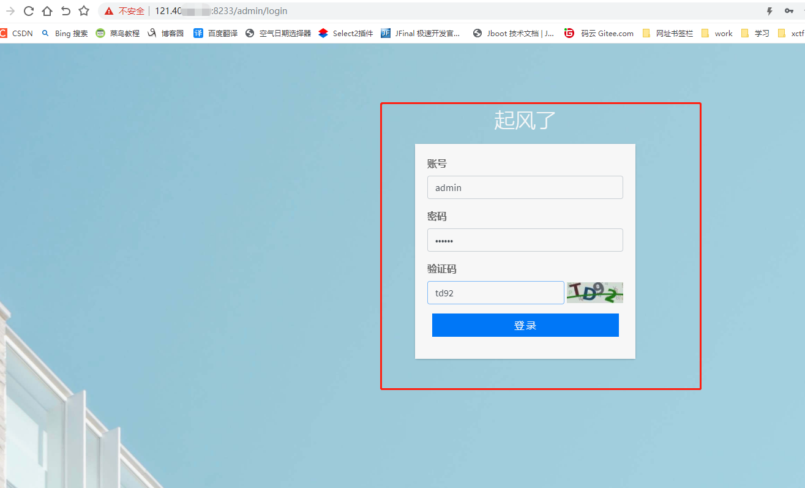