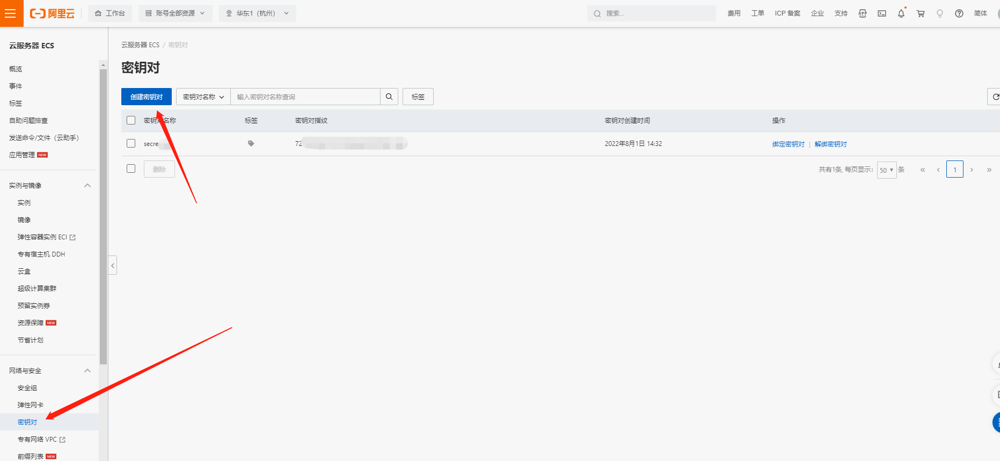
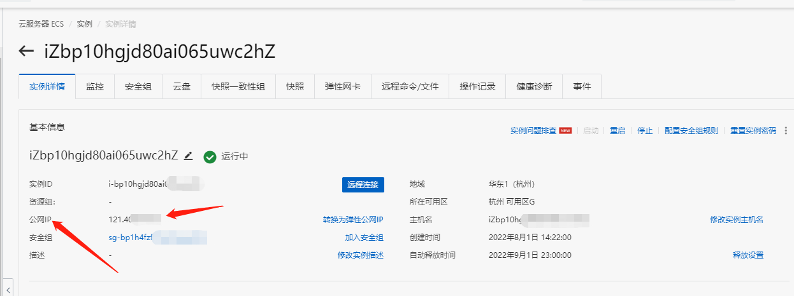
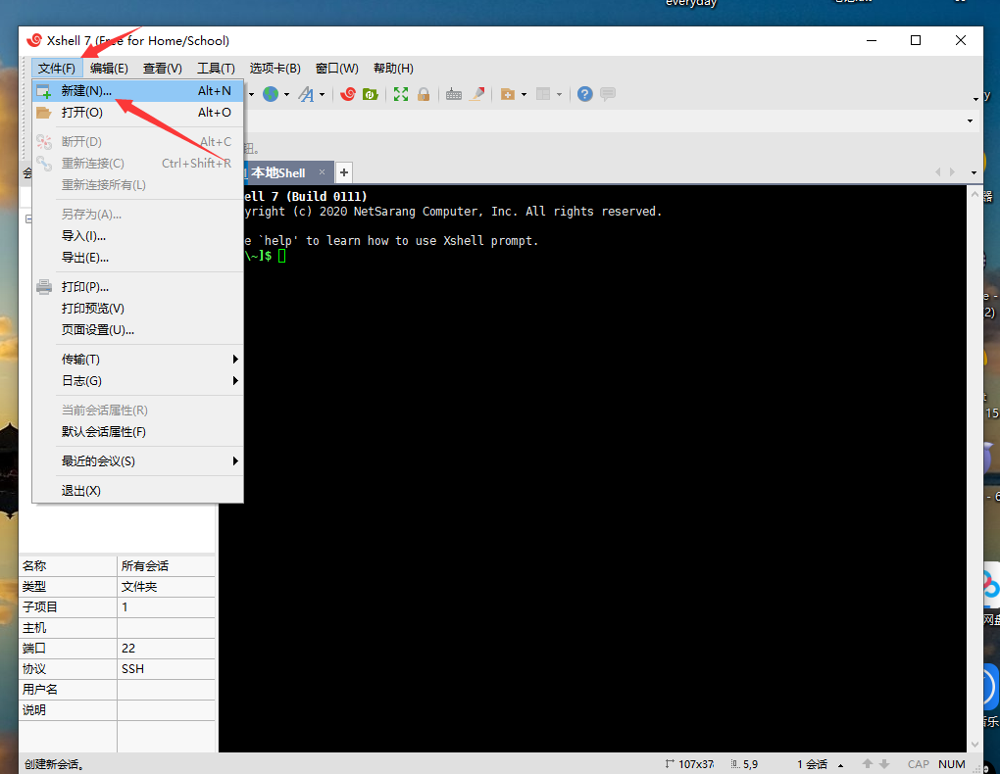
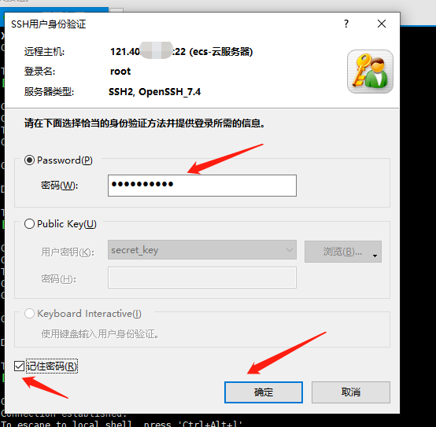
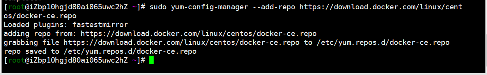
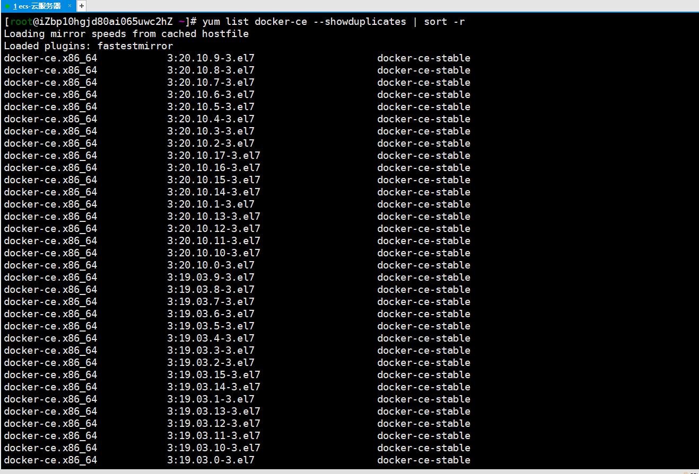
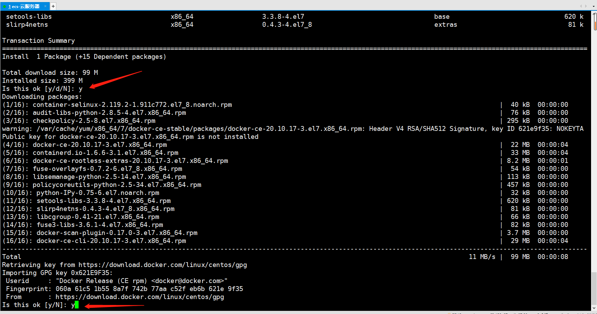

# ECS 云服务器安装 Docker

## 1、阿里云服务器

    1.1 阿里云官网

官网地址：[https://www.aliyun.com/](https://www.aliyun.com/)

    1.2 开通云服务器（略）

    1.3 云服务器，更换操作系统（CentOS）
        

    1.4 选择镜像CentOS
        选择密钥对或者自定义密码都可以
        登录名和自定义密码在xShell连接是会用到

        自定义密码更快捷，密钥对需要在ECS控制台手动创建

   

    1.5 此处示例是以 xShell 连接云服务器，xShell 下载安装（略）。
        连接要用到的数据：公网 IP，登录名和自定义的密码
        公网 IP 如下图所示：

    1.6 xShell 创建连接

    1.7 数据填写
        名称自定义；
        主机为云服务器的公网 IP；
        端口号云服务器默认为 22；
        点击确定保存。

    1.8 登录用户和密码填写
        双击创建的账号，进入填写页面
        如下图所示：

    1.9 xShell 连接成功

## 2、Docker 安装

    2.1 安装 Docker 所需要的依赖；
        输入指令：
        sudo yum install -y yum-utils device-mapper-persistent-data lvm2
        安装完毕，如下图所示：

    2.2 设置 Docker 的 yum 的源
        输入指令：
        sudo yum-config-manager --add-repo https://download.docker.com/linux/centos/docker-ce.repo
        设置完成，如下图所示：

  

    2.3 查看仓库所有 Docker 版本
        输入指令：
        yum list docker-ce --showduplicates | sort -r

    2.4 安装 Docker
        输入指令：
        sudo yum install docker-ce  #安装的是最新版 18.9.4
        sudo yum install <FQPN>  # 安装指定版本，例如：sudo yum install docker-ce-17.12.1.ce

   

    2.5 验证 Docker 是否安装成功
        输入指令：docker --version
        如下图所示：安装成功

