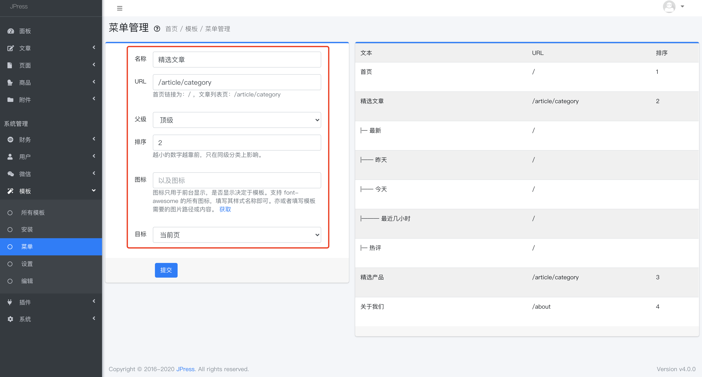
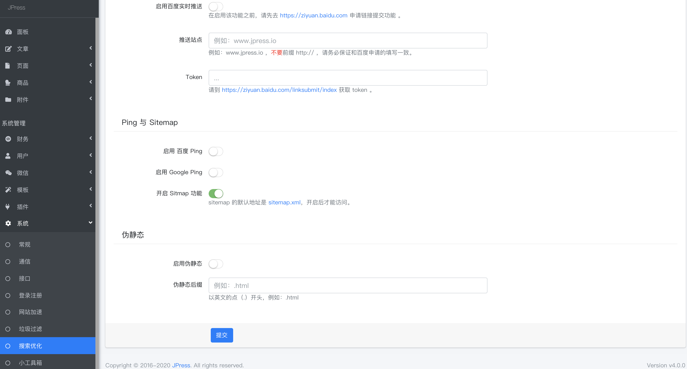
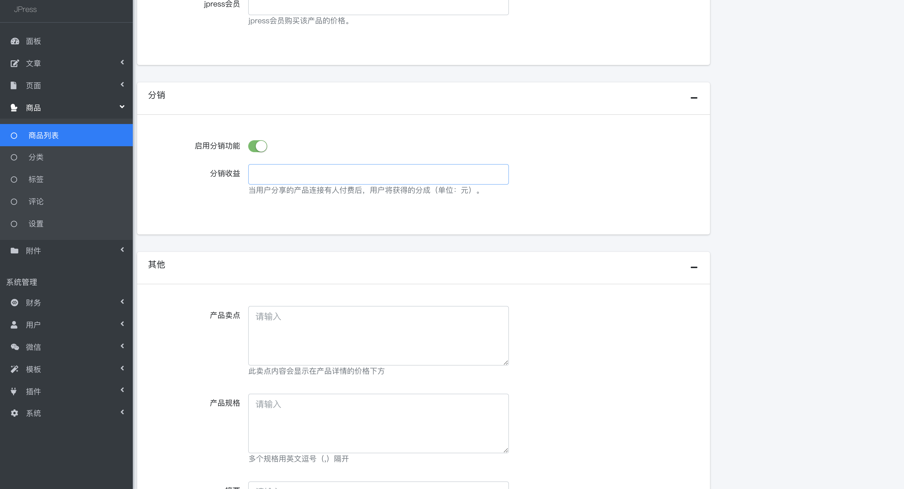
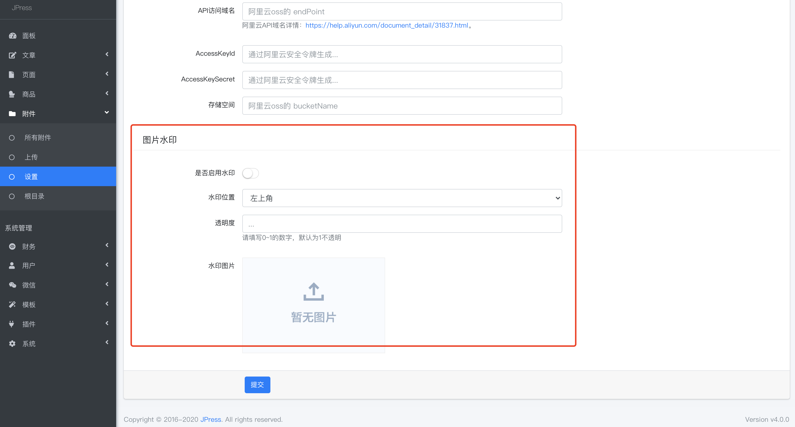
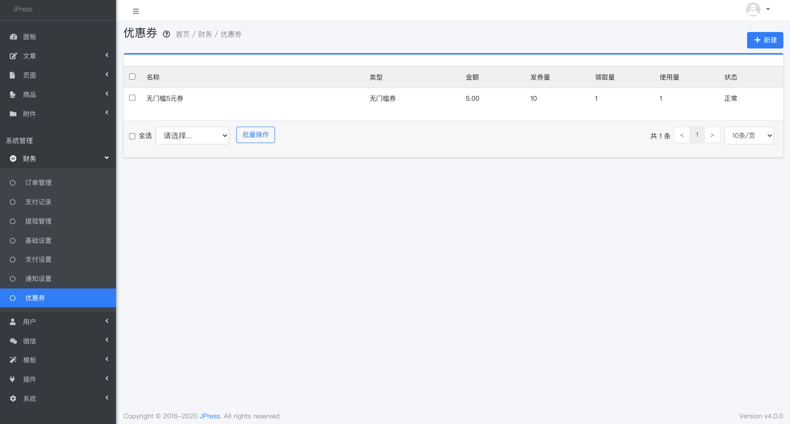
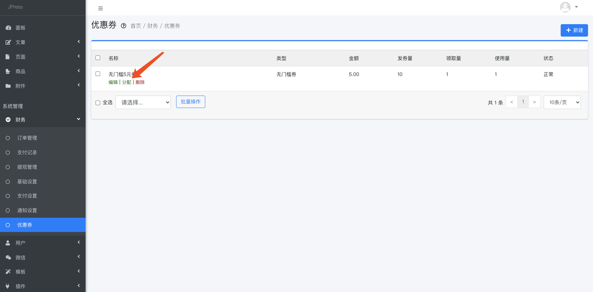
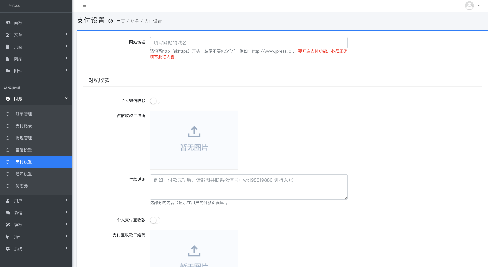
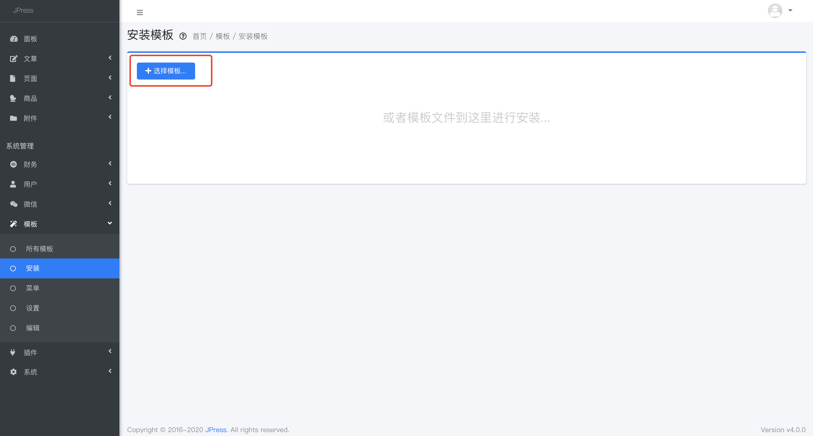
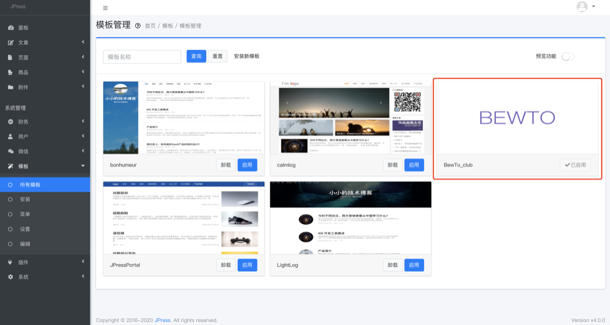
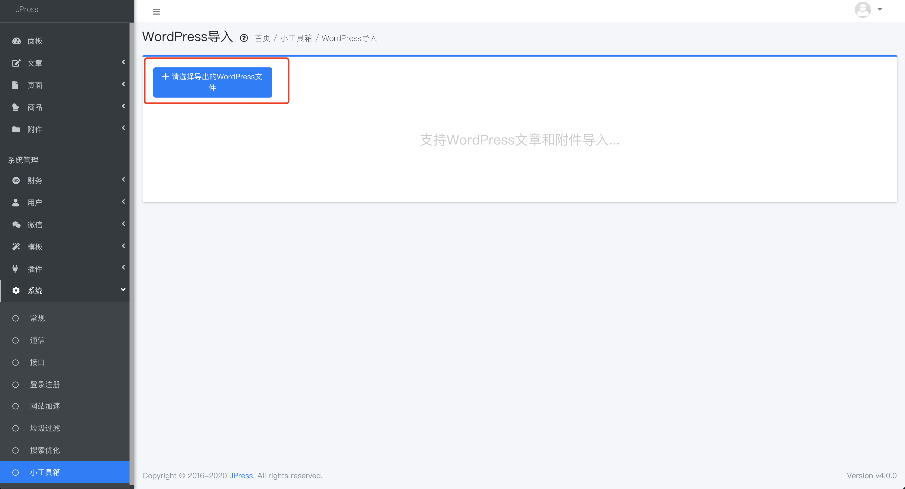

# 常见问题

[[toc]]

## 如何配置导航（菜单）？

 有2种方式添加：
### 1.  > 模板 - 菜单

在这里设置菜单名称、要跳到的URL地址、是一级还是二级菜单、在导航上的排序、以及菜单前面的图标，
还有点击是否打开新页面。

其中的URL是一篇文章、一个分类的链接、一个页面的链接，所以填写之前，要提前发布一篇文章或者建好一个分类；

图标的设置需要模板的支持，模板支持图标，方可设置，否则设置无效；

如果对添加完成的菜单进行编辑，删除等操作，只需要将鼠标移到右侧菜单上即可显示对应操作文字。

### 2.  > 文章 - 分类

新建分类，slug是自定义的，是显示在网址的后缀，建议尽量用拼音或者英文。

然后将【显示到菜单】的开关打开，这个分类就会显示在导航上了。

## 菜单和分类的区别？

菜单指的是网站的导航，导航可以连接到一篇文章，一个页面，或者一个分类等；

分类是指某一类型文章的集合，可以选择是否将这个分类放到导航上；

## 如何开启/关闭评论功能？
 > 文章 > 设置
 
 如果模板支持评论功能，那么可以在这里控制开启/关闭评论功能、是否允许未登录客户发表评论、
 评论是直接显示在页面上，还要经过管理员的审核才能显示、以及评论的时候是否开启验证码。
 

## 当有用户评论能否邮件或者短信通知管理员？

菜单：【文章--设置】找到评论邮件通知管理员或评论短信通知管理员，根据提示做好相应设置即可。

## JPress如何配置SEO相关？
JPress目前对SEO方面的支持已经相当友好，我们从以下几个方面看看
1. > 系统 > 搜索优化

可以在这里设置SEO需要的标题、关键字、描述；

除了搜索引擎的被动抓取，这里还可以主动将网站信息推送到百度，Google，以及开启网站地图功能，让搜索引擎更好的抓取；

另外，网站也可以设置伪静态，对搜索引擎更友好。

除此之外，当新建文章、新建分类、新建页面时，可以对当前文章、分类、页面做针对性的SEO关键字和描述设置：

## 如何配置单页面，比如关于我们，招聘页面，或者营销落地页？

1.首先模板文件中要有制作好的单页面文件，比如：list.html

2.打开菜单【页面--新建】，选择对应的模板样式，如下图：

3.输入标题、页面内容、配置页面的SEO信息即可。

4.最后回到页面管理，鼠标移到标题上，点击【查看】就可预览该页面内容。

## 文章元信息功能如何使用？
1.找到菜单【插件--安装】，把文章元信息插件安装好；

## 发表文章的时候，想添加作者，付款二维码等选项怎么办？
## 支持分销功能吗？如何设置？
JPress支持分销功能。
菜单 【商品-商品列表】，新建商品时，启用分销功能，并设置分销收益即可，如下图：

## 如何支持给网站所有图片打水印？
菜单：【附件--设置】，启用水印，然后设置好水印的图片，位置，以及透明度即可，如下图：

## 如何给某些用户发送优惠券？
1. 菜单【财务--优惠券】，点击【新建】，如下图：

2.  按照运营情况和提示，填写优惠券内容，点击提交。

3.  返回到优惠券列表，鼠标移到标题上，点击【分配】选项，如下图：

4.  填写分配的用户Id，点击提交即可；

> 提示：用户Id在菜单 【用户-用户管理】里面找。

## JPress支持哪些收款方式？

JPress支持的收款方式有：
- 个人微信收款；
- 个人支付宝收款；
- 微信对公收款；
- 支付宝对公收款；
- paypal对公收款。

对应菜单：【财务-支付设置】，如下图：

> 提示：这些收款功能，都需要正确配置后方可使用。

## 当有客户付款的时候，是否可以收到通知？
菜单：【商品--设置】，找到评论邮件通知管理员或评论短信通知管理员，根据提示做好相应设置即可，如下图：

## 如何给会员加特殊标识？
## 文章是否可以只给会员展示？
## 如何通过JPress来配置公众号？
1.在公众号后台菜单【开发--基本配置】中，找到【AppID】【AppSecret】【Token】；

2.在JPress后台找到【微信-基础配置】，然后把上面的3个值对应填写，如下图：

3.然后就可以在【微信】下方的菜单中，设置公众号的默认回复、自动回复、还有公众号菜单、多客服等。

## 如何安装/卸载模板和插件？

JPress后台自带四套模板，如果默认四套模板无法满足需求，
可以购买或者自己开发模板，然后安装到后台，安装/卸载过程如下：

1.找到菜单【模板--安装】，然后选择模板（此时选择的文件是个包，不要解压），
安装过程几秒钟就可以搞定，而且是自动安装；

2.安装完成后，在【模板-所有模板】就可以找到刚才安装的那套模板，如下图：

3.如果想卸载该套模板，只需启用其他模板后，点击该套模板的卸载按钮即可。

> 备注：安装/卸载插件，跟模板的流程一样的，只不过模板是个压缩包，而插件是以 .jar 为结尾的文件。

## 如何进行模板设置？

无论是默认的模板，还是后来安装的模板，都可以在 【模板-设置】中对其进行设置。
> 每套模板的设置页面都不同，具体设置内容是根据模板作者定的，
一般设置的内容会包含比如：logo，banner图，广告图片，标题内容等等。

## 如何对模板进行二次开发？
当购买了一套模板，并不能完全满足需求，那就需要对该模板就行二次开发。

1.在【模板--编辑】中，可以找到该模板的全部源码，如下图：

2.有前端基础的人，对代码进行改动，确认后点击【更新文件】。

3.也可以点击右侧的【上传模板文件】，上传自己的模板文件。

> 模板的二次开发需要有一定的前端语言（HTML+CSS）基础，更新文件后立马生效，
所以不懂技术的同学不要轻易操作这里。

## 如何将WordPress文章导入到JPress？
1.在 WordPress 后台，将文章导出；

2.在JPress后台 【系统--小工具箱】，找到WordPress文章导入：

3.选择从WordPress导出的文件，即可全部导入。

> 同理，可以将 Hexo / Jekyll / Markdown文章导入到JPress

## 如何将微信公众号的文章导入到JPress？
1.先在JPress菜单【微信--基础设置】里面填写好【AppID】【AppSecret】【Token】；

2.找到菜单【系统--小工具箱】，找到微信公众号文章导入；

3.点击【开始导入】即可。

## 如何对用户发的垃圾关键字过滤？

网站运营者可以通过此功能过滤掉用户的不当言论，如下图：

1.自定义垃圾关键字，当用户发表言论涉及到这些垃圾关键字时，该言论无法发表；

2. 运用某些云端的AI过滤，只需要填写对应云端的App Id、App Secret 和 App Code 即可。

## 如何支持关注公众号登录网站的功能？
此功能搭配关注公众号登录插件，可实现关注公众号登录网站的功能，对于用户来说登录过程简洁易接受，
对于网站运营者来说，可以很快吸粉。
具体操作，参考此插件使用手册。

## JPress为公众号涨粉？
JPress搭配任务宝插件，能够很好的为公众号吸引新粉丝，活跃老粉丝，此部分参考任务宝使用手册。

