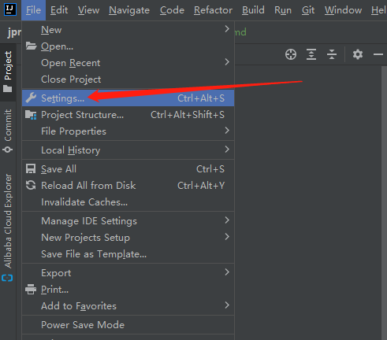
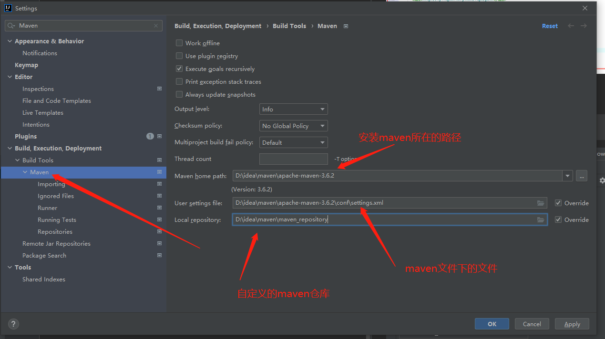
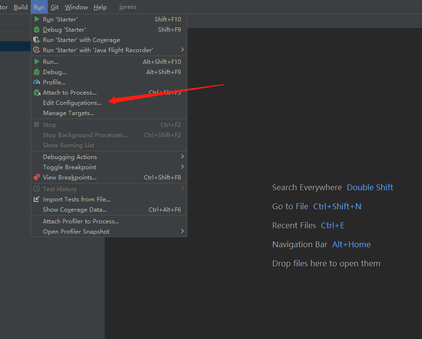
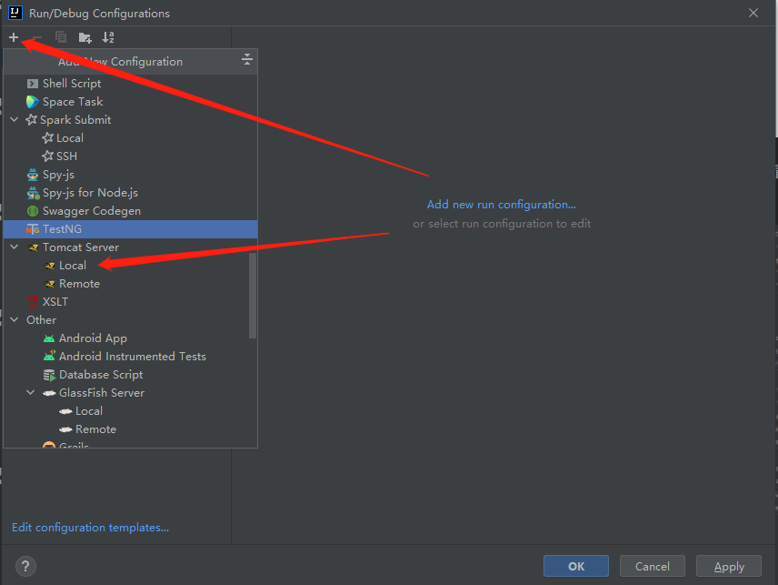
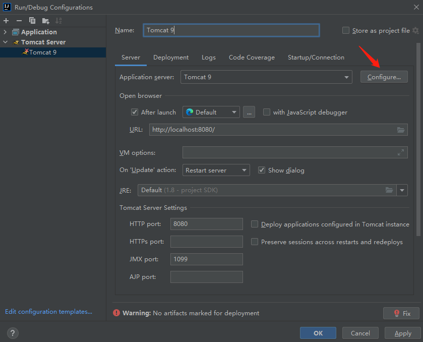
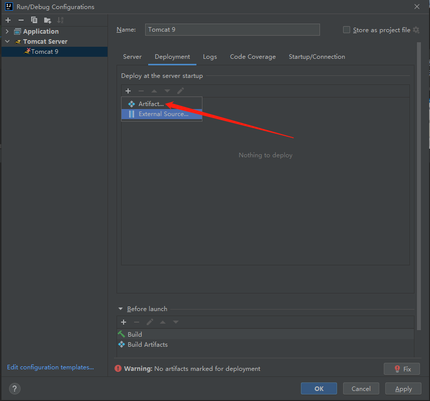
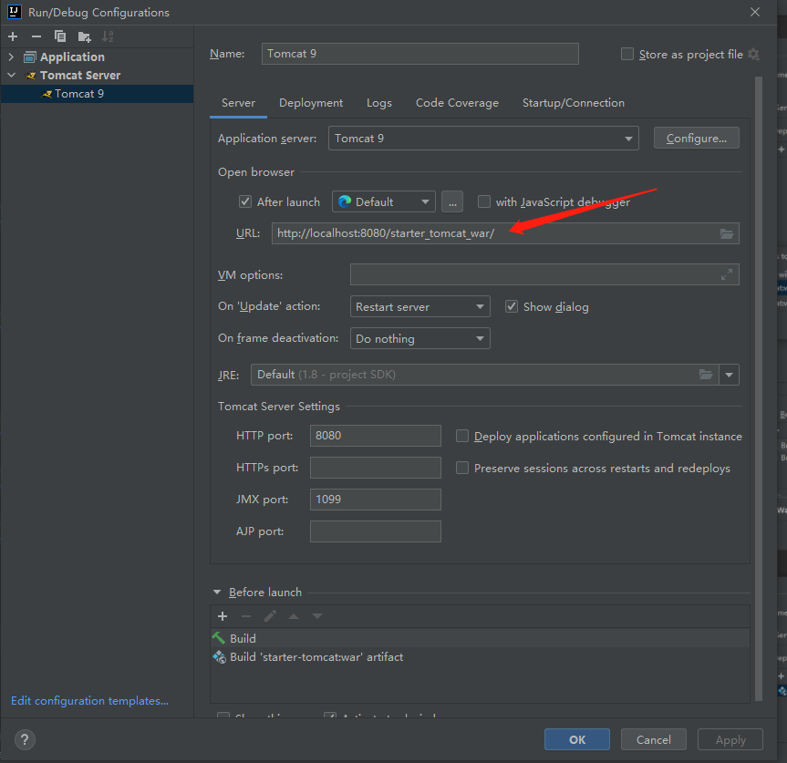
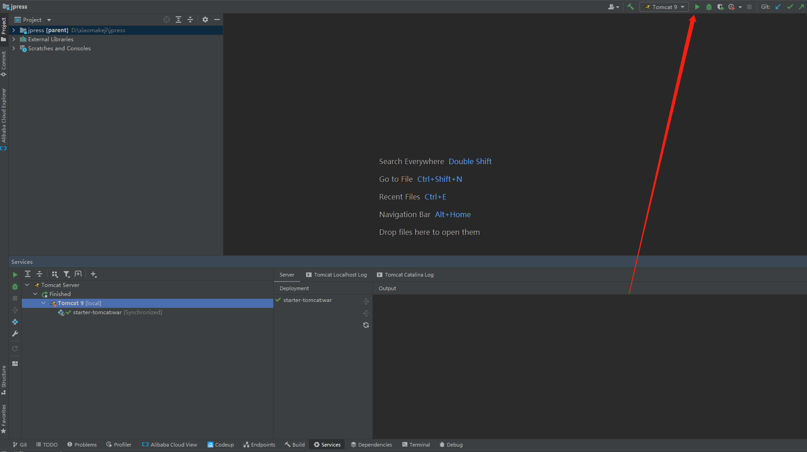
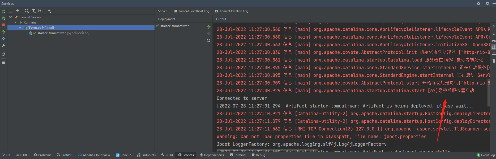
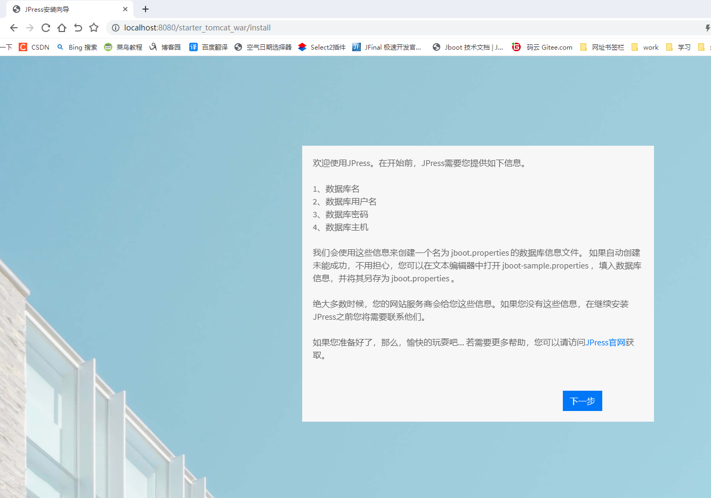

# IDEA 开发环境准备

## 1、jdk 配置

jdk 的下载安装参考：[文档](/manual/jdk_config.md)

在 IDEA 中配置 jdk

setting 是 idea 配置，Project Structure 是项目配置

点击 Project Structure 进入项目配置，选择你安装的 jdk,再点击 apply 应用

点击 Modules,选择安装的 jdk,再点击应用

SDKs 的配置，选择你安装的 jdk

## 2、maven 配置

maven 的下载安装参考：[文档](/manual/maven_config.md)

maven 在 IDEA 中的配置

打开 idea 中 setting，如下图所示：

配置 maven 路径

## 3、tomcat 配置

tomcat 的下载安装参考：[文档](/manual/tomcat_config.md)

IDEA 配置 tomcat 启动

第一步打开 idea，点击 Run -> EDit Configurations

进去之后，点击 + 号，下拉选择 Tomcat Server -> local

选择你下载的 tomcat 解压后的路径，

再点击添加要部署的 war 包,再点击 apply 应用

配置完 Deployment,再来看 server,URL 地址已经被修改

IDEA 启动配置的 tomcat 9

启动成功，控制台出现中文乱码问题

打开：apache-tomcat-9.0.65 -> conf -> logging.properties

找到下图所示内容注释掉，并在下面重新添加把 UTF-8 修改为 GBK

重新启动 tomcat，控制台乱码问题解决

tomcat 启动成功

