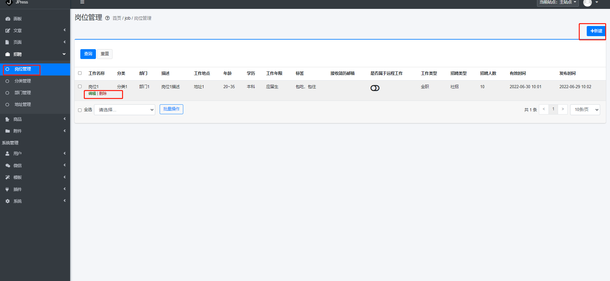
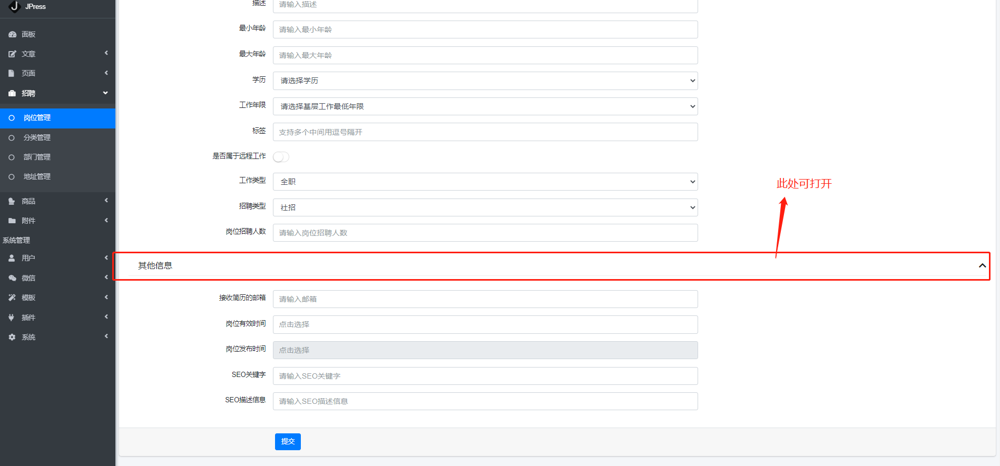

#招聘版块

##阐述
JPress安装成功后,会带有一个招聘的模块,携带对于岗位的发布,修改,删除等功能

##如何发布、管理岗位

> 招聘-岗位管理

如下图所示：

图注2：鼠标移动到岗位名称上,可以编辑,删除该岗位

图注3：新建岗位

新建岗位页面如下图所示：

此处注意事项：

1-最大年龄应大于最小年龄，且都不能为零

2-岗位有限时间不得小于岗位发布时间

3-下方图注1，其他信息可打开

##如何创建岗位分类

> 招聘-分类管理

如下图所示：

分类创建好以后,会直接显示在右侧的分类管理

分类创建好后,在新建或者编辑岗位页面也会展示出来

我们可以将鼠标移动到分类名称上,可对该分类进行编程,删除操作

>部门和地址管理与岗位分类类似