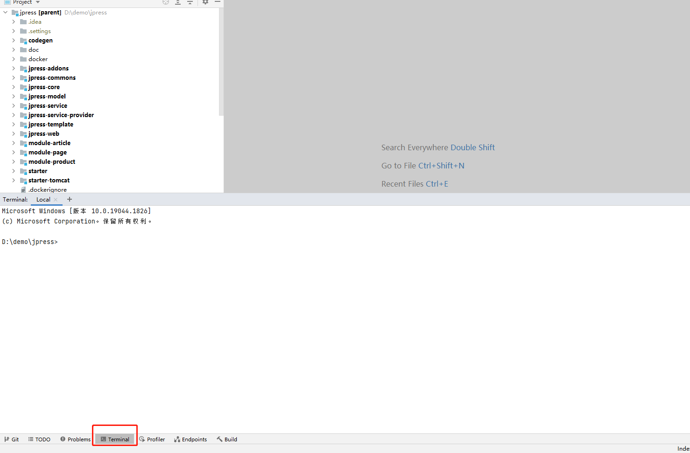
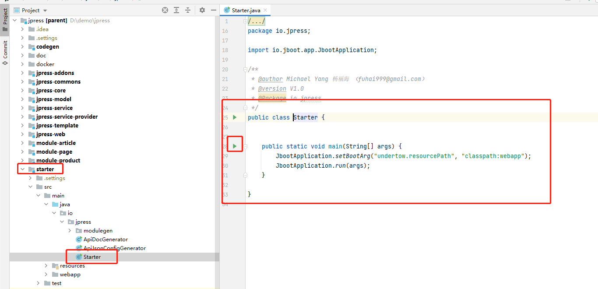
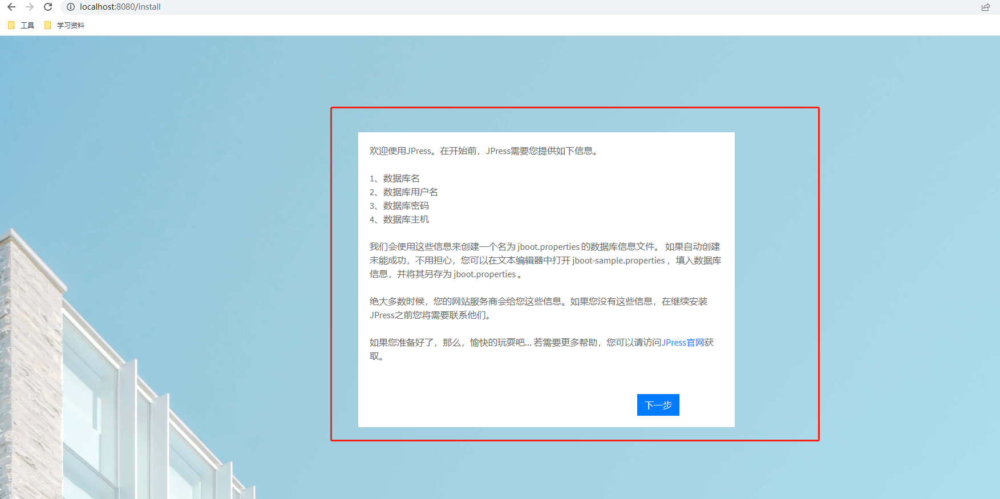
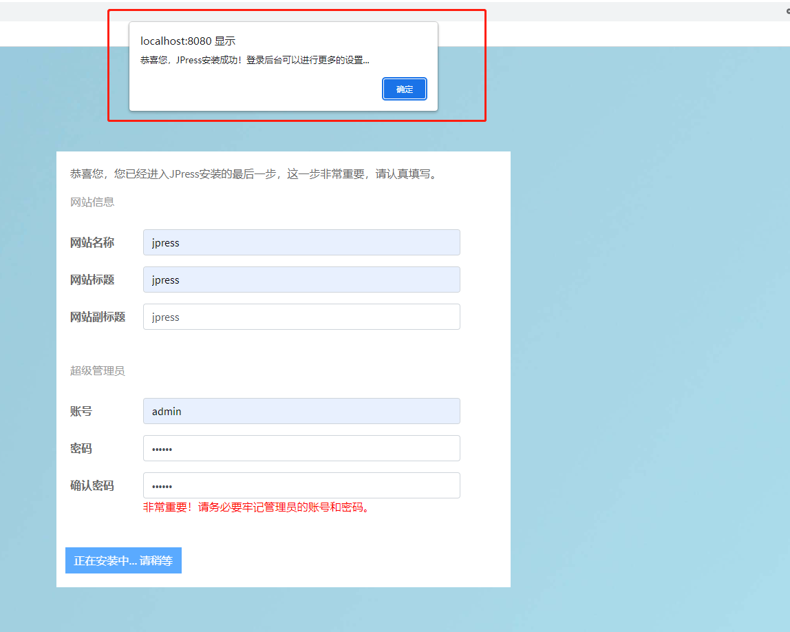
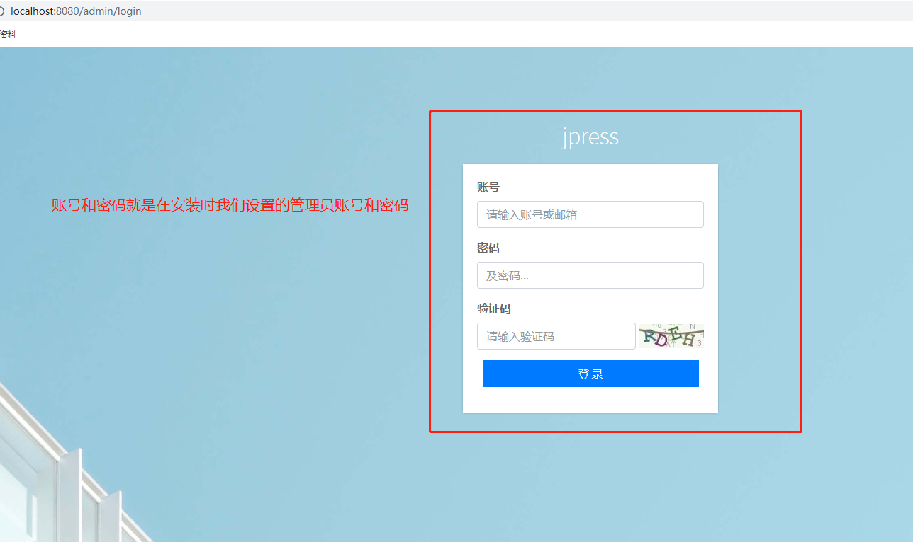

# jpress 的编译和运行
* **这里以idea为例来演示操作 eclipse同理即可**
## 1-编译

在编译之前，请先配置好当前电脑的 Maven 环境，和 JDk 环境。

* 1、Maven 环境配置：
* 2、JDK 环境配置：

1-打开终端

  
2-输入编译命令 **mvn clean package** 然后回车 等待编译结束

  
* 3-编译结束
  
  
## 2-运行
* 1-找到项目启动类 并**点击绿色小箭头启动项目**
  
  
* 2-出现如下界面 则表示启动成功

  
* 3-启动项目之后在本地环境下 可以**通过 http://127.0.0.1:8080 或者 http://localhost:8080 来访问我们的首页**
* 4-如果我们是第一次下载并启动 那么就会进入到 jpress的图形安装页面 **安装过程会自动建库建表**
  
  
* 5-然后点击下一步 然后填入对应的信息 点击下一步
  
  
* 6-然后 同样的填入对应的信息 点击完成 然后等待一会
  

* 7-出现提示安装成功的弹窗之后 则表示安装成功
  
  
* 8-安装成功之后 需要在项目文件中 **stater->target->classes 文件夹下找到 **install.lock 和 jboot.properties 俩个文件**
  
  
* 9-然后将这俩个文件 复制到 **starter->src->main->resource** 目录下
>说明->因为 jpress 是否安装决定在这两个文件 当执行 mvn clean 命令时 maven 会清除 target 下的所有文件 从而使 JPress 会再次走安装流程 所以需要将这俩个文件复制到 resources目录下

  
  
* 10-访问 jpress 首页
>我们可以通过 http://localhost:8080 来访问我们的首页

* 11-访问 jpress 后台
>我们可以通过 http://localhost:8080/admin 来访问我们的后台

  

* 12-输入账号和密码 以及验证码之后进入后台 **至此 jpress 已经编译并运行成功**
  