# 云服务器 CentOS7 操作系统上 Tomcat 部署项目

## 1、xShell 和 xftp 下载安装（略）

xShell 和 xftp 下载地址：[https://www.xshell.com/zh/free-for-home-school/](https://www.xshell.com/zh/free-for-home-school/)

## 2、xftp 连接云服务器

xftp 新建连接 

    
连接会话属性：名称：自定义，主机：云服务器公网IP

上图中的用户名和密码，在两种地方可以设置

（1）更换操作系统时，如下图所示：

（2）对云服务器的实例操作：管理 -> 重置实例密码

如下图所示：

数据填写完毕，最后点击确定，弹出会话列表

选择你添加的会话，点击连接，如下图所示：

连接成功

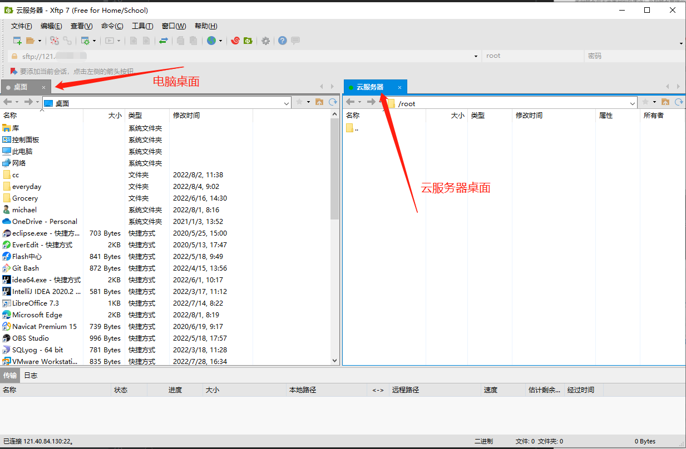

## 3、JDK 压缩包下载

下载 jdk1.8 

注：此处 CentOS7 是64位，所以下载的是：Linux x64， 文件类型为 tar.gz 的文件

JDK 官网地址：[https://www.oracle.com/java/](https://www.oracle.com/java/)

xftp 界面，找到 Windows 桌面上下载好的 jdk1.8 的压缩包

把 jdk 压缩包拖动到云服务器界面，直接鼠标选中文件拖动即可

如下图所示：

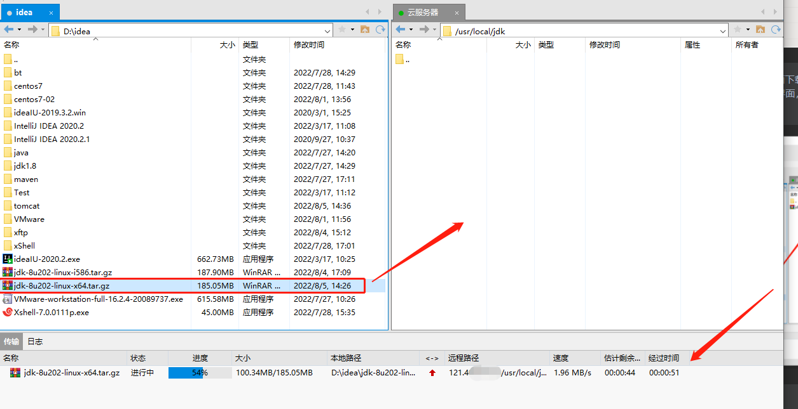

xShell 连接云服务器，找到 jdk1.8 所在的位置，输入解压指令：

    tar -xvf jdk-8u202-linux-x64.tar.gz  

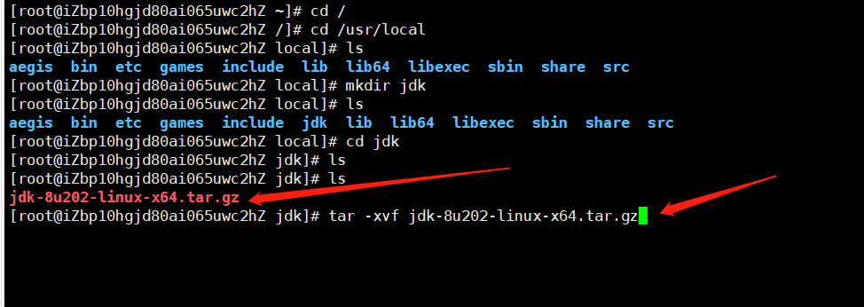

配置 jdk 环境，输入编辑指令：

    vim /etc/profile

进入编辑页面，输入 i 开始编辑

在最后一行加上环境：

    #set java enviroment
    JAVA_HOME=/usr/local/jdk/jdk1.8 
    CLASSPATH=.:$JAVA_HOME/lib.tools.jar
    PATH=$JAVA_HOME/bin:$PATH
    export JAVA_HOME CLASSPATH PATH
    
JAVA_HOME= jdk 的安装路径，编辑完毕，按下键盘的 Esc 退出编辑模式，再输入指令：

    :wq

保存并退出

如下图所示：

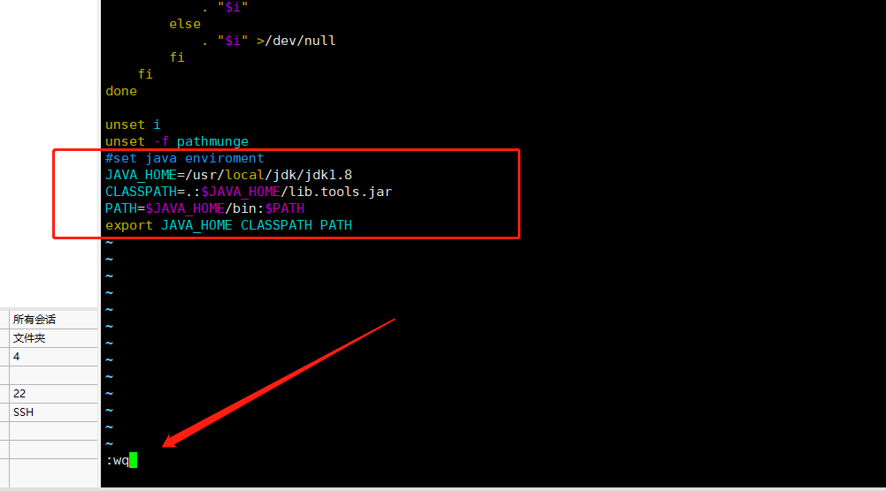

检查 jdk 是否安装成功，编辑完保存退出

输入重置环境指令：

    source /etc/profile

输入查看版本指令：

    java -version

## 4、Tomcat 压缩包下载

下载 apache-tomcat-9.0.65.tar

下载地址：[https://tomcat.apache.org/download-90.cgi](https://tomcat.apache.org/download-90.cgi)

在 xftp 界面找到 Windows 桌面下载好的 tomcat 压缩包

把 tomcat 压缩包拖动到云服务器界面，直接鼠标选中文件拖动即可

如下图所示：    

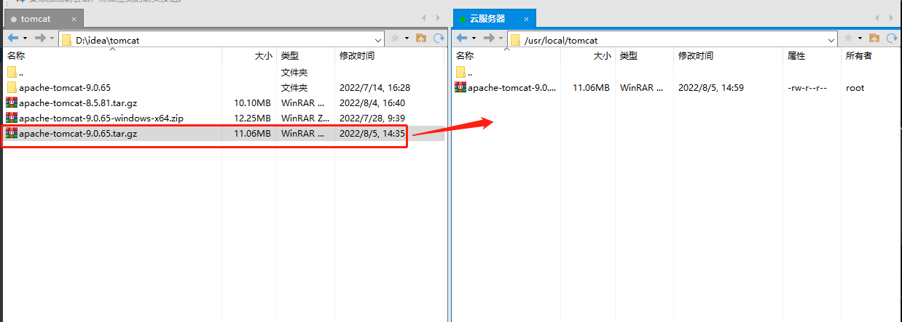

xShell 连接云服务器，输入解压指令：

    tar -xvf apache-tomcat-9.0.65.tar.gz

开放 8080 端口
    

启动tomcat，进入 tomcat 的 bin 目录，输入启动指令：

    ./startup.sh 

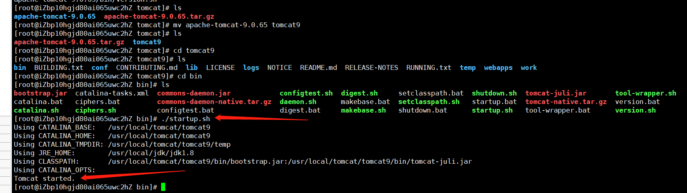

测试是否启动成功，在浏览器中输入：云服务器公网IP:8080

如下图所示：

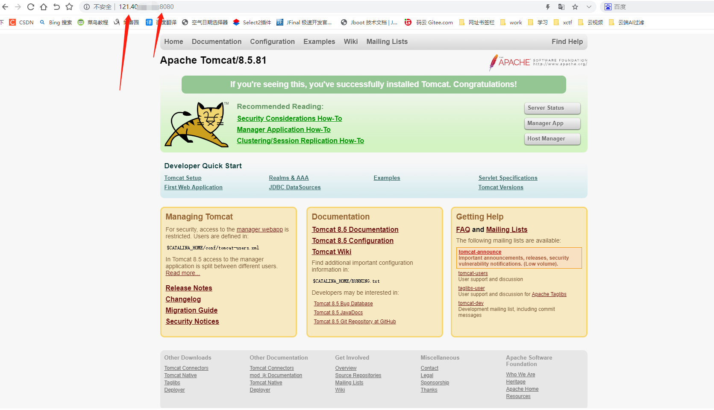

## 5、linux 中 mysql 下载安装

输入查看指令：

    rpm -qa | grep mysql

查看是否安装过 mysql

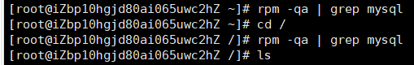

下载安装 mysql 的 repo 源，CentOS 7 的 yum 源中默认是没有 mysql 的

所以我们首先下载安装 mysql 的 repo 源，输入指令：

    wget http://repo.mysql.com//mysql57-community-release-el7-7.noarch.rpm

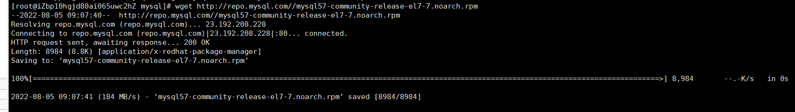

安装 mysql 的 repo 源，输入指令：

    rpm -ivh mysql57-community-release-el7-7.noarch.rpm

安装之后会获得 /etc/yum.repos.d/mysql-community.repo 和 /etc/yum.repos.d/mysql-community-source.repo 两个源

安装 mysql，输入安装指令：

    yum install mysql-server 

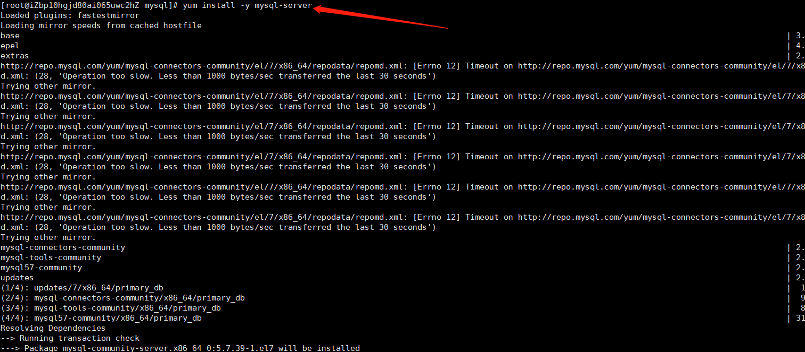

安装 mysql 遇到问题：

安装报错：
        
    Failing package is: mysql-community-libs-compat-5.7.39-1.el7.x86_64
          GPG Keys are configured as: file:///etc/pki/rpm-gpg/RPM-GPG-KEY-mysql
        
解决办法：执行指令：

    rpm --import https://repo.mysql.com/RPM-GPG-KEY-mysql-2022

再重新执行安装指令：yum install mysql-server，则安装成功，如下图所示：

启动 mysql，输入指令：

    service mysqld start
        
输入查看临时密码指令：

    grep 'temporary password' /var/log/mysqld.log
        
2022-08-05T01:40:27.650536Z 1 [Note] A temporary password is generated for root@localhost: tbTmxl:xa1-l

初始密码在 “root@localhost:“之后

更改密码指令（新密码要符合策略：大写字母 + 小写字母 + 特殊字符 + 数字）：

    mysql_secure_installation

如下图所示：

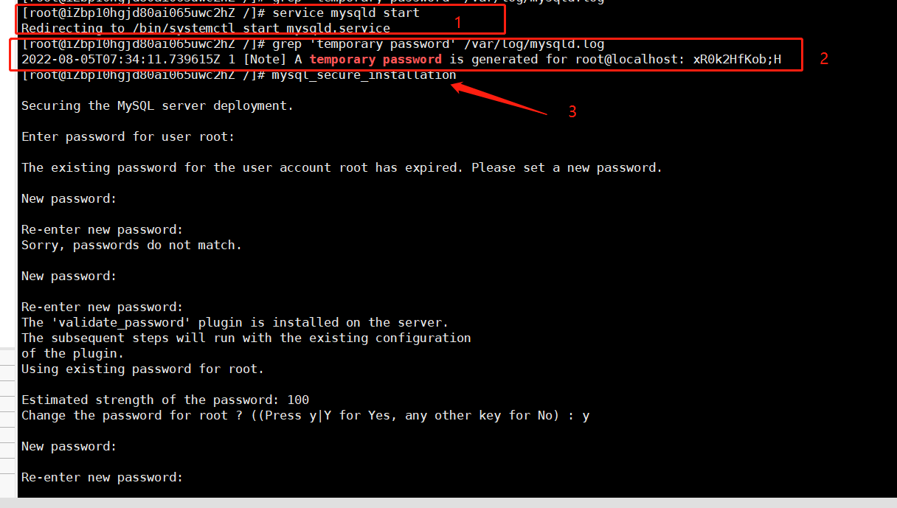

安装配置成功，如下图所示：

   

本地连接云服务器的 mysql 失败

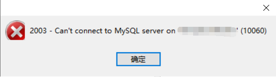

云服务器开放 3306 端口

登录 mysql，输入查看用户访问权限指令：

    select user ,host from mysql.user; 
            
开放用户的访问权限，使用如下命令将所需要开放的用户的访问权限改为任意：

    GRANT ALL PRIVILEGES ON *.* TO 'root'@'%' IDENTIFIED BY '*********' WITH GRANT OPTION;

注意：这里的密码需要最短为8位，而且最好同时有大写字母、小写字母、数字、特殊符号否则可能通不过密码强度校验而报错。

也可以使用set global validate_password_policy=0;命令临时去掉密码强度校验

如下图所示：

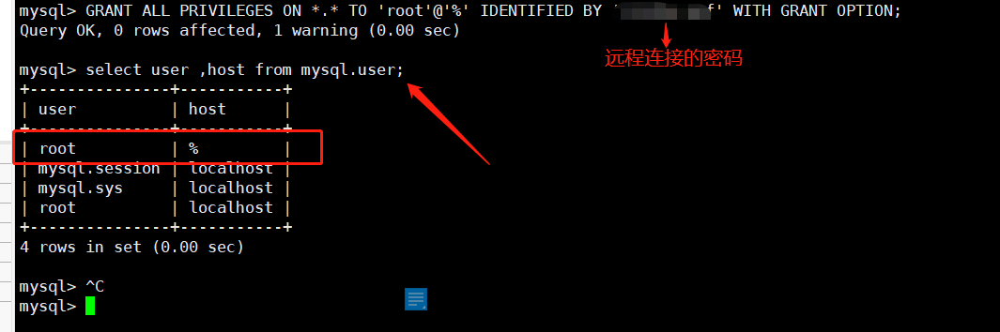

本地连接云服务器 mysql，主机：云服务器公网 IP

在云服务器的 mysql 中创建新的数据库，鼠标右键点击本地连接的云服务器 mysql，再选择新建数据库

如下图所示：

## 6、云服务器 tomcat 部署项目

找到项目 war 包位置，通过 xftp 把本地的 war 包上传到 tomcat 的 weapps 目录下

如下图所示：

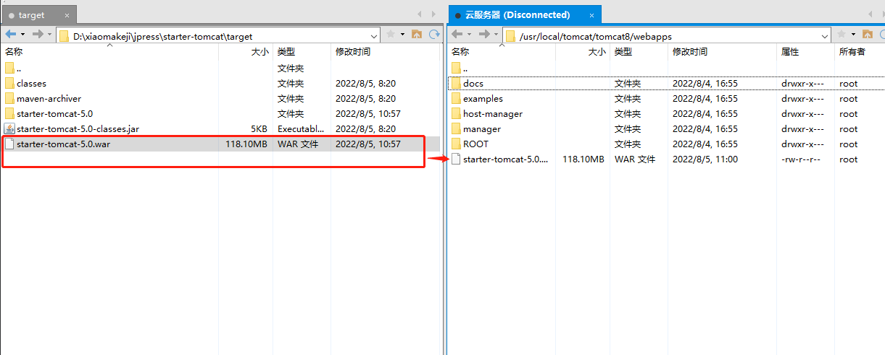

测试是否部署成功，进入 tomcat 的 bin 目录，输入启动指令：

    ./startup.sh 

注：要关闭防火墙
        
在浏览器中输入：云服务器公网 IP：8080/war 包的名字 

如：120.40.80.130：8080/starter-tomcat-5.0

如下图所示：

