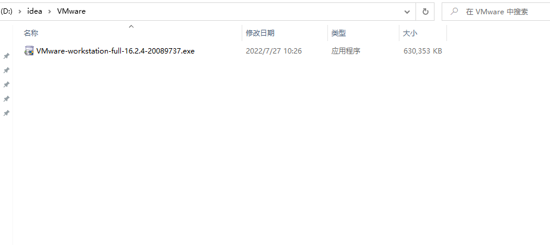
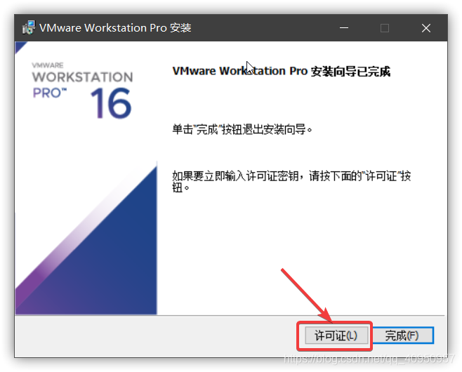
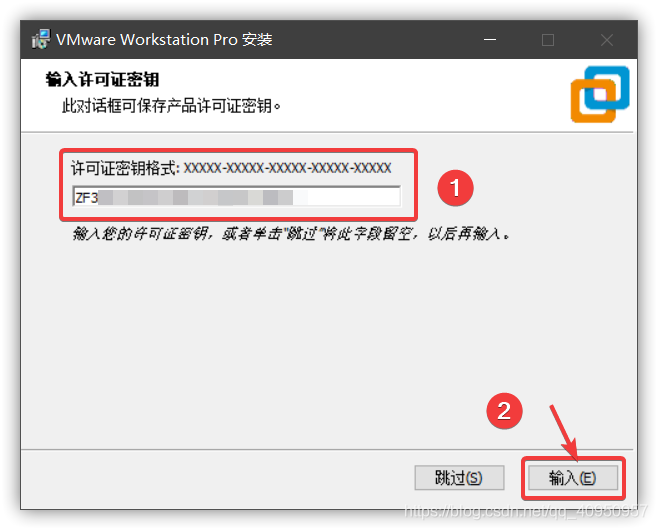
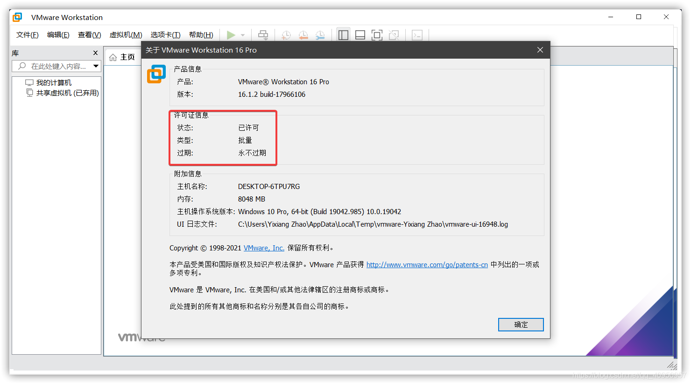
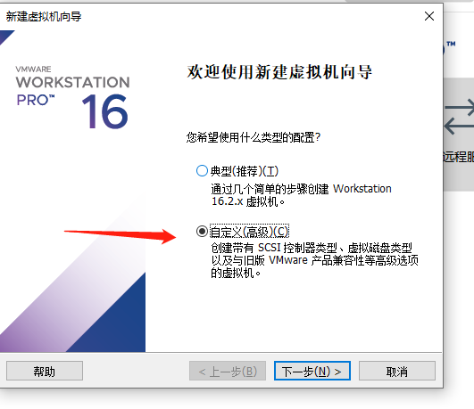
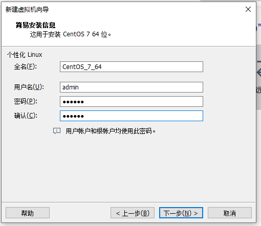
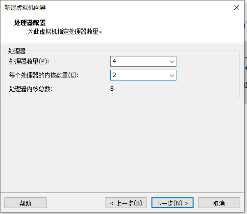
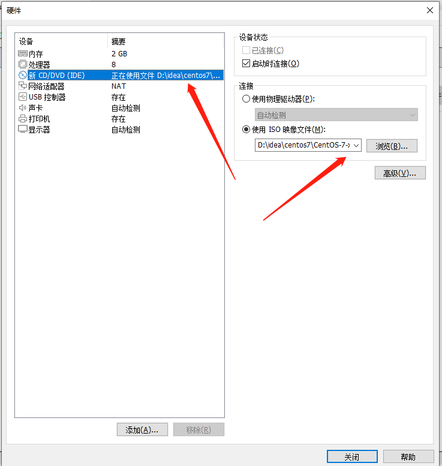
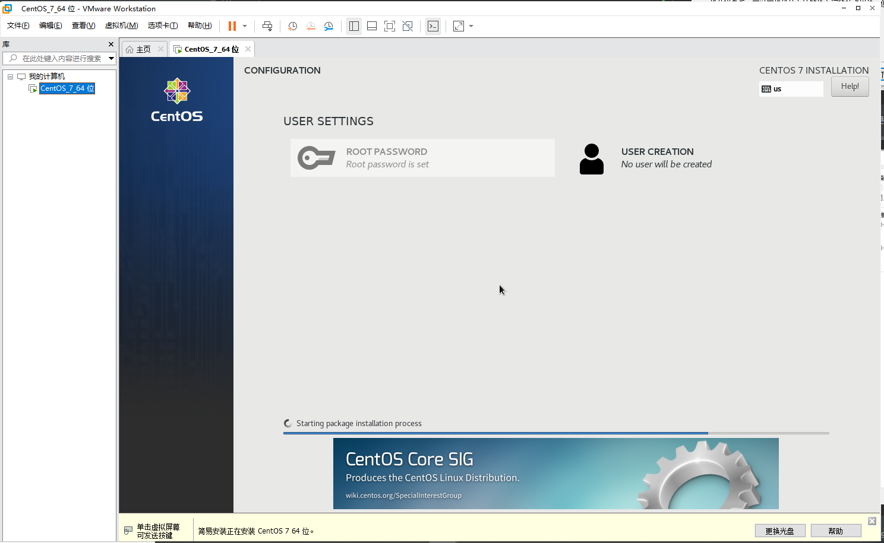

# CentOS 下载

官网下载地址：[https://www.centos.org/download/](https://www.centos.org/download/)

## 1、下载 centos

进入下载页面，选择 x86 64

根据需要选择，此处以 aliyun 镜像示例

文件过大，下载时间长

镜像下载完毕

##2 下载 VMware 

官网下载地址[https://www.vmware.com/cn/products/workstation-pro.html](https://www.vmware.com/cn/products/workstation-pro.html)

选择 Workstation Pro，点击进入下载页面

此处选择试用版为示例

打开下载好的 .exe 文件，即可开始安装
        安装位置默认在 C 盘下，也可以自定义安装路径，安装路径尽量不要有中文
        安装时一路 next 即可。

安装成功

若你是购买的，点击**许可证**输入密钥激活软件

安装后可能要求重启系统，重启后进入软件。

依次点击导航栏中的 帮助 -> 关于 VMware Workstation ，查看许可证信息的状态，
        
如下图所示即为激活成功。

试用版直接点击完成即可，打开 VMware，创建新的虚拟机，
        
注：以下皆为示例内容，实际看自身需求

选择自定义

选择下载的 CentOS 7 镜像

    
继续点击下一步，会弹出下图所示内容

点击下一步，可以自定义位置

点击下一步，配置处理器数量，和核心数分配根据自己电脑来配，重点是：内核数不要超过自己电脑内核数。

点击下一步，进行内存分配（默认为1024MB），分配大小为2GB，即2048MB

下面几步默认即可

网络类型：默认使用网络地址转换；SCSI控制器：默认LSI Logic(L) ；虚拟磁盘类型：默认SCSI(S)；磁盘：默认选择创建新的磁盘 

指定磁盘容量    

下一步“指定磁盘”文件默认即可，到自定义硬件，

 最后点击完成，即会生成新的虚拟机，正在安装 CentOS 7 64位，如下图所示：

CentOS 7 64位安装完成，点击中间用户就可以进行登录操作了

输入设置的密码,点击登录

进入虚拟机页面

## 3、虚拟机语言设置（更换为中文）

点击左上角 Applications->System Tools -> Setting

选择 Region & Language

点击 Language 那一栏进行语言设置

选择 汉语（中国），再点击 Done

再点击 Restart 进行重置

点击 Log Out，然后重新登录

语言设置完成，重新登录

## 4、虚拟机网络连接配置

鼠标放在虚拟机页面，单击鼠标右键，选择打开终端

进入终端页面

网络连接配置，需编辑 ifcfg-ens33 文件，需要管理员权限才可编辑，

    用户区分：
    $ 普通用户
    # root 用户
    输入指令：su ，按回车键，再输入你的登录密码，如下图显示，则切换成功

找到虚拟机，左上角编辑按钮，点击选择虚拟网络编辑器，操作如下图所示，点击更改设置进入编辑模式

网络编辑

    步骤如下：
    1、选择类型为NAT模式的点击进行编辑
    2、取消使用本地 DHCP 服务将 IP 地址分配给虚拟机
    3、记下NAT设置的 IP 、掩码、网关，编辑 ifcfg-ens33 文件时会用到
    4、点击应用
    5、点击确定

如下图所示：

查找 ifcfg-ens33 文件，在虚拟机终端输入指令：

    cd /etc/sysconfig/network-scripts 

进入目录，再输入 ls ，查看当前目录下文件，找到要编辑的文件：ifcfg-ens33
    
如下图所示：

输入编辑指令：

    vi ifcfg-ens33

编辑 ifcfg-ens33 文件，进入编辑页面按下键盘上的 i 进入编辑模式

IPADDR IP 地址，NETWORK 子网掩码，GATEWAY 网关 IP，DNS

在最下方输入相应的数据：

    IPADDR=192.168.21.129
    NETWORK=255.255.255.0
    GATEWAY=192.168.21.2
    DNS=192.168.21.2

输入完毕后，再按下键盘上的 Esc 按钮，再输入指令 （:wq），再点击回车键保存并退出

如下图所示：

测试是否配置成功，输入指令 ：

    ping www.baidu.com

如下图所示：ping 成功则网络连接成功：

