# 云服务器 undertow 部署项目

## 环境准备：jdk1.8，mysql5.7

## 1、JDK 压缩包下载

下载 jdk 1.8 

在xftp 界面找到 Windows 桌面下载好的 jdk 压缩包

把 jdk 压缩包拖动到云服务器界面，直接鼠标选中文件拖动即可，如下图所示：

xShell 连接云服务器，输入解压指令：

    tar -xvf jdk-8u202-linux-x64.tar.gz 

配置jdk环境，修改文件名称：

    mv jdk1.8.0_202 jdk1.8

进入 jdk1.8 文件夹：cd jdk1.8

输入定位指令：

    pwd

输入编辑指令：

    vim /etc/profile

进入编辑页面，输入 i 开始编辑，如下图所示：

在最后一行加上环境：

    #set java enviroment
    JAVA_HOME=/usr/local/jdk/jdk1.8 
    CLASSPATH=.:$JAVA_HOME/lib.tools.jar
    PATH=$JAVA_HOME/bin:$PATH
    export JAVA_HOME CLASSPATH PATH
    
JAVA_HOME= jdk 的安装路径，编辑完毕，按下键盘的 Esc 退出编辑模式，再输入 ：
    
    :wq 

按下回车键，（:wq）的意思是保存并退出，如下图所示：

检查 jdk 是否安装成功，编辑完保存退出

先输入重置环境指令：

    source /etc/profile

再输入查看 jdk 版本指令：

    java -version

## 2、云服务器中 mysql 的下载安装

输入查看是否安装过指令：

    rpm -qa | grep mysql

下载安装 mysql 的 repo 源，CentOS 7的 yum 源中默认是没有 mysql 的

所以我们首先要下载安装 mysql 的 repo 源，输入指令：

    wget http://repo.mysql.com//mysql57-community-release-el7-7.noarch.rpm

安装 mysql 的 repo 源，输入指令：

    rpm -ivh mysql57-community-release-el7-7.noarch.rpm

安装之后会获得 /etc/yum.repos.d/mysql-community.repo 和 /etc/yum.repos.d/mysql-community-source.repo 两个源

安装 mysql，输入指令：

    yum install mysql-server

安装 mysql 遇到问题：
（1）安装报错：

    Public key for mysql-community-client-5.7.39-1.el7.x86_64.rpm is not installed
     Failing package is: mysql-community-libs-compat-5.7.39-1.el7.x86_64
     GPG Keys are configured as: file:///etc/pki/rpm-gpg/RPM-GPG-KEY-mysql
        

解决办法：执行指令：

    rpm --import https://repo.mysql.com/RPM-GPG-KEY-mysql-2022

再重新执行安装指令：

    yum install mysql-server

安装成功

启动 mysql，输入指令：

    service mysqld start

输入查看临时密码指令：

    grep 'temporary password' /var/log/mysqld.log

2022-08-05T01:40:27.650536Z 1 [Note] A temporary password is generated for root@localhost: tbTmxl:xa1-l
初始密码在 “root@localhost:“之后

输入更改密码输入指令（新密码要符合策略：大写字母 + 小写字母 + 特殊字符 + 数字）：

    mysql_secure_installation
        
如下图所示：

安装配置成功，输入登录指令：

    mysql -uroot -p 
    按回车再输入密码

如下图所示：

本地连接云服务器的 mysql 失败

云服务器开放 3306 端口

登录 mysql，输入查看用户访问权限指令：

    select user ,host from mysql.user; 

开放用户的访问权限，使用如下命令将所需要开放的用户的访问权限改为任意：

    GRANT ALL PRIVILEGES ON *.* TO 'root'@'%' IDENTIFIED BY '*********' WITH GRANT OPTION;
            
注意：这里的密码需要最短为8位，而且最好同时有大写字母、小写字母、数字、特殊符号否则可能通不过密码强度校验而报错，如下图所示：

本地连接云服务器 mysql，主机：云服务器公网 IP

在云服务器的 mysql 中创建新的数据库，鼠标右键点击本地连接的云服务器 mysql，再选择新建数据库

如下图所示：

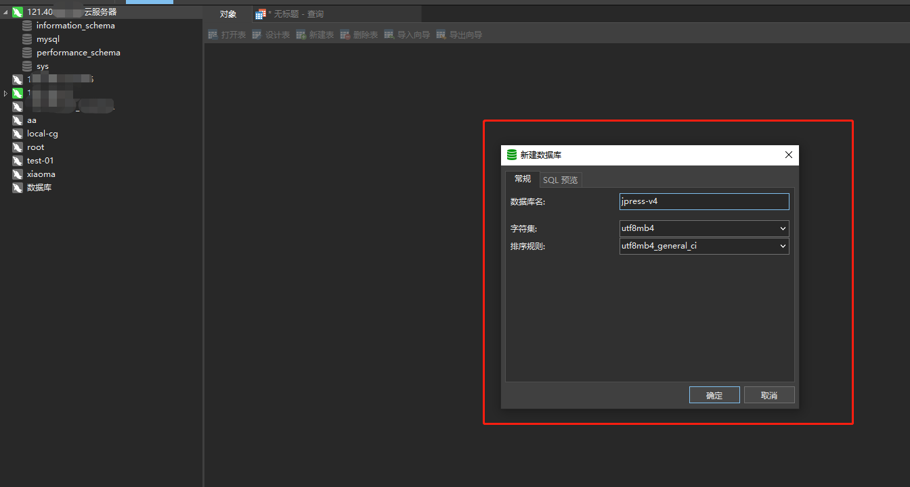

## 3、安装 unzip

解压 .zip 文件，需要安装 unzip，输入安装指令：

    yum install -y unzip zip

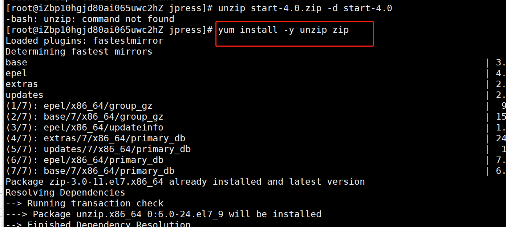

## 4、undertow 部署

项目打包，输入指令：mvn clean package

项目打包后生成的压缩包：start -> target -> starter-4.0.zip

找到压缩包在 Windows 的位置，鼠标选中压缩包，单击右键选择 Open In -> Explorer
        
如下图所示：

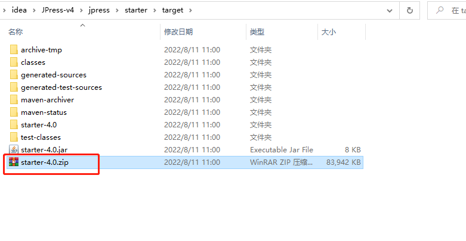

通过 xftp 文件传输工具，上传压缩包 starter-4.0.zip 到云服务器

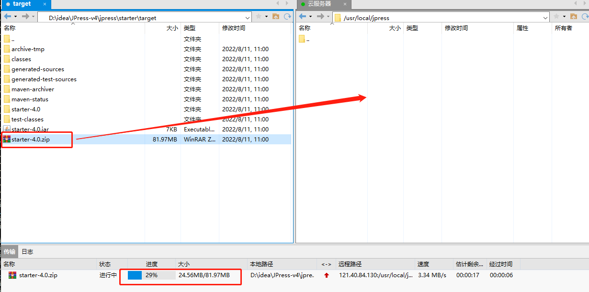

解压 starter-4.0.zip，输入解压缩指令：

    unzip starter-4.0.zip -d starter-4.0

解压缩完成

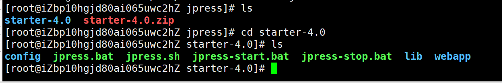

启动项目，输入启动指令：

    ./jpress.sh start

启动报错，如下图所示：

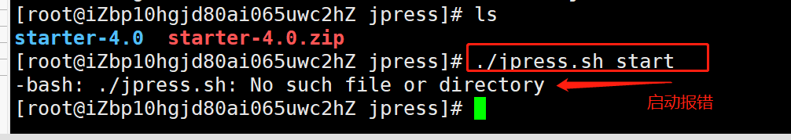

进入解压后的文件夹：cd starter-4.0，查看 jpress.sh 文件格式

输入编辑指令：

    vi jpress.sh

进入编辑页面，按下 Esc 键，输入查看格式指令：

    :set ff
 
输入指令后按下回车键，如下图所示：

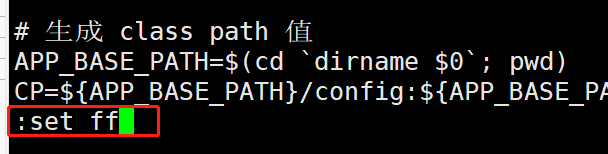

文件格式：fileformat=dos，dos 表示文件编码方式是 windows 编辑，如下图所示：

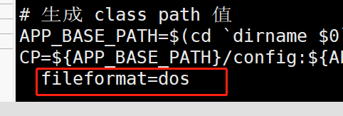

修改文件编码方式为 unix 格式，按下 Esc 键，输入指令：

    :set ff=unix

如下图所示：

再按下 Esc 键，输入指令：

    :wq

输入指令后按下回车键，（:wq）的意思是保存并退出

编辑 jpress.sh 文件的访问信息，输入编辑指令：

    vim jpress.sh

进入编辑页面，输入 i 开始编辑，如下图所示：

在上图指定位置添加： 

    -Dundertow.host=0.0.0.0

按下 Esc，输入保存并退出指令：

    :wq 

启动项目，输入指令：

    ./jpress.sh start

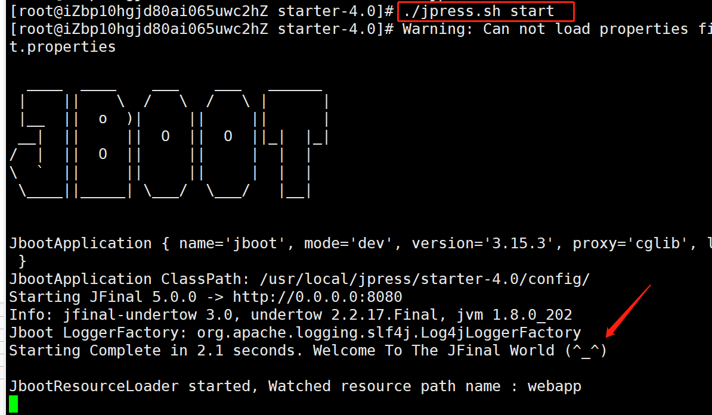

浏览器输入网址进入

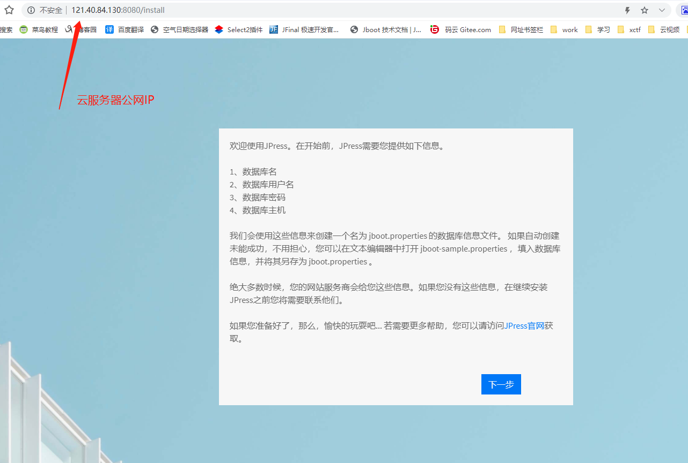

填写数据库信息，数据库名、用户名、密码在上方连接云服务器 mysql 时创建修改的；主机：云服务器的公网 IP

自定义网站名称和超级管理员信息，填写完后点击完成，

完成安装

进入登录页面，输入账号密码登录

登录成功，进入后台管理页面

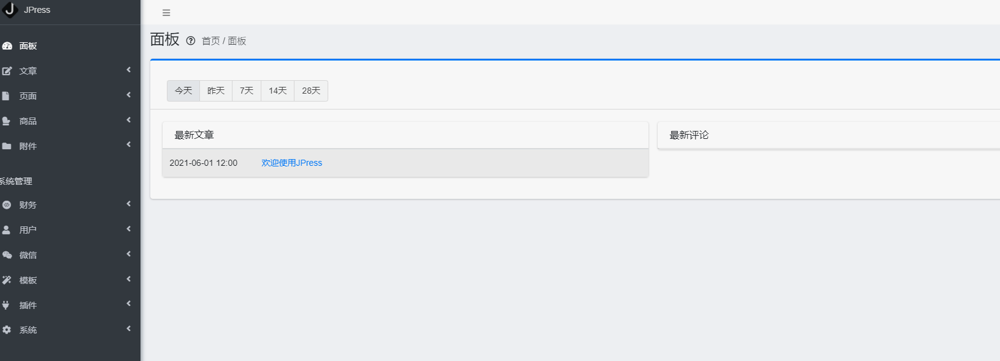

后台启动 JPress 需要修改 jpress.sh 文件里的启动脚本。找到 start() 方法如下所示：

    function start()
    {
        java -Djava.awt.headless=true -Xverify:none ${JAVA_OPTS} -cp ${CP} ${MAIN_CLASS} &
    }

将其修改内容为如下所示：

    function start()
    {
        nohup java -Djava.awt.headless=true -Xverify:none ${JAVA_OPTS} -cp ${CP} ${MAIN_CLASS} >/dev/null 2>&1 &
    }

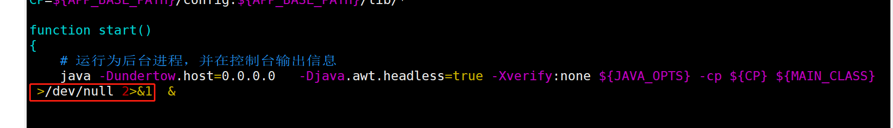

后台启动

    