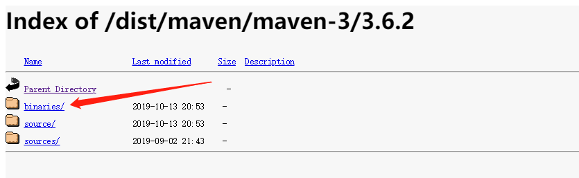
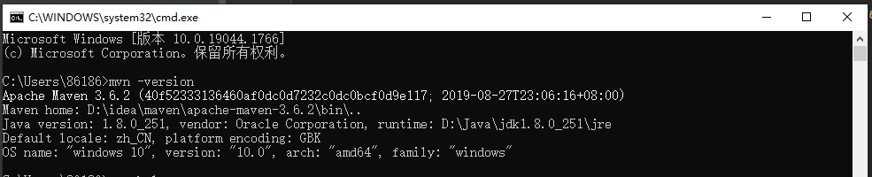
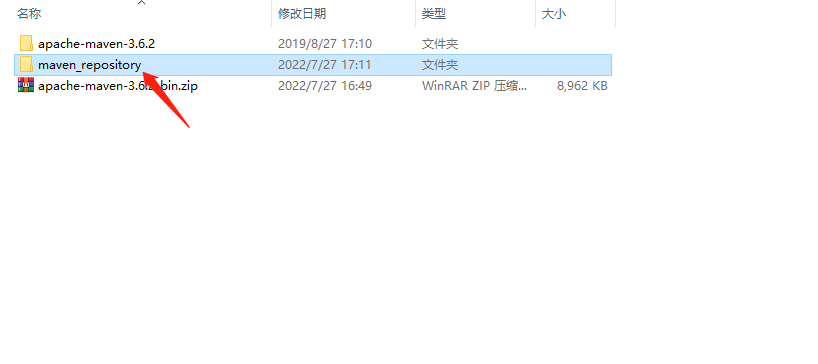
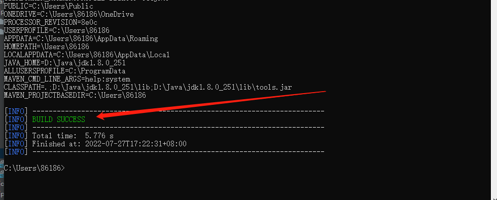
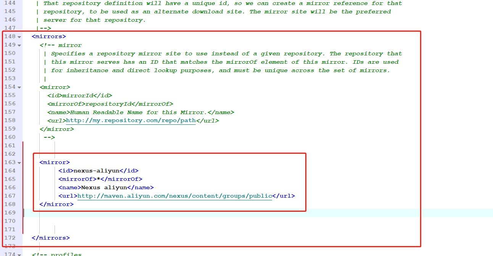

# Maven 下载及配置

## 1、Maven 下载
Maven 官网地址：[https://maven.apache.org/download.cgi](https://maven.apache.org/download.cgi)

进入 Maven 官网，点击 archives 

下载版本 3.6.2

找到下载的压缩包并解压

## 2、配置环境变量

在电脑左下角搜索框输入：控制面板

控制面板 -> 系统与安全 -> 系统

高级系统设置 -> 高级 -> 环境变量

新建环境变量，变量名为 MAVEN_HOME，变量值为 maven 解压后所在的路径

双击 Path，进入界面后，点击编辑文本

## 3、验证 maven 是否安装配置成功

按win+r 快捷键 打开命令窗口，输入 cmd 指令，点击确定

输入查看版本指令：

    mvn -version

setting 文件配置，自定义 maven 仓库（如果不自定义有默认的仓库）

在磁盘中创建一个文件夹，名称为 maven_repository (可以自定义根据自己的习惯起名)。

打开 maven 的安装目录，选择 conf 文件夹中的 setting.xml 文件

编辑文件 settings.xml

找到 settings.xml 中的 localRepository 配置，修改成创建的 maven_repository 文件夹的目录

如：D:\idea\maven\maven_repository

检验下是否已经设置成功，控制台输入：

    mvn help:system，

出现BUILD SUCCESS 说明执行成功

找到新建的maven_repository文件夹查看里面是否有 org 文件夹

如果里面生成文件，即说明修改成功。

修改 Maven 的下载镜像地址为阿里源

安装好Maven时，要及时的修改Maven下载的镜像地址

这里添加的是阿里云中央镜像

