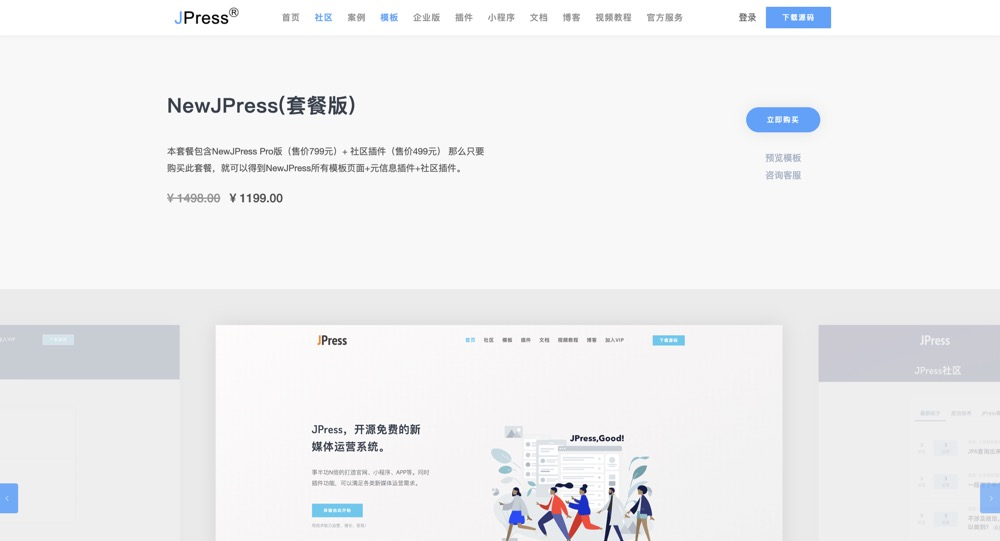

# 商品设置

[[toc]]

## 阐述

本版块可以助你搭建一个带有分销功能的商城。具体功能视模板而定。比如JPress
官网的商城板块是这样的：

## 发布新商品

> 商品-商品列表-新建

发布商品，有基本设置比如商品价格，产品卖点，产品规格，封面视频等。

也有营销相关的设置，比如：限时打折价，限时时间，分销功能，分销收益，访问量设置，
剩余库存等。

还有关于SEO的设置。

## 其他功能

其他功能，比如商品的编辑，删除，商品分类，标签，商品评论与设置等，请参考文章对应的板块文档。
