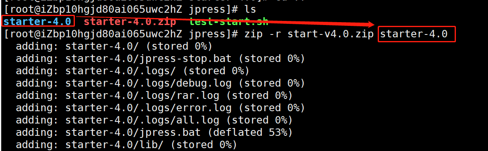
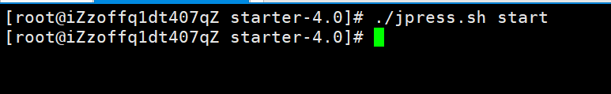

# 云服务器 undertow 部署的项目迁移
Windows 流程相同

## 1、云服务器 CentOS7 操作系统上 undertow 部署的项目迁移到另一台云服务器

两台服务器的运行环境相同

打包要迁移的云服务器上的 JPress 项目，输入打包指令：

    zip -r start-v4.0.zip starter-4.0
   
start-v4.0 ：自定义打包名称，starter-4.0 ：要打包的文件；如下图所示 ：

数据备份（十分重要）

数据迁移，连接新的服务器，并创建数据库，数据库名称要和旧的相同

运行SQL文件，选择你备份的 .sql 文件，如下图所示：

启动项目，后台运行

迁移成功

