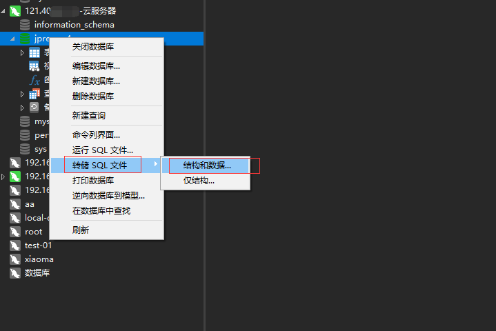
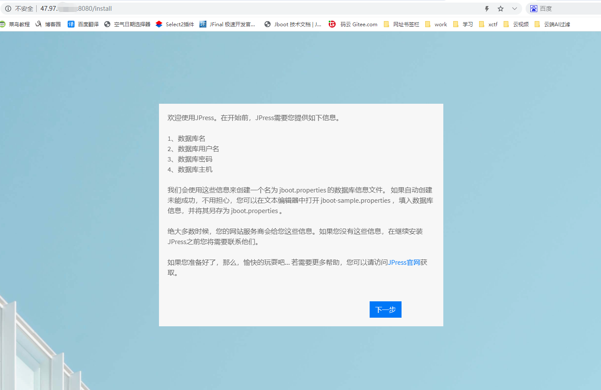
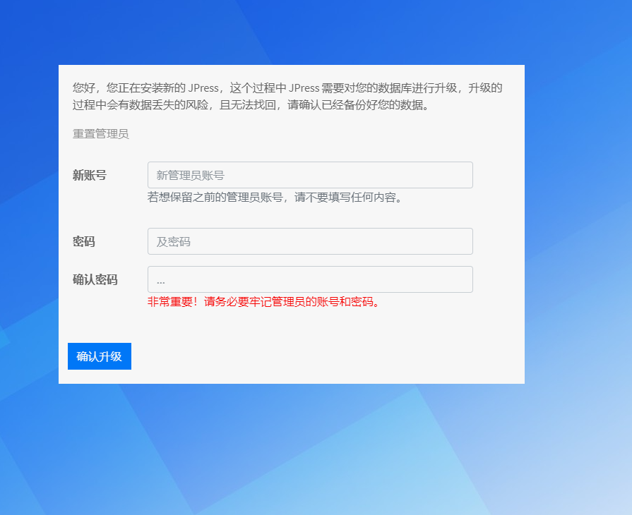

# 项目升级

## 云服务器上的 JPress 项目从版本 v4 升级到 v5

注：暂时只支持 v3 和 v4 升级到 v5，v3 和 v4 升级到 v5 的流程相同，下面讲述的是 v4 升级到 v5 的流程

数据库数据备份（非常重要）

停止项目，找到项目所在的文件夹

删除 v4 下的 lib，webapp/static，webapp/WEB-INF

把 v5 下的 lib，webapp/static，webapp/WEB-INF 上传到 v4 对应的位置

如下图所示：

删除v4 下的 config 文件夹下的 install.lock 和 jboot.properties

重走安装流程，更新数据库（新版本有新增表或字段），安装时连接的数据库还是原来的数据库

启动项目

浏览器访问：公网 IP:8080，如下图所示：

数据库名称必须和之前的一样（连接的还是之前的数据库），点击下一步

重置管理员，也可以和之前的相同

注：升级前一定要进行数据备份，防止升级过程中数据丢失，输入完毕后点击升级

升级完毕，点击确定后进入登录页面

