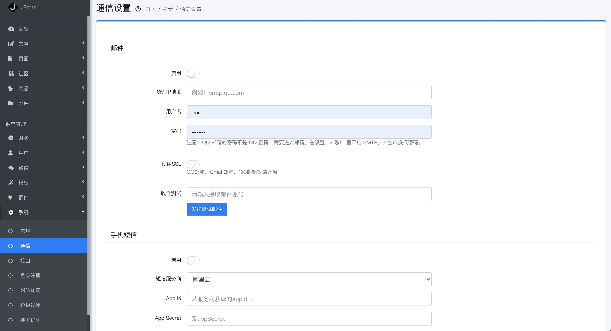
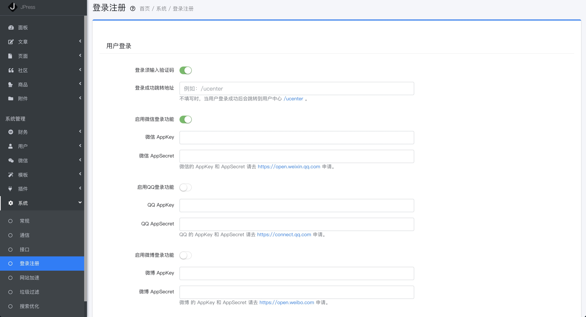
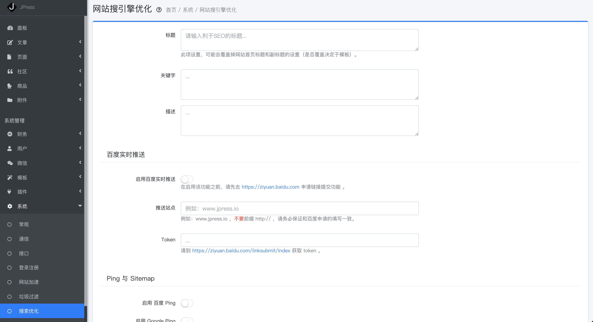

# 设置功能

[[toc]]

## 阐述

下方介绍的这些功能，一般需要有一些运维基础，比如配置通信信息，API信息，网站搜索引擎优化等。

## 常规设置

> 系统-常规

在这里可以设置网站名称，标题，副标题，这些会显示在网站的头部。

同时也可以设置网站备案号和版权信息，这部分需要模板支持才会到网站底部。

## 通信设置

> 系统-通信

这部分是用来给网站用户发消息所做的配置，根据网站提示来即可。

## 接口设置

> 系统-接口

可以通过开发接口来获取JPress的数据，这部分是给开发者使用。

## 登录注册设置

> 系统-登录注册

可以设置用户登录注册时的信息，比如登录是否启用验证码，是否启用微信、QQ、微博、
Github、码云、钉钉登录等，如果启用，正确配置即可。

## 网站加速设置

> 系统-网站加速

本功能，可以让网页速度飞起来！

## 垃圾过滤

> 系统-垃圾过滤

此功能为了防止用户或者机器发布非法关键字到网站，可以提前定义一批关键字，
系统将自动屏蔽。

也可以直接调用云端的过滤，此功能云端收费，做好相应配置。

## 网站搜索引擎设置

> 系统-搜索优化

此功能是优化网站SEO，便于抓取排名等，包括SEO关键字，标题，描述，以及百度实时推送，
Ping 与 Sitemap 以及伪静态等。

