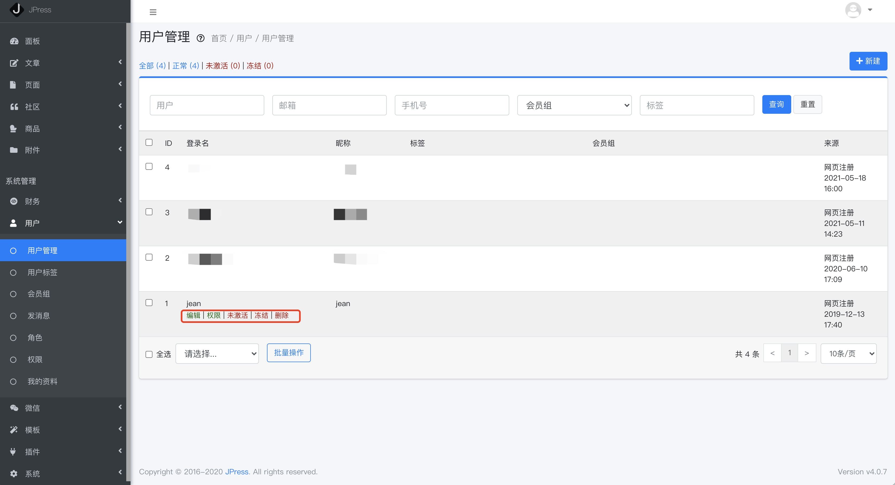

# 用户管理

[[toc]]

## 阐述

在网站上注册的用户可以在这里管理，比如编辑某用户的信息，冻结某用户，给其分配权限，或者删除掉等。

## 权限

> 用户-权限

当第一次进入时，此页面空的，需要点击右上角 同步所有权限 即可得到如下图所示的页面，
进而可以给某些用户分配特定的权限。

## 发消息

> 用户-发消息

可以给某些用户发送邮件、短信，或者微信，前提是将相关配置填写好。

## 我的资料

> 用户-我的资料

可以看到自己的基本信息，也可以修改昵称，头像，密码等个人信息。

