# Tomcat 部署

## 部署环境：jdk1.8，Tomcat9，mysql5.7

## jdk 下载安装及配置

jdk 官网地址： [https://www.oracle.com/java/](https://www.oracle.com/java/)

### 1、jdk 下载

进入官网，定位到：Java -> Java SE -> Oracle JDK 点击进入，如下图所示：

选择 Java archive，再鼠标下拉页面，选择 Java SE 8 (8u202 and earlier)

下载 jdk-8u202-windows-x64.exe

### 2、jdk 安装

下载 jdk 到本地，找到该文件，鼠标双击 .exe 应用程序，运行 jdk 进行安装

进入 jdk 安装界面，点击下一步

安装位置可以默认，也可以自定义，然后一直点击下一步直到完成即可。

### 3、配置 jdk1.8 的环境变量

在电脑左下角搜索框输入：控制面板

控制面板 -> 系统与安全 -> 系统

高级系统设置 -> 高级 -> 环境变量

新建环境变量，变量名为 JAVA_HOME，变量值为 jdk 安装的路径

鼠标双击 Path，已安装过 jdk 的点击编辑，第一次安装的点击新建

### 4、验证 jdk 是否配置成功

按 win+r 快捷键，打开命令窗口，输入 cmd 指令，点击确定

输入指令：

    java -version

若能查看到安装的 jdk 版本，则配置成功

## Tomcat 下载安装及配置

### 1、Tomcat9 下载

Tomcat 官网地址：[https://tomcat.apache.org/](https://tomcat.apache.org/)

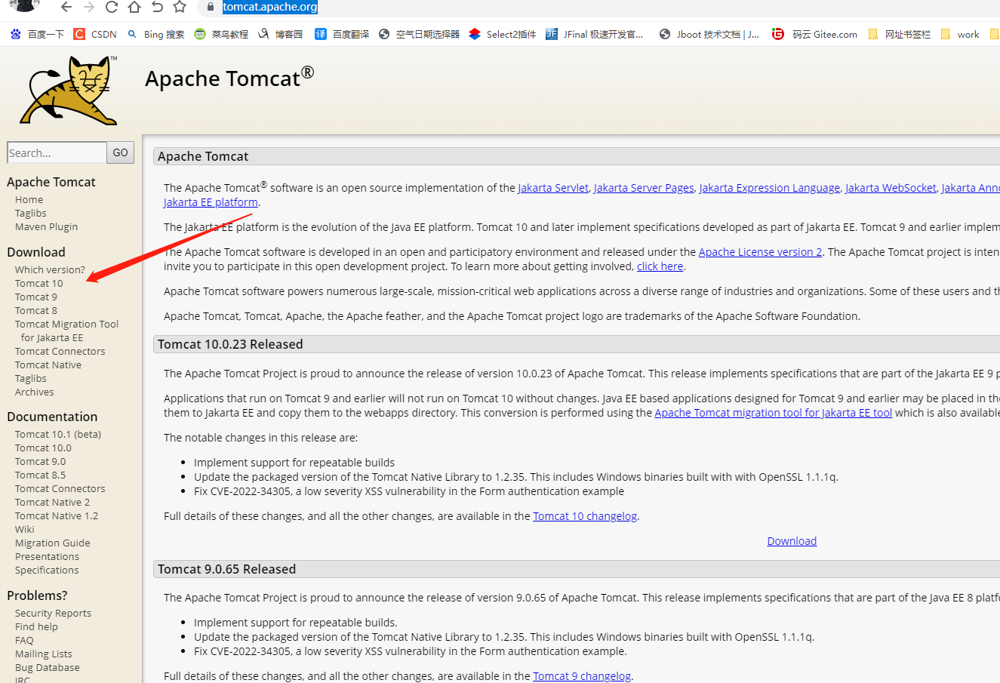

点击 tomcat 9 进入下载页面，再点击下载 64-Bit Windows zip（Win64）

找到下载的压缩包并解压

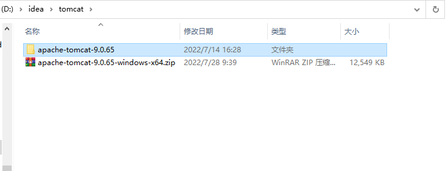

### 2、Tomcat 配置环境变量

首先在电脑左下角搜索框输入：控制面板

控制面板 -> 系统与安全 -> 系统。

高级系统设置 -> 高级 -> 环境变量

新建环境变量，变量名为 TOMCAT_HOME，变量值为 tomcat 解压后所在的路径

双击 Path，点击新建

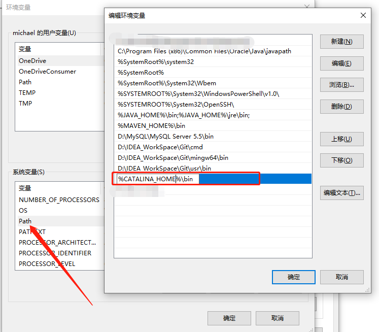

### 3、验证 tomcat9 是否配置成功

按 win+r 快捷键，打开命令窗口，输入 cmd 指令，点击确定

输入指令：

    startup.bat

看能否正常启动

上图 tomcat 启动后乱码的问题：

打开解压后的文件：apache-tomcat-9.0.65 -> conf -> logging.properties

编辑文件：logging.properties

找到一行代码，如下所示：

    java.util.logging.ConsoleHandler.encoding = UTF-8

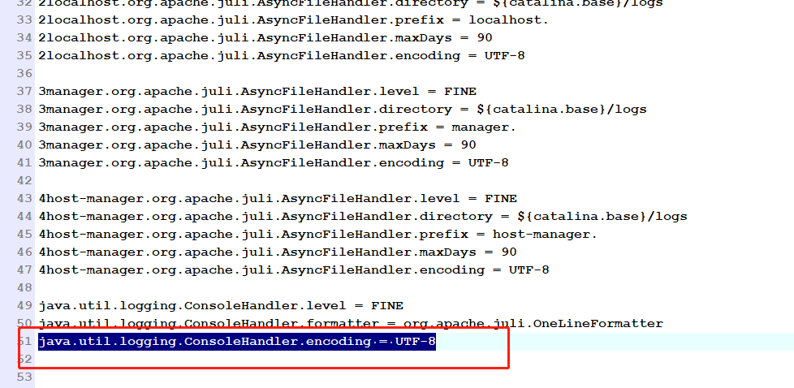

修改为：

    java.util.logging.ConsoleHandler.encoding = GBK

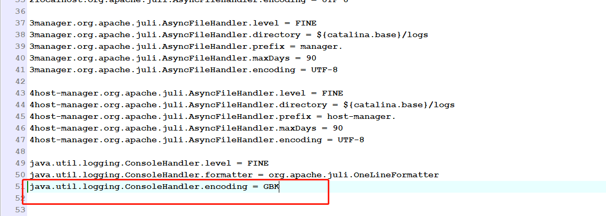

保存并重新启动 tomcat，输入指令：startup.bat，乱码问题得到解决。

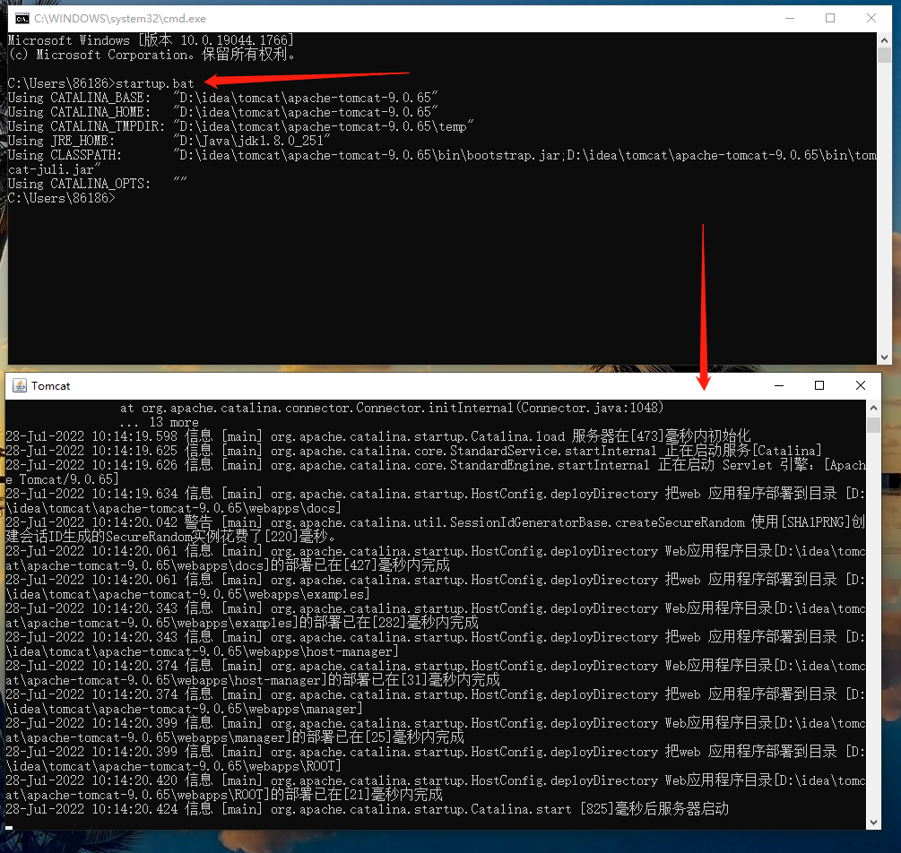

验证是否能正常访问，网页测试

注：上图网页测试时，下图输入指令：startup.bat 启动的 tomcat 命令界面不能关闭，关闭后无法访问

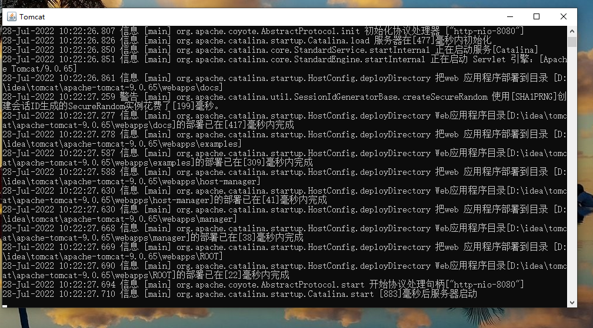

tomcat 默认端口号为 8080，若 8080 被占用或想更换访问端口号

编辑：apache-tomcat-9.0.65 -> conf -> server.xml

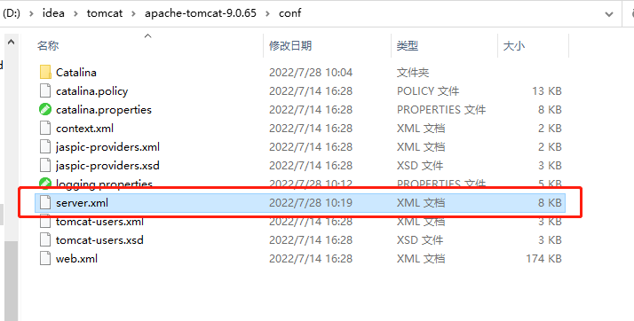

编辑 server.xml，找到 Connector 标签所在位置，如下图所示：

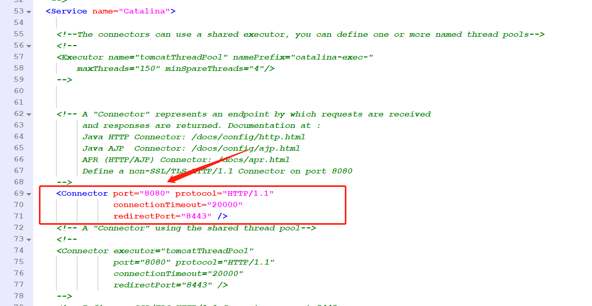

端口号修改：9527

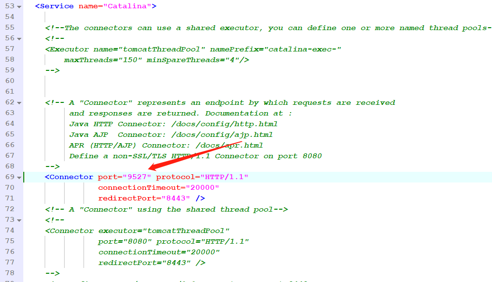

重新启动 tomcat

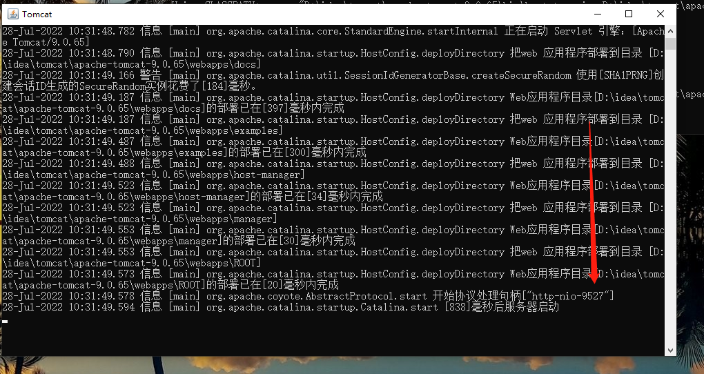

网页测试，输入更改的端口号：9527

配置 tomcat 开机自启动

找到 tomcat 文件的 bin 目录

输入 cmd

进入命令页面，输入指令：

    service.bat install Tomcat

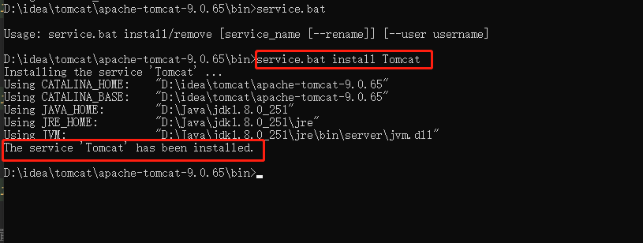

在电脑左下角搜索框输入：服务

找到 Apache Tomcat 9.0，单击鼠标右键，选择属性，把启动类型选择自动，点击确定，如下图所示：

## MYSQL 下载安装及配置

### 1、mysql5.7 下载

官网下载地址:[https://dev.mysql.com/downloads/mysql/](https://dev.mysql.com/downloads/mysql/)

进入官网下载页面，点击 Archives 进入选择版本页面

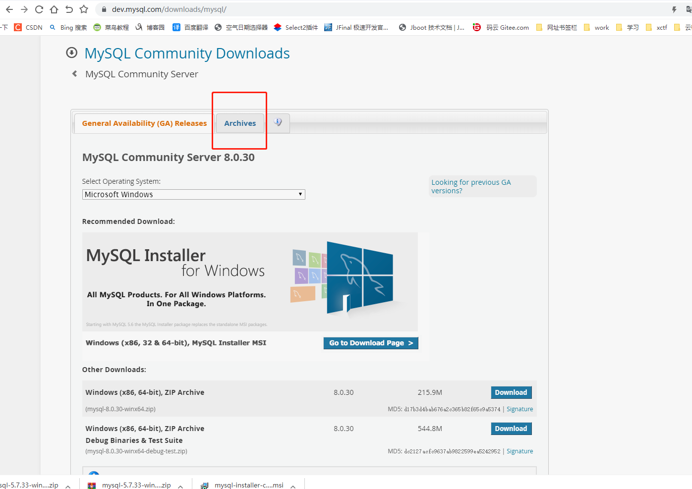

选择版本和下载

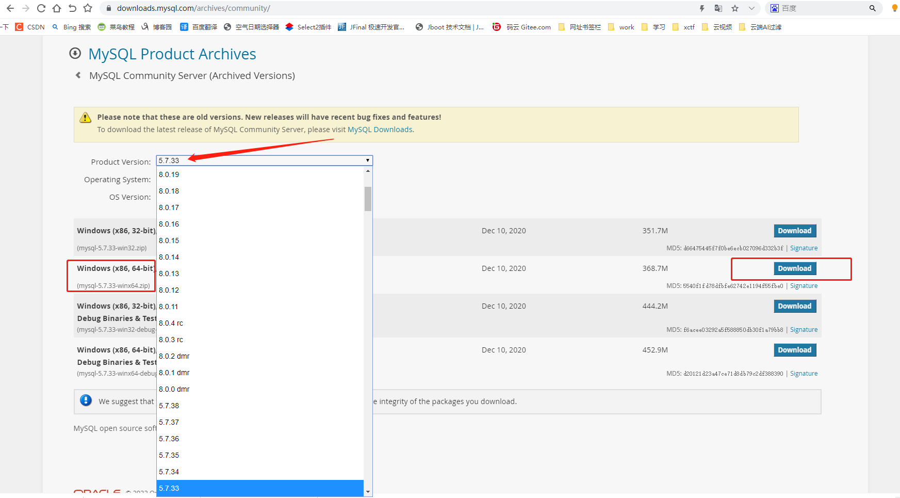

找到下载的压缩包，并解压

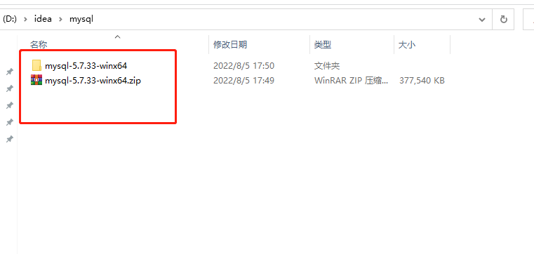

### 2、配置 mysql 环境变量

鼠标右键单击此电脑，选择属性，弹出设置页面

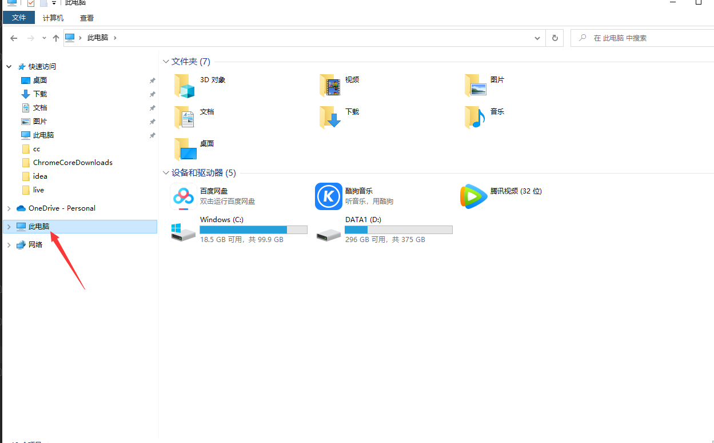

高级系统设置 -> 高级 -> 环境变量

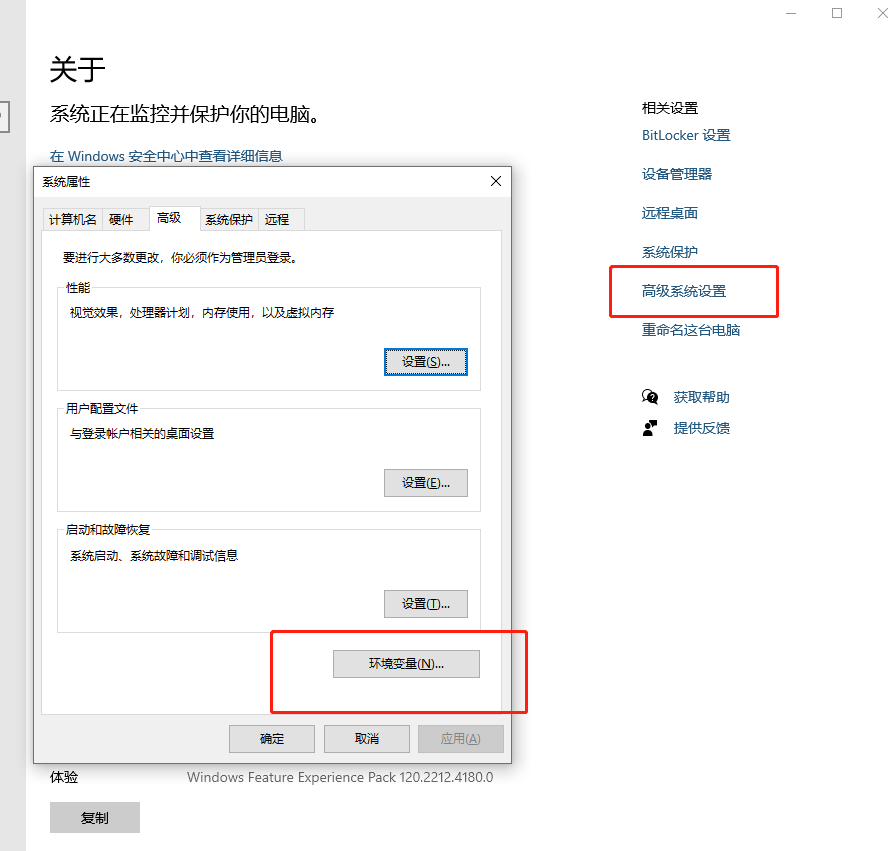

系统变量 -> Path，双击打开点击新建，路径为 mysql 的安装路径，如下图所示：

mysql 安装（略）

## 3、Windows 环境准备完成，tomcat 部署

删除 tomcat 文件中 webapps 文件夹下所有文件；

再把项目的 war 包放进去，并修改名称为 ROOT.war，注意是大写英文字母；

ROOT 文件夹生成的两个方案：
（1）你可以自己解压缩 ROOT.war ，就是一个 .zip 的压缩文件；
（2）启动 tomcat 后，tomcat 自动帮你解压缩。
如下图所示：

启动 tomcat，输入网站地址，按下回车键，如下图所示：

        
部署成功

