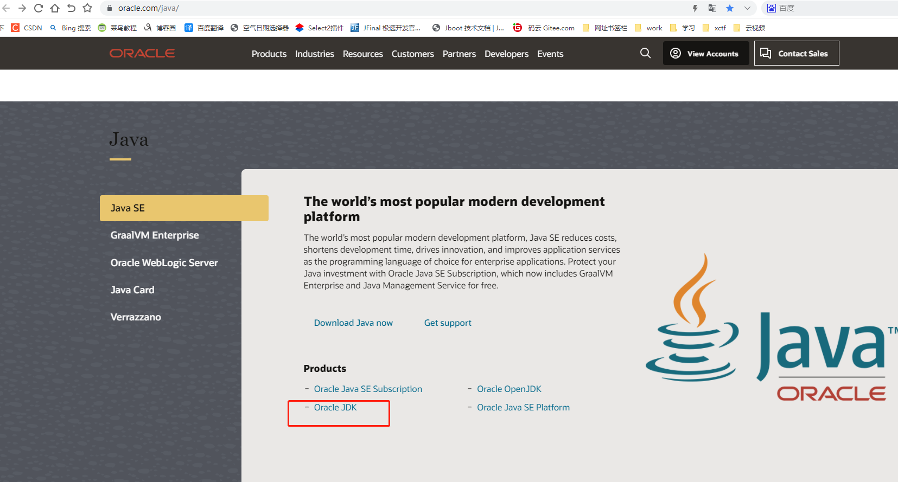
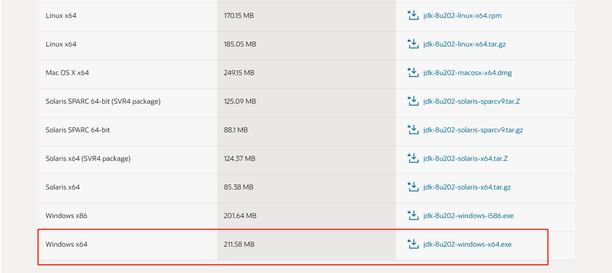
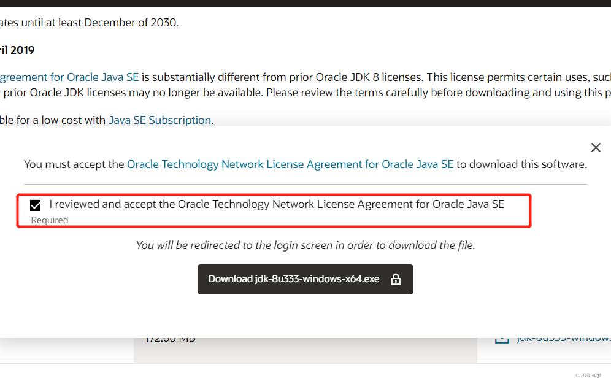
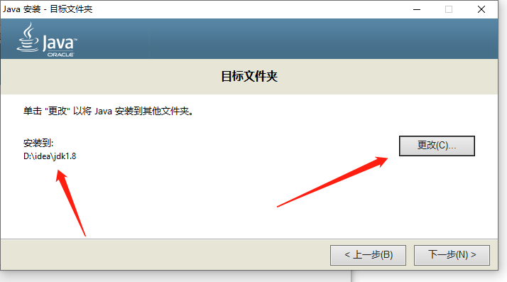
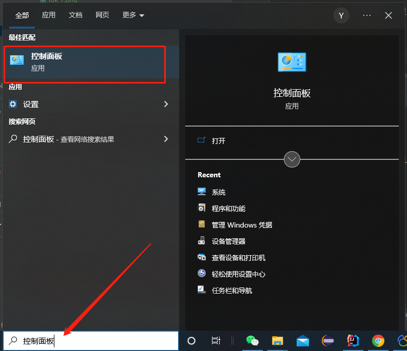
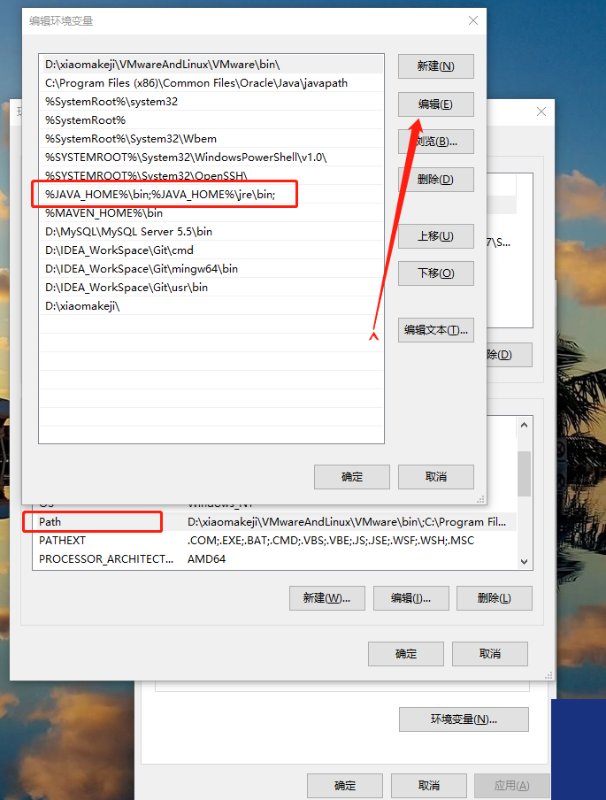
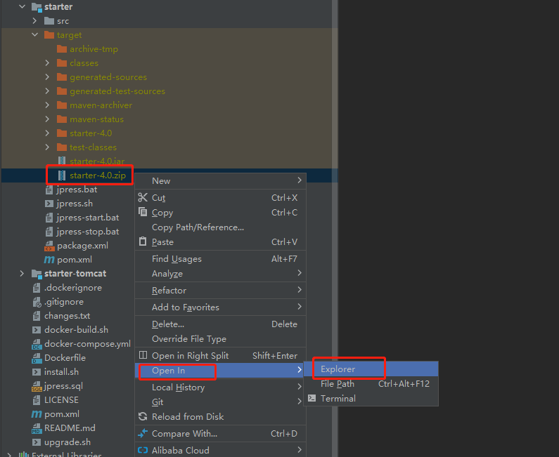
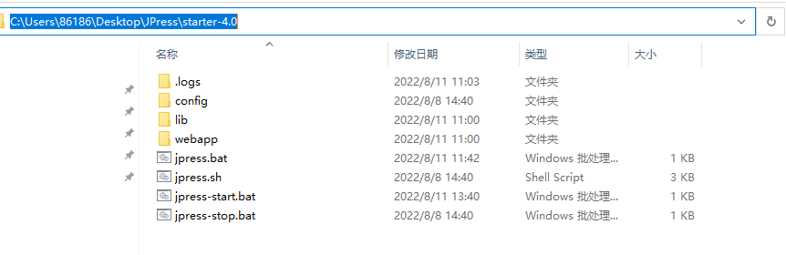
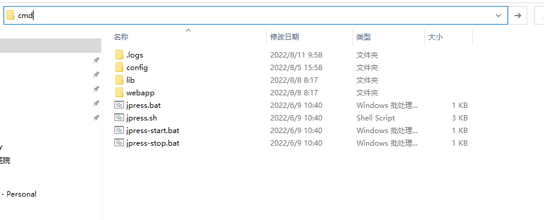
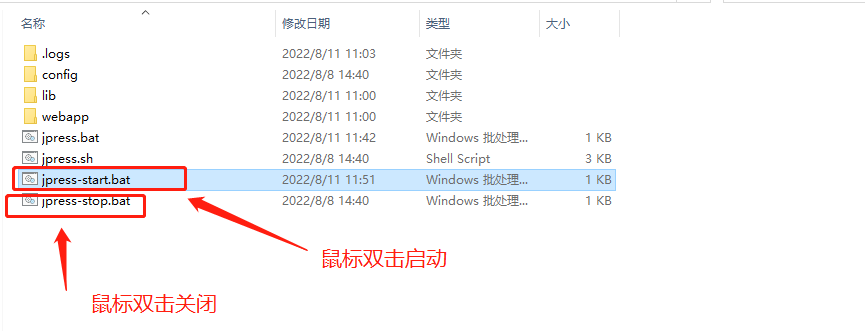

# undertow 部署

## 部署环境：jdk1.8

## jdk 下载安装及配置

jdk 官网地址： [https://www.oracle.com/java/](https://www.oracle.com/java/)

### 1、jdk 下载

进入官网，定位到：Java -> Java SE -> Oracle JDK 点击进入，如下图所示：

选择 Java archive，再鼠标下拉，选择 Java SE 8 (8u202 and earlier)

下载 jdk-8u202-windows-x64.exe

### 2、jdk 安装

下载 jdk 到本地，找到 jdk 所在文件夹，双击 .exe 运行 jdk ，进行程序安装

进入 jdk 安装界面，点击下一步

安装位置可以默认，也可以自定义，然后一直点击下一步直到完成即可。

### 3、配置环境变量

首先在电脑左下角搜索框输入：控制面板

控制面板 -> 系统与安全 -> 系统

高级系统设置 -> 高级 -> 环境变量

新建环境变量，变量名为 JAVA_HOME，变量值为 jdk 的安装路径

双击 Path，编辑环境变量，点击新建

### 4、 验证 jdk 是否配置成功

按 win+r 快捷键，打开命令窗口，输入 cmd 指令，点击确定

输入指令：

    java -version

可以查看到安装的 jdk 版本则成功。

## undertow 部署项目

### 1、部署

项目打包，输入指令：

    mvn clean package

项目打包后生成的压缩包：start -> target -> starter-4.0.zip

找到压缩包在 Windows 的位置：

鼠标选中压缩包，单击右键选择 Open In -> Explorer，如下图所示：

新建文件夹存放压缩包，并解压缩

进入解压后的文件夹

输入 cmd 指令，按下回车键，进入命令界面，如下三图所示：

启动项目，输入指令：

    jpress.bat start

按下回车键，关闭界面，项目会停止

配置后台启动，输入指令：

    start /b  jpress.bat start

这个后台启动指的是，你可以继续在命令界面进行其他操作，关闭界面，项目会停止

上图项目启动完成，进行浏览器访问，如下图所示：

下图连接数据库的操作：Windows 要安装 mysql 5.7 数据库；MySQL 下载安装（略）

配置后台启动，关闭命令界面，项目照常运行，找到解压缩包下的文件：jpress-start.bat

鼠标选中 jpress-start.bat 单击右键，选择编辑，进入编辑页面
        
添加代码：

        @echo off
        if "%1"=="h" goto begin
        start mshta vbscript:createobject("wscript.shell").run("""%~nx0"" h",0)(window.close)&&exit
        :begin

如下图所示：

jpress-start.bat 启动项目；jpress-stop.bat 停止项目

配置启动项目后，打开浏览器进入指定网址页面，如下图所示：

编辑 jpress-start.bat 文件，输入：

        start ChromeCore.exe -k "http://localhost:8080" 

ChromeCore.exe：Windows 安装的浏览器程序；http://localhost:8080 ：指定的网址

 

双击 jpress-start.bat 启动项目后，自动打开浏览器

