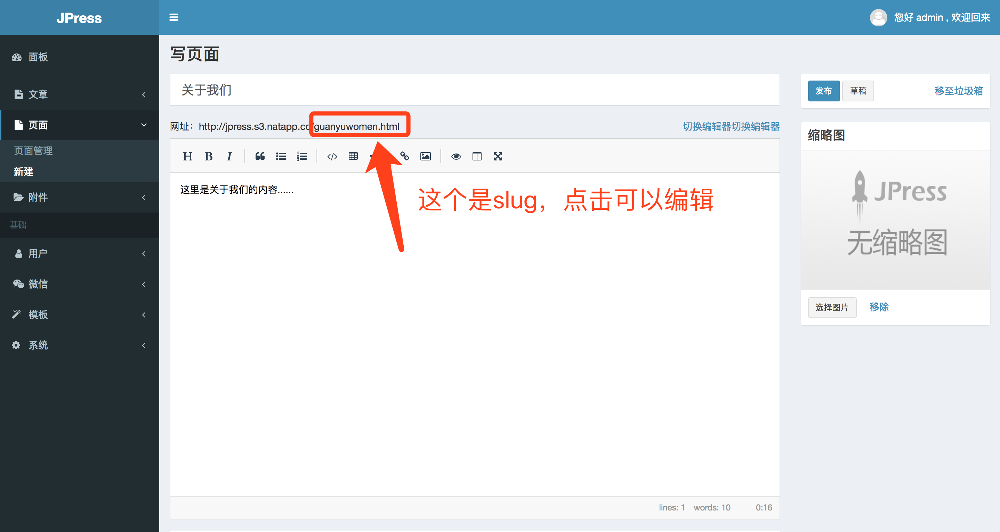
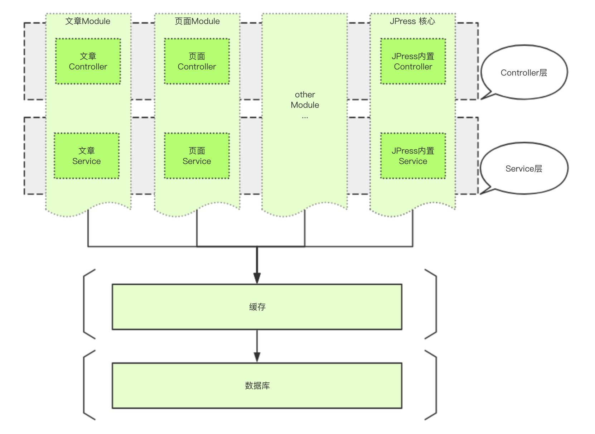
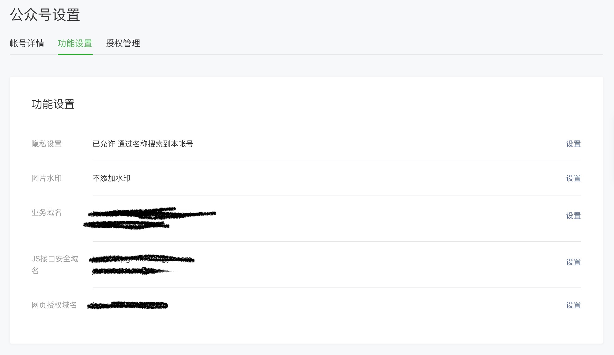
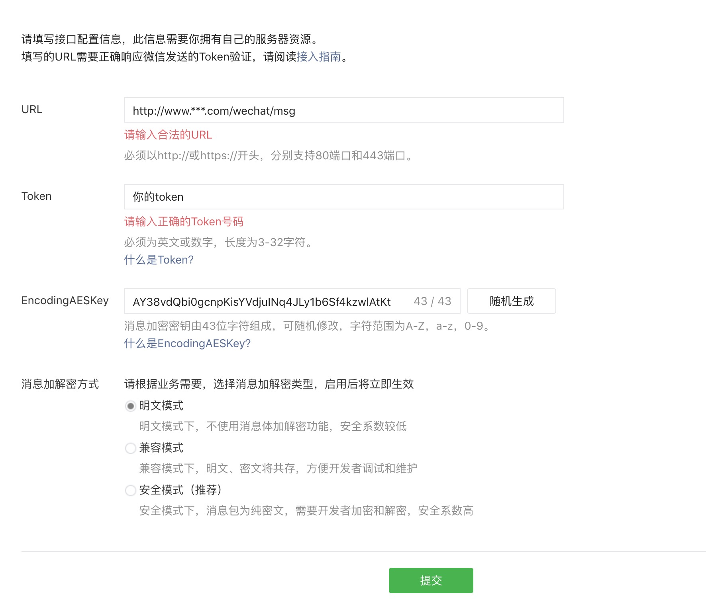
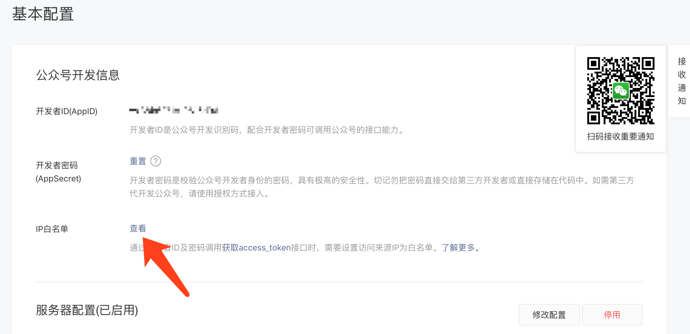

# JPress 文档


在使用JPress之前，你应该对数据库、服务器等有基本的认识。本文档是建立在这些基础知识之上的。

另外可以通过以下几种方式获得帮助：

1. JPress官方公众号：jpressio
2. JPress交流QQ群：288397536
3. 开源中国进行发帖提问。

## JPress安装

### 通过Docker进行安装

Linux :

```
wget https://gitee.com/fuhai/jpress/raw/master/docker-compose.yml
docker-compose up -d
```

Mac OS :

```
curl -O https://gitee.com/fuhai/jpress/raw/master/docker-compose.yml
docker-compose up -d
```

执行完毕以上命令之后，访问 `http://127.0.0.1:8080` 即可。

### 手动安装

JPress手动安装需要以下几个步骤：

1. 下载JPress源码
2. 通过maven编译JPress成war包（或可执行程序）
3. 启动JPress

#### 1.下载JPress源码

下载JPress源码通过以下几种方式：

1、git clone

```
git clone https://gitee.com/fuhai/jpress.git
```

2、进入 Gitee 的 JPress 发行页面进行下载

链接地址： https://gitee.com/fuhai/jpress/releases

#### 2.通过Maven编译JPress成war包和可执行程序

JPress可以编译成war包和可执行程序，war需要在tomcat等web容器下运行。可执行程序内置undertow，不需要其他第三方web容器，运行脚本即可通过浏览器访问jpress应用。


下载好 JPress 源码后，通过 shell 进入源码目录，执行如下 maven 命令：

```shell
mvn package
```

稍等片刻，待命令执行完毕之后，即可在 `starter-tomcat/target` 目录下生成 `starter-tomcat-2.0.war` 的war包，在 `starter/target/` 目录下生成 starter-2.0 的文件夹，starter-2.0 文件夹的目录如下：

```
├── config
├── lib
├── webapp
├── jpress.sh
└── jpress.bat
```

 若编译不通过注意事项：
 
 * maven版本建议用3.0 以上，2.x没有测试过
 * java版本1.8
 * maven注意添加aliyun的源，修改 `maven/conf/setting.xml`文件，找到 mirrors 节点 ，修改如下：

 ```xml
<mirrors>
        <mirror>  
        	  <id>alimaven</id>  
        	  <name>aliyun maven</name>  
        	  <url>http://maven.aliyun.com/nexus/content/groups/public/</url>  
        	  <mirrorOf>central</mirrorOf>  
    	</mirror>
</mirrors>

 ```


#### 3、启动JPress

##### 启动 jpress war 包

拷贝`starter-tomcat/target` 目录下的 `starter-tomcat-1.0.war` war包，放到tomcat的webapp目录下，手动解压缩。

启动tomcat（运行 `tomcat/bin/startup.sh`），浏览器输入 `http://127.0.0.1:8080/starter-tomcat-2.0` 即可访问。

若把 `tomcat/webapp/starter-tomcat-2.0` 里面的文件拷贝到 `tomcat/webapp/ROOT`，访问`http://127.0.0.1:8080`即可。


##### 启动 jpress 可执行程序


拷贝`starter/target/` 的 `starter-2.0` 目录，放到 Linux 上。


执行 `./jpress.sh start` 脚本也可以启动jpress项目（window系统下执行  `./jpress.bat`）。


## 模板制作

JPress模板主要是由html、css、js和JPress标签组成，JPress标签的主要作用是用于读取后台数据，逻辑控制。

与此同时、JPress模板文件的文件名也是固定的，目录结构如下：


|模板文件| 描述 | 备注 |
| --- | --- | --- |
| index.html |首页模板|  |
| error.html |错误页面模板| 当系统发生错误的时候，会自动调用此页面进行渲染，也可以扩展为 error_404.html，当发生404错误的时候优先使用此文件，同理可以扩展 error_500.html ，当系统发生500错误的时候调用此文件渲染。 |
| setting.html |后台的模板设置页面| 当次html不存在的时候，用户进入后台的模板设置，会显示此模板不支持设置功能 |
| screenshot.png |模板缩略图| 用于在后台的模板列表里显示的图片  |
| template.properties |模板信息描述文件|  文件格式在下方 |
| page.html |页面模块的模板|  page.html 可以扩展为 page_aaa.html 、page_bbbb.html ，当模板扩展出 page_xxx.html 的时候，用户在后台发布页面内容的时候，就可以选择使用哪个模板样式进行渲染。例如： page_xxx.html 其中 `xxx` 为样式的名称。|
| article.html | 文章详情模板| 和page模块一样，article.html 可以扩展出 article_styel1.html、article_style2.html，这样，用户在后台发布文章的时候，可以选择文章样式。（备注：用户中心投稿不能选择样式）  |
| artlist.html | 文章列表模板| 和page、article一样，可以通过样式 |
| user_login.html | 用户登录页面| JPress已经内置了登录页面，但是，当模板下有 user_login.html 的时候，就会自动使用模板下的这个页面来渲染 |
| user_register.html | 用注册页面| 用法通 user_login.html |


备注：所有的模板文件都可以扩展出专门用于渲染手机浏览器的模板。

例如：首页的渲染模板是 `index.html` ，如果当前目录下有 `index_h5.html`，那么，当用户通过手机访问网站的时候，JPress 会自动使用 `index_h5.html` 去渲染。 page 和 article、artlist 同理。

template.properties 文件配置如下
  
```
id = cn.jeanstudio.bluelight
title = BlueLight
description = BlueLight是JeanStudio工作室为JPress设计的官网模板
anthor = jeanStudio
authorWebsite = http://www.jeanstudio.cn
version = 1.0
versionCode = 1
updateUrl =
screenshot = screenshot.png
```

* id ：模板ID，全网唯一，建议用域名+名称的命名方式
* title ：模板名称
* description ：模板简介
* anthor ：模板作者
* authorWebsite ：模板作者的官网
* version ：版本（不添加默认为1.0.0）
* versionCode ：版本号（只能是数字，不填写默认为1）
* updateUrl ：此模板升级的url地址
* screenshot ：此模板的缩略图图片（不填写默认为：screenshot.png）


#### 模板标签

有了以上这些目录结构，实际上不用任何的标签就可以成为一套模板了，只是这个模板是静态模板，不能读取后台数据。

只有通过在静态的html上，添加 JPress 标签，才能可以读取后台数据。

目前，JPress内置的模板标签如下：

**1、全局标签，全局标签用全用大写显示，全局标签在任意模板页面都可以使用。**

| 标签名称 | 数据类型 | 标签描述 |  
| --- | --- | --- | 
| #(WEB_NAME ??) | 字符串 |  网站名称 |  
| #(WEB_TITLE ??) |  字符串 | 网站标题 |  
| #(WEB_SUBTITLE ??) |  字符串 | 网站副标题 | 
| #(WEB_DOMAIN ??) |  字符串 | 网站域名 | 
| #(WEB_COPYRIGHT ??) |  字符串 | 网站版权信息 | 
| #(SEO_TITLE ??) |  字符串 | 网站SEO标题 | 
| #(SEO_KEYWORDS ??) |  字符串 | 网站SEO关键字 | 
| #(SEO_DESCRIPTION ??) |  字符串 | 网站SEO描述 | 
| MENUS  | 数据列表( list ) | 菜单数据 | 

标签描述，标签建议用 `#( 名称 ??)` 的方式来读取数据，而不是用 `#(名称)` 两个问号（??）的意思是如果 后台填写的名称为空格，那么就用 两个问号（??）之后的内容来显示。

例如： 
`#(WEB_NAME ??)` 表示优先使用 WEB_NAME 来显示，但是当 WEB_NAME 为空的时候，显示空数据（因为两个问好（??）之后的内容为空）。

`#(WEB_NAME ?? WEB_TITLE)` 表示优先使用 WEB_NAME 来显示，但是当 WEB_NAME 为空的时候，用 WEB_TITLE（网站标题） 来显示。

`#(SEO_TITLE ?? WEB_TITLE +'-'+ WEB_SUBTITLE)` 表示优先使用 SEO_TITLE（SEO标题） 来显示，但是当 SEO_TITLE 为空的时候，用 `WEB_TITLE - WEB_SUBTITLE` 来显示。

有了以上知识后，我们的 index.html 首页模板文件可以如下：

```html
<!DOCTYPE html>
<html lang="zh-CN">
<head>
    <title>#(SEO_TITLE ?? (WEB_TITLE + '-' + WEB_SUBTITLE))</title>
    <meta name="keywords" content="#(SEO_KEYWORDS ??)">
    <meta name="description" content="#(SEO_DESCRIPTION ??)">
</head>
<body>
这是首页....
</body>
</html>
```

以上内容都只是针对 `字符串` 这种数据类型进行展示的，全局标签中还有一种数据类型叫 `数据列表( list )`，那么，怎么来显示数据列表呢？

这个时候`#( 名称 ??)`就不能正常显示了，需要用到一个新的标签：

```html
#for 
... 
#end
```

`#for ... #end` 标签也叫循环标签，意思是把列表循环显示出来。

对于 `MENUS` 这种数据类型为 `数据列表( list )` 的数据，`#for ... #end` 标签使用如下。

   
```html
#for(menu : MENUS)
    <li> <a href="#(menu.url ??)">#(menu.text ??)</a> </li>
#end
```

这样，若我们在后台创建了5个菜单，那么html会输出 5个 `<li> ... </li>`

对于以上的菜单显示，还有一个问题就是如何显示二级菜单呢？

代码如下：

```html
#for(menu : MENUS)
    <li> <a href="#(menu.url ??)">#(menu.text ??)</a> </li>
    #if(menu.hasChild())
        <div class="二级菜单的class">
        #for(childMenu : menu.getChilds())
            <li> <a href="#(menu.url ??)">#(menu.text ??)</a> </li>
        #end
    </div>
    #end
#end
```

以上代码显示了所有菜单的的二级菜单，但是，有些时候我们想在网站的某些位置，显示 **当前菜单** 下的子菜单，如何做呢？


代码如下：

```html
#for(me: MENUS)
    #if(me.isActive && me.hasChild())
        <h3 class="menut-title">#(me.text ??)</h3>
        <ul class="inner-menut">
            #for(m : me.getChilds())
                <li class="#(m.isActive ? 'active' : '')">
                    <a href="#(CPATH)#(m.url ??)">
                    #(m.text ??)
                    </a>
                </li>
            #end
        </ul>
    #end
#end
```


**2、数据指令，数据指令一般情况下只能用于特有页面**

文章相关指令：

| 指令名称 | 可用页面 |描述 |  
| --- | --- | --- | 
| #article() | 任意 | 用于读取特定的单篇文章 |  
| #articles() | 任意 | 用于读取文章列表，例如：热门文章文章、最新评论文章列表等等 | 
| #tagArticles() | 任意 | 读取某个tag下的文章列表 | 
| #categoryArticles() | 任意 | 读取某个分类下的文章列表 | 
| #articlePage() | 任意 | 用于对文章列表进行的内容和分页进行显示 | 
| #commentPage() | 文章详情：article.html | 用于对文章评论的内容和分页进行显示 | 
| #nextArticle() | 文章详情：article.html | 下一篇文章 | 
| #previousArticle() | 文章详情：article.html | 上一篇文章 | 
| #relevantArticles() | 文章详情：article.html | 相关文章列表，相同标签的的文章 |
| #categories() | 任意 | 读取文章模块的所有分类 | 
| #tags() | 任意 | 用于读取文章标签 |  
| #articleCategories() | 任意 | 用于读取某一篇文章的所属分类，例如：文章的标签、文章的分类等 |  


页面相关指令：

| 指令名称 | 可用页面 |描述 |  
| --- | --- | --- | 
| #page() | 任意 | 用于读取某个页面 |  
| #pages() | 任意 | 用于读取页面列表 | 
 
 
 用户相关指令：

| 指令名称 | 可用页面 |描述 |  
| --- | --- | --- |  
| #users() | 暂不支持 | 用于读取页面列表 | 


##### #article() 指令的用法

此指令是用来读取一篇文章，网站的任意页面进行展示。

```html
#article()
<a href="#(article.url)">#(article.title)</a>
<div>#(article.content)</div>
#end
```

##### #articles() 指令的用法

此指令是在任何页面，用来读取文章列表。例如：最新文章、热门文章等

```html
#articles(flag="",hasThumbnail="",orderBy="",count=10)
    #for(article : articles)
        <a href="#(article.url)">#(article.title)</a>
    #end
#end
```

**#articles() 指令支持的参数有：**

* flag：文章标识，这个是在编辑文章的时候自由填写。
* hasThumbnail：是否需要缩略图，值为 true 和 false。
* orderBy ：根据什么进行排序，目前支持的值有：order_number（用户自定义排序）、comment_count（文章的评论数量）、comment_time（文章的评论时间）、view_count（文章的访问量）、created（文章的创建时间）、modified（文章的修改时间）
* count ：要显示多少篇文章
* style ：文章样式

##### #tagArticles() 指令的用法

此指令是在任何页面，用来读取文章列表。例如：最新文章、热门文章等

```html
#tagArticles(tag="aaa",hasThumbnail="",orderBy="",count=10)
    #for(article : articles)
        <a href="#(article.url)">#(article.title)</a>
    #end
#end
```

**#tagArticles() 指令支持的参数有：**

* tag：哪个tag。
* hasThumbnail：是否需要缩略图，值为 true 和 false。
* orderBy ：根据什么进行排序，目前支持的值有：order_number（用户自定义排序）、comment_count（文章的评论数量）、comment_time（文章的评论时间）、view_count（文章的访问量）、created（文章的创建时间）、modified（文章的修改时间）
* count ：要显示多少篇文章

##### #categoryArticles() 指令的用法

此指令是在任何页面，用来读取文章列表。例如：最新文章、热门文章等

```html
#categoryArticles(categoryFlag="",hasThumbnail="",orderBy="",count="")
    #for(article : articles)
        <a href="#(article.url)">#(article.title)</a>
    #end
#end
```

**#categoryArticles() 指令支持的参数有：**

* categoryFlag：分类的标识。
* hasThumbnail：是否需要缩略图，值为 true 和 false。
* orderBy ：根据什么进行排序，目前支持的值有：order_number（用户自定义排序）、comment_count（文章的评论数量）、comment_time（文章的评论时间）、view_count（文章的访问量）、created（文章的创建时间）、modified（文章的修改时间）
* count ：要显示多少篇文章

##### #articlePage() 指令的用法
指令 #articlePage() 只能用在文章列表页，也就是 artlist.html 模板文件及其扩展文件。

```java
#articlePage()

    #for(article : articlePage.list)
        <a href="#(article.url ??)">
        文章标题是：#(article.title ??)
        </a> 
        <div>
            文章内容是：#maxLength(article.text,100)
        </div>    
    #end

    #articlePaginate()
        #for(page : pages)
            <a class="page-link" href="#(page.url ??)">
                #(page.text ??)
            </a>
        #end
    #end
    
#end
```
**说明**
指令 #articlePage() 内部又包含了另一个指令 #articlePaginate()，#articlePaginate()是用于显示上一页和下一下。

**指令 #articlePage() 的参数有：**

* pageSize ：可以用来指定当前页面有多少条数据，默认值是：10。也就是说 `#articlePage()` 等同于 `#articlePage(pageSize=10)`

**分页指令#articlePaginate()的参数有**

* previousClass ：上一页的样式，默认值：previous
* nextClass ：下一页的样式，默认值：next
* activeClass ：当前页面的样式，默认值：active
* disabledClass ：禁用的样式（当下一页没有数据的时候，会使用此样式），默认值：disabled
* anchor ：锚点链接
* onlyShowPreviousAndNext ：是否只显示上一页和下一页（默认值为false，一般情况下在手机端才会把这个值设置true）
* previousText ：上一页按钮的文本内容，默认值：上一页
* nextText ：下一页按钮的文本内容，默认值：下一页
* firstGotoIndex : 是否让第一页进入首页，默认值：false

##### #commentPage()指令的用法

指令 #commentPage() 只能用在文章详情页，也就是 article.html 模板文件及其扩展文件。用于读取这篇文章的相关评论信息以及评论的分页功能。

```html
#commentPage()

    #for(comment : commentPage.list)
        <div>评论内容是：#(comment.content ??)</div>  
        <div>评论作者是：#(comment.authro ??)</div>  
    #end

    #commentPaginate()
        #for(page : pages)
            <a class="page-link" href="#(page.url ??)">
                #(page.text ??)
            </a>
        #end
    #end
    
#end
```
**说明**
和一样#articlePage()，#commentPage()指令  内部又包含了另一个指令 #commentPaginate()，#commentPaginate()是用于显示评论的上一页和下一下。

**指令 #commentPage() 的参数有：**

* pageSize ：可以用来指定当前文章详情，每页的评论条数是多少，默认值是：10。也就是说 `#commentPage()` 等同于 `#commentPage(pageSize=10)`

**分页指令#commentPaginate()的参数有**

* previousClass ：上一页的样式，默认值：previous
* nextClass ：下一页的样式，默认值：next
* activeClass ：当前页面的样式，默认值：active
* disabledClass ：禁用的样式（当下一页没有数据的时候，会使用此样式），默认值：disabled
* anchor ：锚点链接
* onlyShowPreviousAndNext ：是否只显示上一页和下一页（默认值为false，一般情况下在手机端才会把这个值设置true）
* previousText ：上一页按钮的文本内容，默认值：上一页
* nextText ：下一页按钮的文本内容，默认值：下一页

##### #nextArticle() 指令的用法

指令 #nextArticle() 只能用于**文章详情页**，用于显示下一篇文章的相关信息或者内容。

```html
#nextArticle()
<a href="#(next.url)">标题是：#(next.title ??)</a>
#end
```

##### #previousArticle() 指令的用法

指令 #previousArticle() 只能用于**文章详情页**，用于显示上一篇文章的相关信息或者内容。

```html
#previousArticle()
<a href="#(previous.url)">标题是：#(previous.title ??)</a>
#end
```


##### #categories() 指令的用法

指令 #categories() 可以在任意页面使用，用来读取分类的内容。

```html
#categories()
    #for(category : categories)
        <a href="#(category.url ??)">#(category.title ??)</a>
    #end
#end
```

**指令#categories()的参数有**

* flag ：读取哪些flag的分类列表。
* parentFlag ：读取父级必须是该flag的分类列表。
* asTree ：是否以树状的数据进行返回，默认是false，返回全部分类。

##### #articleCategories() 指令的用法

指令 #articleCategories() 是用于读取某一篇文章的分类、或tag标签。

如下代码是用于读取文章的分类：

```html
#articleCategories(article.id,"category")
    #for(category : categories)
    <a href="#(category.url ??)">#(category.title ??)</a>
    #end
#end
```

如下代码是用于读取谋一篇文章的标签（一般用在文章列表循环里）：

```html
#articleCategories(article.id,"tag")
    #for(category : categories)
    <a href="#(category.url ??)">#(category.title ??)</a>
    #end
#end
```


**指令#articleCategories()的参数有**

* articleCategories的使用必须传入两个值，顺序不能相反。第一个是文章的id，第二个是指定要获取文章分类的类型。


##### #tags() 指令的用法
```html
#tags()
    #for(tag : tags)
        <li><a href="#(tag.url)">#(tag.title)</a></li>
    #end
#end
```

**指令#tags() 的参数有**

* orderBy : 排序方式
* count : 数量


##### #page() 指令的用法

指令 #page() 可以用于任何页面，用于读取页面内容。

代码如下：

```html
#page(slug=“about”)
这个页面的标题是：#(page.title ??)
这个页面的内容是：#(page.content ??)
#end
```

**指令#page()的参数有**

* slug ：page的唯一标识，在后台编辑页面的时候填写，如下图：



##### #pages() 指令的用法

指令 #pages() 可以用于任何页面，用于读取页面内容**列表**。

代码如下：

```html
#pages()
    #for(page : pages)
    这个页面的标题是：#(page.title ??)
    这个页面的内容是：#(page.content ??)
    #end
#end
```

**指令#pages()的参数有**

* flag ：页面标志，可以在后台编辑页面的时候填写。通过flag，可以把几个页面归属到同一个flag，做到页面的“归类”作用。

##### #users() 指令的用法

暂未完成


## JPress二次开发

JPress 是一个内置了几乎任何互联网系统都必须模块：

* 用户管理
* 权限管理
* 文章功能
* 页面功能
* 微信公众号对接
* 微信小程序
* API接口
* 安全机制
* ...

目前、市面是几乎任何的互联网系统都应该具备以上几个功能，所以，通过JPress来做二次开发，是非常明智的选择。

另外，是基于JFinal 和 Jboot进行开发的，JFinal 连续在开源中国（oschina.net）获得了多年的 “最受欢迎的中国开源软件” 称号，Jboot 是基于JFinal的一个微服务框架，在1亿+用户量的商业产品得到了验证，稳定和安全。

通过 JPress 进行二次开发，也是非常容易的。

**JPress 架构图**



### 开始
在开始 JPress 二次开发之前，有必要了解下JPress的目录结构：


| 目录  | 描述 |  备注 |
| --- | --- | --- |
| codegen | 代码生成器 | 开发的时候用与生成maven模块代码，运行时用不到该模块 |
| doc | 文档存放目录 |  |
| jpress-commons | 工具类和公用代码 |  |
| jpress-core | JPress的核心代码 |  |
| jpress-model | JPress非业务实体类 |  |
| jpress-service-api | JPress非业务 service 接口定义  |  |
| jpress-service-provider | JPress非业务 service 接口实现 |  |
| jpress-template | JPress的html模板 |  |
| jpress-web | JPress非业务的web处理代码 | 包含了 Controller、指令等 |
| module-article | 文章模块代码 |  |
| module-page | 页面模块代码 |  |
| starter | undertow启动模块，开发的时候可以运行里面的 DevStarter.java 的main方法 | 编译的时候会 jpress 可执行程序 |
| starter-tomcat | tomcat 启动模块 | 编译的时候回生成 war 包，用于放在tomcat部署 |


如果使用JPress来开发一个自己的程序呢 ？我们假设要使用 jpress 来开发一个小型的论坛。

主要有以下几个步骤：

* 1、需求分析和建库建表
* 2、通过 JPress 直接生成 maven 模块和相关基础代码
* 3、通过 实现 ModuleListener 配置模块基本信息
* 4、通过 注解 @AdminMenu 和  @UcenterMenu 配置后台和用户中心菜单
* 5、编码实现模块基本逻辑
* 6、修改maven配置并运行

**1、需求分析和建库建表**

我们假设论坛有三个表、分表时论坛版块、帖子和帖子回复，因为jpress已经有用户表了，所以不再需要用户表。

为了能够讲清楚如何使用jpress进行二次开发，我们故意把论坛的版块功能给简化了，论坛版块暂时不支持子版块功能。

表名分别为：`club_category`、`club_post`、`club_post_comment`。


**2、通过 JPress 直接生成 maven 模块和相关基础代码**

我们在 jpress 项目的 starter 模块下，建立一个新的代码生成器，用于对社区模块的代码生成。

代码生成器如下：

```java
public class PageModuleGenerator {


    private static String dbUrl = "jdbc:mysql://127.0.0.1:3306/newjpress";
    private static String dbUser = "root";
    private static String dbPassword = "";


    private static String moduleName = "club";
    private static String dbTables = "club_category,club_post,club_post_comment";
    private static String modelPackage = "io.jpress.module.club.model";
    private static String servicePackage = "io.jpress.module.club.service";

    public static void main(String[] args) {

        ModuleGenerator moduleGenerator = new ModuleGenerator(moduleName, dbUrl, dbUser, dbPassword, dbTables, modelPackage, servicePackage);
        moduleGenerator.gen();

    }
}
```

执行完 `main()` 方法后，会在当前目录下生产一个叫 club 的新的maven模块。

**3、通过 实现 ModuleListener 配置模块基本信息**

我们自动生成的 `module-club-web` 模块里，建立一个 叫 `ClubModuleListener` 的类，实现`ModuleListener`接口。

代码如下：

```java
public class ClubModuleListener implements ModuleListener {

    @Override
    public String onRenderDashboardBox(Controller controller) {
        //在这里配置后台首页的相关模块
        //代码可以参考 ArticleModuleLisenter
        return null;
    }

    @Override
    public void onConfigAdminMenu(List<MenuGroup> adminMenus) {
        //这里配置后台菜单
        //代码参考 ArticleModuleLisenter
    }

    @Override
    public void onConfigUcenterMenu(List<MenuGroup> ucenterMenus) {
        //这里配置用户中心菜单
        //代码参考 ArticleModuleLisenter
    }
}
```
以上提到的`ArticleModuleLisenter`代码在： https://gitee.com/fuhai/jpress/blob/master/module-article/module-article-web/src/main/java/io/jpress/module/article/ArticleModuleLisenter.java

**4、通过 @AdminMenu 和  @UcenterMenu 配置后台和用户中心菜单**

我们来为club这个模块添加一个新的后台菜单，在这个之前，我们先来建立一个共识：

* 1、菜单，肯定是一个可以访问的url地址。
* 2、既然是可以访问的url地址，那么这个url地址肯定会对应某个Controller的某个方法。

因此，某个菜单，其实就是Controller的某个方法。

对于这个论坛系统，我们希望后台菜单显示如下：

```
论坛管理
>>> 帖子列表
>>> 回帖管理
>>> 版块管理
```

那么，我们需要建立一个叫 `_ClubController` 的类（名字任意取，后台相关的Controller，建议用下划线（_）开头，这样可以和 jpress 统一。）

代码如下：

```java
@RequestMapping("/admin/club")
public class _ClubController extends AdminControllerBase {

    @AdminMenu(text = "帖子列表", groupId = "club")
    public void index() {
        render("club/post_list.html");
    }
    
    @AdminMenu(text = "回帖管理", groupId = "club")
    public void index() {
        render("club/post_comment_list.html");
    }

    @AdminMenu(text = "版块管理", groupId = "club")
    public void index() {
        render("club/category_list.html");
    }  
}
```

**注意：**

* `@AdminMenu`里的`groupId`的值必须是`ClubModuleListener`里配置的id。如果我们把 `groupId` 修改为 `groupId = "page"`，那么此菜单将会被添加到后台的页 `页面管理` 这个菜单下面。
* `_ClubController` 必须继承至 `AdminControllerBase`。
* `@RequestMapping("/admin/club")`里的值必须是 `/admin/`开头。

**5、编码实现模块基本逻辑**

暂略


**6、修改maven配置并运行**

默认情况下，此时通过 `mvn clean install` 进行进行编译，会出现maven编译错误。原因是代码生成器虽然生成了 club 模块，但是 club 模块依赖 `parent`， `module-club` 下的 pom 文件如下：

```xml
<parent>
    <groupId>io.jpress</groupId>
    <artifactId>parent</artifactId>
    <version>2.0</version>
</parent>
```
maven 会去自动下载 io.jpress.parent 这个module，maven中央仓库上找不到这个 module 就会出现 maven编译错误。

因此，需要修改 jpress 根目录的 pom.xml ，添加把 `module-club` 添加到 pom.xml 里去，让 `module-club` 成为 jpress 的子模块。

如下代码：
```
<modules>

    <!--.....略 .... -->
    <module>module-article</module>
    <module>module-page</module>
    
    <!-- 添加这一行代码-->
    <module>module-club</module>

    <!--.....略 .... -->
</modules>
```

此时，如果直接运行starter模块下的main方法，也不到任何效果，原因是：

* 1、starter 这个模块并未依赖你生成的 club 模块
* 2、starter 里的resource并没有 club 模块的资源、比如html、css等。

所以，接下来我们需要修改 starter 的 `pom.xml` 文件，添加如下依赖。

```xml
<dependency>
    <groupId>io.jpress</groupId>
    <artifactId>module-club-web</artifactId>
    <version>2.0</version>
</dependency>

<dependency>
    <groupId>io.jpress</groupId>
    <artifactId>module-club-service-provider</artifactId>
    <version>2.0</version>
</dependency>
```


同时，为了让 maven 编译的时候，把 `club` 中的资源拷贝到 starter 里阿里。我们需要修改starter模块下的 pom.xml 的`maven-resources-plugin`插件配置为如下：

```xml
<plugin>
    <artifactId>maven-resources-plugin</artifactId>
    <executions>
        <execution>
            <id>copy-resources</id>
            <phase>validate</phase>
            <goals>
                <goal>copy-resources</goal>
            </goals>
            <configuration>
                <outputDirectory>${basedir}/target/classes/webapp</outputDirectory>
                <resources>
                    <resource>
                        <directory>${basedir}/../jpress-web/src/main/webapp</directory>
                    </resource>
                    <resource>
                        <directory>${basedir}/../jpress-template/src/main/webapp</directory>
                    </resource>
                    <resource>
                        <directory>${basedir}/../module-page/module-page-web/src/main/webapp</directory>
                    </resource>
                    <resource>
                        <directory>${basedir}/../module-article/module-article-web/src/main/webapp</directory>
                    </resource>

                    <!-- 添加如下代码-->
                    <resource>
                        <directory>${basedir}/../module-club/module-club-web/src/main/webapp</directory>
                    </resource>
                </resources>
            </configuration>
        </execution>
    </executions>
</plugin>

```

此时，进行 `mvn clean install` 完毕之后，就可以正常运行了。

注意：`starter-tomcat` 模块也需要做如此配置。


## 微信插件开发

在 jpress 里，做微信开发非常简单，直接看代码：

```java
public class HelloWechatAddon implements WechatAddon {

    @Override
    public boolean onMatchingMessage(InMsg inMsg, MsgController msgController) {

        return false;
    }

    @Override
    public boolean onRenderMessage(InMsg inMsg, MsgController msgController) {
      
        return true;
    }
}
```
**说明：**

* 1、在任意maven module下，编写任意名称的类，实现WechatAddon接口。JPress 会自动扫描到该类，并添加到 JPress 的管理体系里去。
* 2、复写方法`onMatchingMessage`和`onRenderMessage`。
    * onMatchingMessage ：用来匹配是否是本插件要处理的消息
    * onRenderMessage ：用来返回给微信客户端一个消息

* 3、添加 `@WechatAddonConfig` 注解的配置，用来给这个插件添加描述。

以下代码是完整的 hello world 例子，当用户在微信客客户端给公众号输入 `hello` 的时候，服务器给微信返回 `world` 字符串：

```java
@WechatAddonConfig(
        id = "ip.press.helloaddon", //这个插件的ID
        title = "Hello World",//这个插件的标题，用于在后台显示
        description = "这是一个 Hello World 微信插件，方便开发参考。用户输入 hello，返回 world", //这个插件的描述
        author = "海哥" //这个插件的作者
)
public class HelloWechatAddon implements WechatAddon {

    @Override
    public boolean onMatchingMessage(InMsg inMsg, MsgController msgController) {
        
        //当用户给公众号发送的不是文本消息的时候
        //返回 false 不由本插件处理
        if (!(inMsg instanceof InTextMsg)) {
            return false;
        }

        InTextMsg inTextMsg = (InTextMsg) inMsg;
        String content = inTextMsg.getContent();
        
        //当用户输入的内容不是 hello 的时候
        //返回false，不由本插件处理
        return content != null && content.equalsIgnoreCase("hello");
    }


    @Override
    public boolean onRenderMessage(InMsg inMsg, MsgController msgController) {
    
        //创建一个新的文本消息
        //通过 msgController 进行渲染返回给用户
        OutTextMsg outTextMsg = new OutTextMsg(inMsg);
        outTextMsg.setContent("world");
        msgController.render(outTextMsg);
        
        //返回 true，表示本插件已经成功处理该消息
        //若返回false，表示本插件处理消息失败，将会交给系统或者其他插件去处理
        return true;
    }
}
```
完整代码可以看这里：https://gitee.com/fuhai/jpress/blob/master/jpress-web/src/main/java/io/jpress/web/wechat/HelloWechatAddon.java


## JPress Http API

### 配置相关API

#### 获取配置信息

* 访问路径：/api/option
* 参数信息


| 参数  | 描述 | 备注 |
| --- | --- | --- |
|  key| 获取哪些key | 可以传入多个key，多个key用英文逗号隔开 |

例如：

http://127.0.0.1:8080/api/option?key=key1,key2

返回数据：

```json
 {
  state : "ok",
     data : {
         key1: "data1",
         key2: "data2"
     }
 }
```


### 用户相关API

#### 获取用户信息
#### 注册用户
#### 通过微信公众创建用户
#### 通过微信小程序创建用户

通过微信小程序创建用户需要以下几个步骤。

**第一步：小程序端调用 wx.login() 之后获得 code**
**第二步：得到code之后，调用 jpress 的code2session接口**

* 访问路径：/api/wechat/mp/code2session
* 参数信息


| 参数  | 描述 | 备注 |
| --- | --- | --- |
|  code| 通过 wx.login() 获得的code |  |

服务器相应内容如下：

```json
 {
  state : "ok",
  sessionId : "session_id_data"
 }
```

**第三步：小程序调用wx.getUserInfo() 得到加密的用户数据**
**第四步：得到加密数据后，调用 jpress 的解密接口，得到用户ID**

* 访问路径：/api/wechat/mp/decryptUserInfo
* 参数信息


| 参数  | 描述 | 备注 |
| --- | --- | --- |
|  rawData| 通过 wx.getUserInfo() 获得的|  |
|  signature| 通过 wx.getUserInfo() 获得的|  |
|  encryptedData| 通过 wx.getUserInfo() 获得的|  |
|  iv| 通过 wx.getUserInfo() 获得的|  |
|  sessionId| 通过第二步调用code2session接口获得的 |  |


服务器相应内容如下：

```json
 {
  state : "ok",
  token : "token_data"
 }
```
token 非常重要，是用户的唯一标识。其数据是通过jwt进行加密得到的，客户端也可以通过jwt解密后得到原始的 userId。

小程序端的api，涉及到任何和用户相关的操作，都必须传此token进行用户验证。

备注：`/api/wechat/mp/decryptUserInfo`接口不仅仅是对用户数据进行解密，解密成功之后，会把数据存入数据库，得到的用户ID返回给客户端。


### 文章相关API

#### 获取文章详情

* 访问路径：/api/article
* 参数信息


| 参数  | 描述 | 备注 |
| --- | --- | --- |
|  id| 通过ID获取文章内容 |  |
|  slug| 通过slug获取文章内容 |  |

例如：

http://127.0.0.1:8080/api/article?id=123

返回数据：

```json
 {
"state": "ok",
"article": {
    "commentCount": 9,
    "commentEnable": true,
    "commentStatus": true,
    "content": "文章内容\n",
    "created": "2018-09-25 14:58:09",
    "draft": false,
    "editMode": "html",
    "htmlView": "article.html",
    "id": 20,
    "modified": "2018-10-07 11:17:12",
    "normal": true,
    "orderNumber": 0,
    "originalContent": "<p>文章原始内容（这部分可能是markdown）\n",
    "slug": "slug",
    "status": "normal",
    "text": "文本没人....",
    "thumbnail": "/attachment/20181001/1a0fc4fa8e6e4fa8b11de48a362b92d2.png",
    "title": "文章标题",
    "trash": false,
    "url": "/article/slug.html",
    "userId": 1,
    "viewCount": 328
    }
}
```

#### 获取文章类别

* 访问路径：/api/article/category
* 参数信息


| 参数  | 描述 | 备注 |
| --- | --- | --- |
|  id| 通过ID获取类别|  |
|  slug| 通过slug获取类别 |  |
|  type| 类别的类型 | 支持的参数有：`category`, `tag` |

例如：

http://127.0.0.1:8080/api/article/category?id=100

返回数据：

```json
 {
"state": "ok",
"category": {
    "count": 0,
    "htmlView": "artlist.html",
    "id": 10,
    "layerNumber": 0,
    "layerString": "",
    "modified": "2018-10-04 14:30:58",
    "parentId": 0,
    "pid": 0,
    "slug": "keji",
    "tag": false,
    "title": "科技",
    "top": true,
    "type": "category",
    "url": "/article/category/keji.html"
    }
}
```


### 页面相关API


## 微信配置文档

### 微信公众号

微信公众号需要配置几个地方

**一、微信后台 -> 公众号设置 -> 功能设置**

务必要保证以下三个填写了正确的域名：

* 业务域名
* JS接口安全域名
* 网页授权域名

如下图所示：



**二、微信后台 -> 开发 -> 基本设置 -> 服务器配置**

务必要保证以下三个地方填写正确：

* URL：填写你的域名+'/wechat/msg' (这里非常重要)
* token：要保证和在你JPress后台填写的完全一致
* 消息加解密方式：这里选择明文模式

如下图所示：



**三、微信后台 -> 开发 -> 基本设置 -> IP白名单**

如下图所示，点击查看后，填写上 JPress 部署服务器的IP地址。



### 微信小程序


