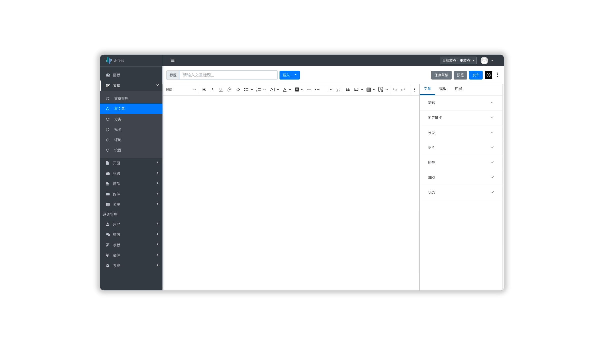

<h1 align="center" style="display: block!important;"> JPress </h1>

## JPress 简介

JPress 是一个使用 Java 开发的、`开源免费` 的建站神器，灵感来源于 WordPress，目前已经有超过 10w+ 的网站使用 JPress 搭建，其中包括多个政府机构，200+上市公司，中科院、红十字会等。

## JPress 联系方式
1. JPress 官方网站：[http://www.jpress.cn](http://www.jpress.cn)
2. JPress官方公众号：jpresscn
3. QQ 群1：591396171
4. QQ 群2：288397536
5. 微信交流群：

